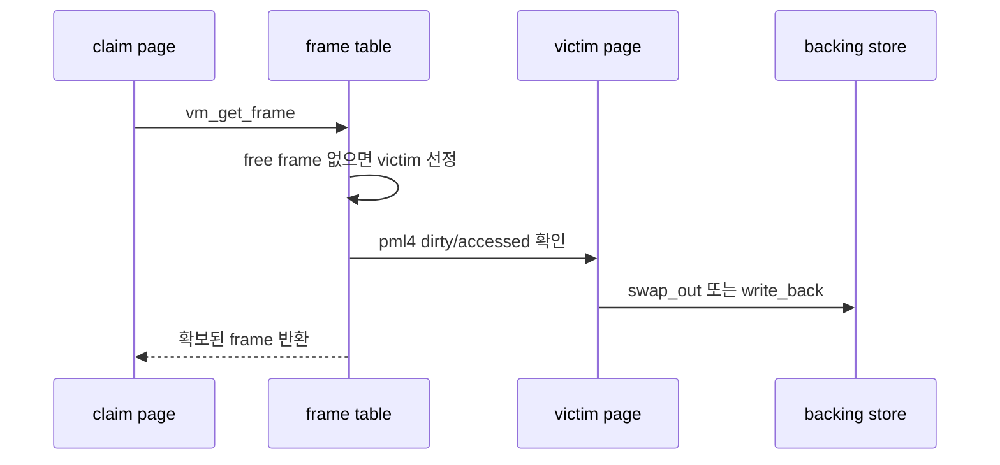

# 05 — Frame Table 전체 개념과 동작 흐름

이 문서는 frame table, eviction, swap의 큰 흐름을 잡기 위한 개요 문서입니다.

---

## 1) Frame Table을 한 문장으로 설명하면

**"실제 user pool 물리 프레임을 전역 자원으로 추적하고, 부족할 때 어떤 page를 내보낼지 결정하는 테이블"**입니다.

핵심은 frame을 page와 연결하되, frame 수명은 한 프로세스가 아니라 전체 VM 정책으로 관리된다는 점입니다.

---

## 2) 왜 필요한가

물리 메모리는 제한되어 있습니다. 모든 lazy/stack/mmap page를 동시에 올릴 수 없으므로, frame이 부족하면 victim page를 골라 backing store로 내보내야 합니다.

---

## 3) 동작 시퀀스

---

## 4) 반드시 분리해서 이해할 개념

- **frame**: 실제 물리 메모리 한 페이지
- **page**: 가상 페이지와 backing store 정보
- **eviction**: frame을 비우기 위해 page 내용을 보존하고 mapping을 제거하는 과정
- **swap**: anonymous page를 임시 저장하는 disk 영역

---

## 5) 자주 틀리는 지점

- `PAL_USER` 없이 frame을 할당
- victim page의 pml4 mapping을 제거하지 않음
- accessed bit를 확인만 하고 초기화하지 않아 clock 알고리즘이 돌지 않음
- swap slot 해제를 누락

---

## 6) 학습 순서

1. `06-feature-frame-allocation-and-claim.md`
2. `07-feature-eviction-and-accessed-bit.md`
3. `../../5. Swap In&Out/1. feature/01-feature-anonymous-swap-in-out.md`

---

## 7) 구현 전 체크 질문

- frame과 page의 소유/수명 차이를 설명할 수 있는가?
- user frame은 항상 `PAL_USER`로 확보되는가?
- eviction 후 victim page의 pml4 mapping이 제거되는가?
- anonymous page와 file-backed page의 backing store 정책을 구분했는가?
