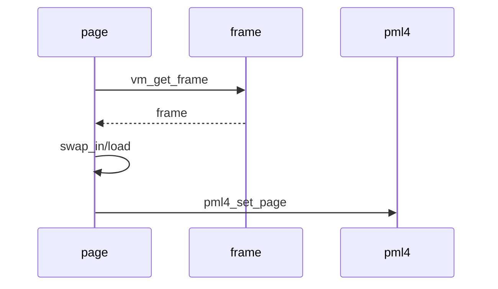

# 02 — 기능 1: Frame Allocation and Claim

## 1. 구현 목적 및 필요성

### 이 기능이 무엇인가
page fault로 claim할 page에 user frame을 할당하고 pml4 mapping을 만드는 기능입니다.

### 왜 이걸 하는가
SPT의 page metadata만으로는 CPU가 접근할 수 없습니다. 실제 frame과 pml4 mapping이 필요합니다.

### 무엇을 연결하는가
`vm_get_frame()`, `vm_do_claim_page()`, `pml4_set_page()`, page type별 `swap_in()`을 연결합니다.

### 완성의 의미
claim 성공 후 page는 frame을 가지고, pml4는 upage를 frame kva에 매핑합니다.

## 2. 가능한 구현 방식 비교

- 방식 A: frame table에 frame 구조체를 별도 관리
  - 장점: eviction victim 추적 가능
  - 단점: 동기화와 list 관리 필요
- 방식 B: palloc 결과만 page에 저장
  - 장점: 단순
  - 단점: eviction 구현이 어려움
- 선택: frame table을 별도로 둔다.

## 3. 시퀀스와 단계별 흐름

## 4. 기능별 가이드

### 4.1 Frame allocation
- 위치: `vm/vm.c`
- user pool에서 frame을 가져오고 frame table에 등록합니다.

### 4.2 Claim
- 위치: `vm/vm.c`
- page와 frame을 연결하고 page type별 load 후 pml4 mapping을 만듭니다.

## 5. 구현 주석

### 5.1 `vm_get_frame()`

#### 5.1.1 user frame 확보
- 위치: `vm/vm.c`
- 역할: user pool에서 frame을 확보하거나 eviction으로 frame을 만든다.
- 규칙 1: `PAL_USER`를 사용한다.
- 규칙 2: frame table에 추적 가능한 구조로 등록한다.
- 금지 1: kernel pool에서 user page frame을 가져오지 않는다.

### 5.2 `vm_do_claim_page()`

#### 5.2.1 page-frame 연결
- 위치: `vm/vm.c`
- 역할: page와 frame을 연결하고 pml4 mapping을 만든다.
- 규칙 1: `page->frame`과 `frame->page`를 모두 설정한다.
- 규칙 2: page type별 swap_in/load가 성공한 뒤 mapping을 완료한다.
- 금지 1: 실패 경로에서 반쯤 연결된 page/frame을 남기지 않는다.

## 6. 테스팅 방법

- lazy load 기본 테스트
- frame allocation 실패를 유도하는 swap 테스트
- pml4 mapping 여부 확인
