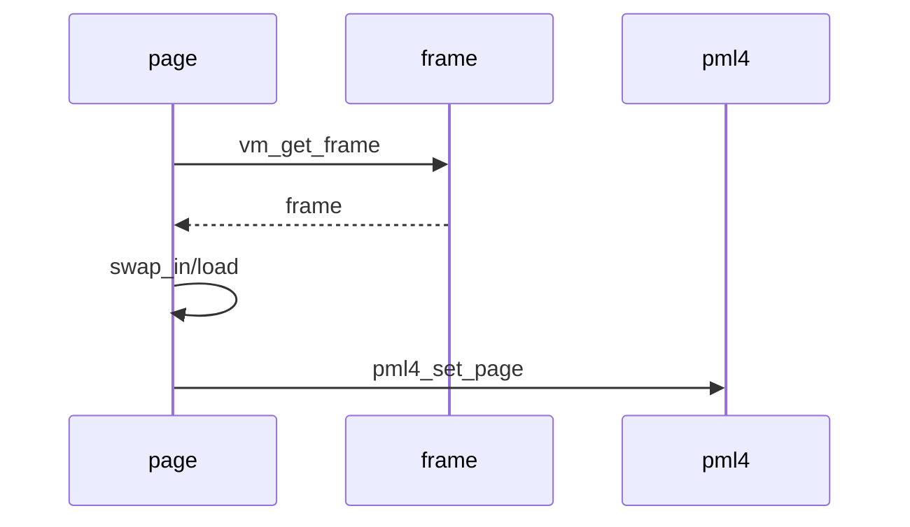
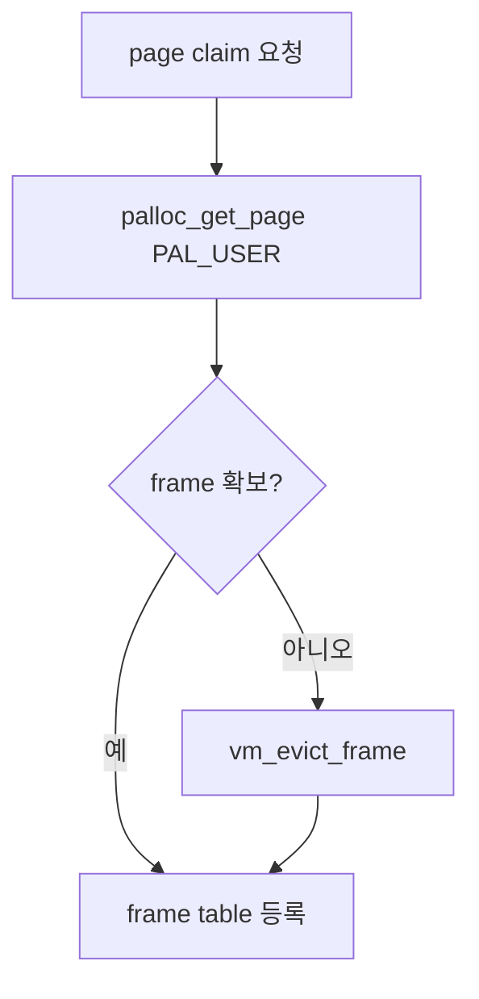
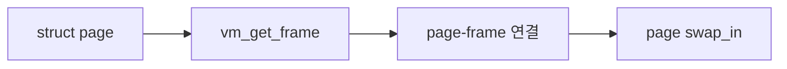
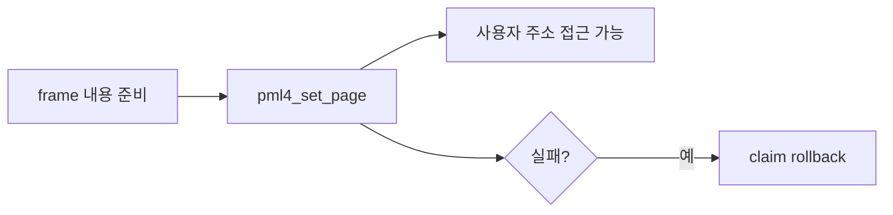
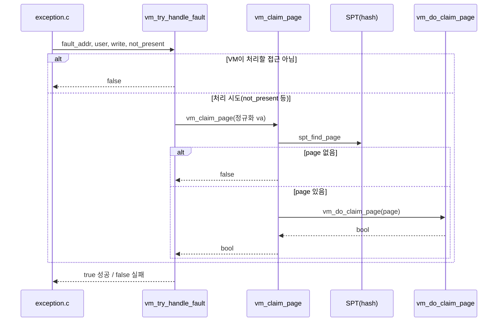
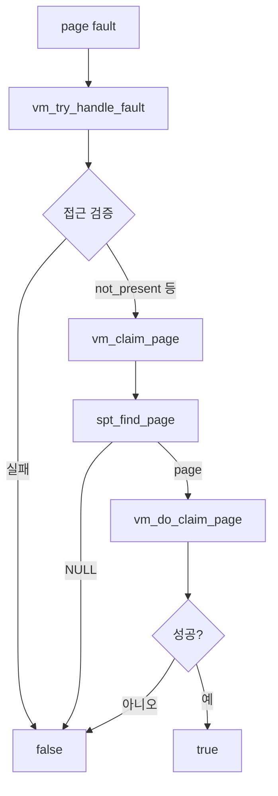

# 06 — 기능 4: Frame Allocation and Claim

## 1. 구현 목적 및 필요성
### 이 기능이 무엇인가
page fault로 claim할 page에 user frame을 할당하고 pml4 mapping을 만드는 기능입니다.
### 왜 이걸 하는가 (문제 맥락)
SPT의 page metadata만으로는 CPU가 접근할 수 없습니다. 실제 frame과 pml4 mapping이 없으면 fault가 끝나지 않습니다.
### 무엇을 연결하는가 (기술 맥락)
`pintos/vm/vm.c`의 `vm_try_handle_fault()`, `vm_get_frame()`, `vm_evict_frame()`, `vm_do_claim_page()`, `vm_claim_page()`, `threads/mmu.h`·`threads/pml4.h`의 `pml4_set_page()`, page type별 `swap_in()`을 연결합니다.

폴트 진입점 **`vm_try_handle_fault()`** 는 `03-feature-spt-insert-find-remove.md`에서 이미 맥락상 연결되어 있다. **실제 폴트 → `vm_claim_page` 등 본 구현은 이 문서의 §5 (`vm_claim_page`/`vm_do_claim_page`)와 함께** 완결하면 된다. 검증은 `2. testing/01-spt-basic-and-page-fault.md`.

### 완성의 의미 (결과 관점)
claim 성공 후 page는 frame을 가지고, pml4는 upage를 frame kva에 매핑합니다.

## 2. 가능한 구현 방식 비교
- 방식 A: frame table에 frame 구조체를 별도 관리
  - 장점: eviction victim 추적 가능
  - 단점: 동기화와 list 관리 필요
- 방식 B: palloc 결과만 page에 저장
  - 장점: 단순
  - 단점: eviction 구현이 어려움
- 선택: frame table을 별도로 둔다.

## 3. 시퀀스와 단계별 흐름

1. `vm_get_frame`으로 user pool frame을 확보한다(eviction 포함).
2. `page->frame`·`frame->page`를 연결한다.
3. `swap_in`으로 내용을 채운 뒤 `pml4_set_page`로 매핑한다.

## 4. 기능별 가이드 (개념/흐름 + 구현 주석 위치)
### 4.1 기능 A: user frame 확보
#### 개념 설명
VM에서 user page를 담는 frame은 반드시 user pool에서 가져와야 합니다. free frame이 없을 때는 즉시 실패하는 것이 아니라 eviction으로 재사용 가능한 frame을 확보하는 흐름까지 연결해야 합니다.
#### 시퀀스 및 흐름

1. `PAL_USER`로 user pool frame을 요청한다.
2. 실패하면 eviction 경로로 frame을 확보한다.
3. 확보한 frame은 eviction victim 선정이 가능하도록 frame table에 등록한다.
#### 구현 주석 (보면 되는 함수/구조체)
- 위치: `pintos/vm/vm.c`의 `vm_get_frame()`
- 위치: frame table 자료구조를 두는 파일/전역 상태

### 4.2 기능 B: page와 frame 연결
#### 개념 설명
frame을 얻는 것만으로는 page fault가 복구되지 않습니다. SPT page와 frame이 서로를 가리키도록 연결하고, page type별 swap-in/load가 그 frame에 내용을 채워야 합니다.
#### 시퀀스 및 흐름

1. `page->frame`과 `frame->page`를 모두 설정한다.
2. page type별 `swap_in()`을 호출해 frame kva에 내용을 채운다.
3. 실패하면 연결된 상태를 정리하고 false를 반환한다.
#### 구현 주석 (보면 되는 함수/구조체)
- 위치: `pintos/vm/vm.c`의 `vm_do_claim_page()`
- 위치: `pintos/include/vm/vm.h`의 `struct page`, `struct frame`

### 4.3 기능 C: pml4 mapping 완료
#### 개념 설명
CPU가 user virtual address로 접근하려면 pml4 mapping이 있어야 합니다. page 내용이 frame에 준비된 뒤 `page->va`와 `frame->kva`를 writable 정책에 맞게 연결해야 합니다.
#### 시퀀스 및 흐름

1. `page->writable`(또는 팀 규약) 정책을 pml4 mapping에 반영한다.
2. mapping 실패 시 frame과 page 연결을 되돌린다.
3. 성공 후 같은 va로 다시 fault가 나지 않는지 확인한다.
#### 구현 주석 (보면 되는 함수/구조체)
- 위치: `pintos/vm/vm.c`의 `vm_do_claim_page()`
- 위치: `pintos/threads/mmu.c` 또는 `pintos/threads/pml4.h`의 `pml4_set_page()`

### 4.4 기능 D: 페이지 폴트에서 claim으로 연결
#### 개념 설명
CPU가 접근했는데 PTE가 비어 있으면(not-present) 페이지 폴트가 발생합니다. 진입 함수는 폴트가 VM이 처리할 만한 접근인지 판별한 뒤, 해당 user va를 기준으로 SPT 조회 및 `vm_claim_page` 경로를 호출해 lazy/uninit 포함 동일 진입점으로 묶습니다.

#### 시퀀스 및 흐름

1. `exception.c`가 fault 주소와 `user`/`write`/`not_present`를 넘겨 `vm_try_handle_fault`를 호출한다.
2. user 주소·팀 규약에 맞게 검증하고, not-present면 `pg_round_down` 등 **§5.3과 동일한 va 규약**으로 `vm_claim_page`에 넘긴다.
3. `vm_claim_page`가 SPT에서 page를 찾으면 `vm_do_claim_page`로 §4.2·§4.3 흐름(frame·swap_in·pml4)을 탄다.
4. write-protect·stack growth 등은 별도 분기로 두고, 본 절은 **present가 아닌 fault → claim** 축을 분명히 한다.

#### 구현 주석 (보면 되는 함수/구조체)
- 위치: `pintos/vm/vm.c`의 `vm_try_handle_fault()`
- 폴트 → SPT/`vm_claim_page` 연계는 `threads/vaddr.h`의 `pg_round_down()`·`is_user_vaddr()` 등과 호출 순서 맞춤
- 연관 호출부: `pintos/userprog/exception.c`의 page fault 처리에서 `vm_try_handle_fault()` 호출 확인

## 5. 구현 주석 (위치별 정리)
### 5.1 `vm_get_frame()`
- 위치: `pintos/vm/vm.c`의 `vm_get_frame()`
- 역할: user pool에서 frame을 확보하거나 eviction으로 frame을 만든다.
- 규칙 1: `PAL_USER`를 사용한다.
- 규칙 2: frame table에 추적 가능한 구조로 등록한다.
- 금지 1: kernel pool에서 user page frame을 가져오지 않는다.

구현 체크 순서:
1. `palloc_get_page(PAL_USER)`로 user frame kva를 요청한다.
2. 실패하면 `vm_evict_frame()`로 재사용 가능한 frame을 확보한다.
3. 성공한 kva를 `struct frame`에 저장하고 frame table에 등록한다.

### 5.2 `vm_do_claim_page()`
- 위치: `pintos/vm/vm.c`의 `vm_do_claim_page()`
- 역할: page와 frame을 연결하고 pml4 mapping을 만든다.
- 규칙 1: `page->frame`과 `frame->page`를 모두 설정한다.
- 규칙 2: page type별 swap_in/load가 성공한 뒤 mapping을 완료한다.
- 금지 1: 실패 경로에서 반쯤 연결된 page/frame을 남기지 않는다.

구현 체크 순서:
1. `vm_get_frame()`으로 frame을 받은 뒤 `page->frame`과 `frame->page`를 연결한다.
2. `swap_in(page, frame->kva)`로 page 내용을 frame에 채운다.
3. `pml4_set_page()`로 `page->va`와 `frame->kva`를 writable 정책에 맞게 매핑한다.

### 5.3 `vm_claim_page()`
- 위치: `pintos/vm/vm.c`의 `vm_claim_page()`
- 역할: va로 SPT에서 page를 찾아 claim 경로로 넘긴다.
- 규칙 1: `spt_find_page` 후 NULL이 아니면 `vm_do_claim_page`로 위임한다.
- 금지 1: SPT 없는 주소에서 조용히 성공 처리하지 않는다.

구현 체크 순서:
1. 입력 `va` 정규화 정책을 `spt_find_page`와 맞춘다.
2. lazy/uninit·swap된 page 모두 같은 진입점으로 들어오는지 확인한다.

### 5.4 `vm_try_handle_fault()`
- 위치: `pintos/vm/vm.c`의 `vm_try_handle_fault()`
- 역할: 페이지 폴트 발생 시 접근 검증 후, 처리 가능하면 `vm_claim_page()`(또는 동일 목적 진입점)로 넘긴다.
- 규칙 1: `not_present` 등 폴트 유형별로 무한 폴트·잘못된 대응을 만들지 않는다.
- 규칙 2: user 주소·권한 판별을 fault 인자와 맞춘다.
- 규칙 3: SPT에는 없지만 합법인 구간은 stack growth 등 **별도 규약** 후 claim으로 이어진다면 그 분기 명시(팀 정책).
- 금지 1: SPT 없는 접근을 조용히 성공 처리하지 않는다.

구현 체크 순서:
1. `pg_round_down`/user va 검증을 `vm_claim_page`·`spt_find_page`와 동일 규약으로 맞춘다.
2. 적절한 경우 `vm_claim_page(fault_va)` 또는 정규화한 va로 호출한다.
3. write-protect·COW는 팀별로 `vm_handle_wp` 등과 분리해 충돌 없이 처리한다(`07` 참고 가능).

## 6. 테스팅 방법
- lazy load 기본 테스트
- frame allocation 실패를 유도하는 swap 테스트
- pml4 mapping 여부 확인
