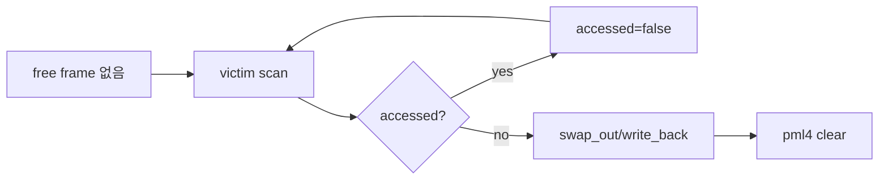
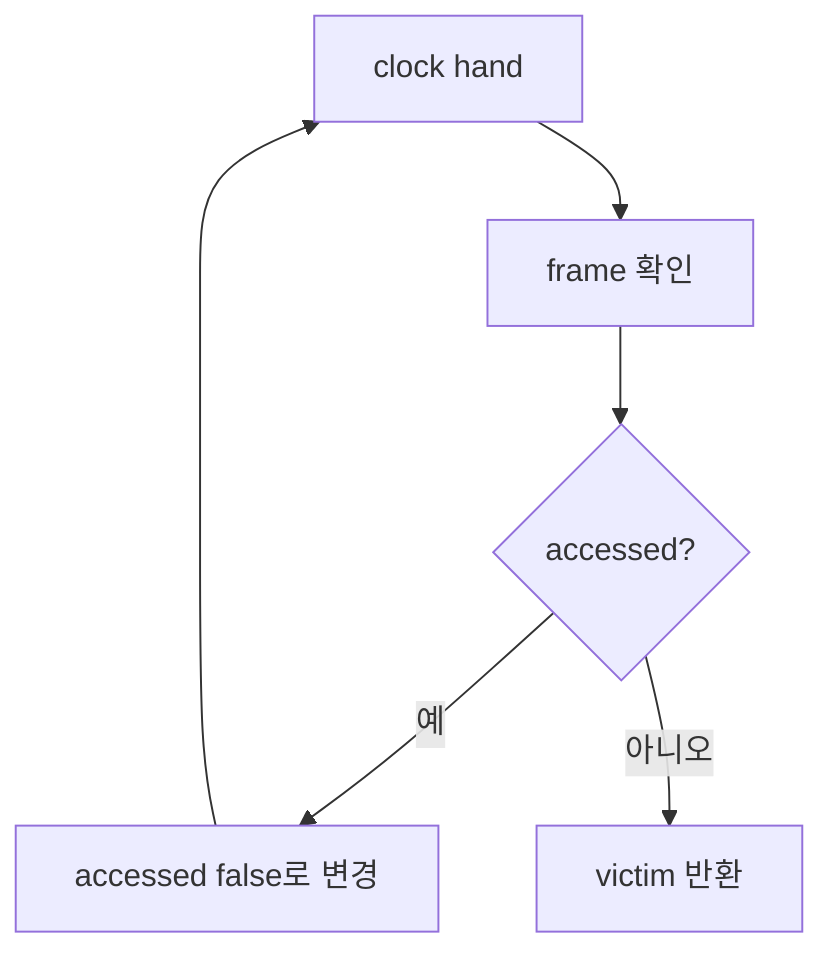

# 07 — 기능 5: Eviction and Accessed Bit

## 1. 구현 목적 및 필요성
### 이 기능이 무엇인가
free frame이 없을 때 victim frame을 선정하고 page 내용을 backing store로 내보내는 기능입니다.
### 왜 이걸 하는가 (문제 맥락)
물리 메모리가 부족해도 프로세스가 필요한 page를 계속 claim할 수 있어야 합니다.
### 무엇을 연결하는가 (기술 맥락)
frame table, `pintos/vm/vm.c`의 `vm_get_victim()`, `vm_evict_frame()`, `pintos/threads/mmu.c`·`pintos/threads/pml4.h`의 `pml4_is_accessed()`, `pml4_set_accessed()`, `pml4_is_dirty()`, page type별 `swap_out`/write_back을 연결합니다.
### 완성의 의미 (결과 관점)
victim page의 데이터가 보존되고 pml4 mapping이 제거된 뒤 frame이 새 page에 재사용됩니다.

## 2. 가능한 구현 방식 비교
- 방식 A: clock 알고리즘
  - 장점: accessed bit를 사용해 최근 사용 page를 피함
  - 단점: hand 관리 필요
- 방식 B: 단순 FIFO
  - 장점: 구현 쉬움
  - 단점: 테스트 압박에서 비효율 가능
- 선택: accessed bit 기반 clock 권장

## 3. 시퀀스와 단계별 흐름

1. `palloc` 실패 시 eviction을 시도한다.
2. victim을 고른 뒤 내용을 보존한다.
3. mapping을 끊고 frame을 반환한다.

## 4. 기능별 가이드 (개념/흐름 + 구현 주석 위치)
### 4.1 기능 A: accessed bit 기반 victim scan
#### 개념 설명
eviction은 아무 frame이나 빼앗는 기능이 아닙니다. accessed bit를 보면 최근에 접근된 page인지 알 수 있으므로, clock 알고리즘처럼 한 번 기회를 주고 오래 안 쓴 frame을 victim으로 고를 수 있습니다.
#### 시퀀스 및 흐름

1. frame table을 순회할 기준 위치를 유지한다.
2. accessed bit가 켜져 있으면 bit를 내리고 다음 frame으로 넘어간다.
3. accessed bit가 꺼진 frame을 victim으로 선택한다.
#### 구현 주석 (보면 되는 함수/구조체)
- 위치: `pintos/vm/vm.c`의 `vm_get_victim()`
- 위치: `pintos/threads/mmu.c` 또는 `pintos/threads/pml4.h`의 accessed bit helper

### 4.2 기능 B: page type별 swap out
#### 개념 설명
victim frame을 재사용하려면 그 frame에 있던 page의 내용을 잃지 않아야 합니다. anonymous page는 swap disk에, file-backed dirty page는 backing file에 저장하는 식으로 page type별 정책을 호출해야 합니다.
#### 시퀀스 및 흐름

1. victim frame에서 현재 소유 page를 찾는다.
2. page operation의 `swap_out()`을 호출한다.
3. 실패하면 frame 재사용을 중단하거나 panic/kill 정책을 명확히 한다.
#### 구현 주석 (보면 되는 함수/구조체)
- 위치: `pintos/vm/vm.c`의 `vm_evict_frame()`
- 위치: `pintos/vm/anon.c`의 `anon_swap_out()`, `pintos/vm/file.c`의 `file_backed_swap_out()`

### 4.3 기능 C: mapping 제거와 frame 재사용
#### 개념 설명
page 내용을 보존한 뒤에는 기존 pml4 mapping을 제거해야 합니다. mapping이 남아 있으면 이전 user va가 새 page의 frame 내용을 잘못 보거나, stale TLB/mapping 문제로 테스트가 깨질 수 있습니다.
#### 시퀀스 및 흐름

1. victim page의 user mapping을 pml4에서 제거한다.
2. `page->frame`과 `frame->page` 연결을 끊는다.
3. 비워진 frame을 새 claim 경로에 반환한다.
#### 구현 주석 (보면 되는 함수/구조체)
- 위치: `pintos/vm/vm.c`의 `vm_evict_frame()`
- 위치: pml4 clear helper와 frame table 관리 코드

## 5. 구현 주석 (위치별 정리)
### 5.1 `vm_get_victim()`
- 위치: `pintos/vm/vm.c`의 `vm_get_victim()`
- 역할: eviction할 frame을 선택한다.
- 규칙 1: accessed bit가 켜진 page는 bit를 내리고 지나간다.
- 규칙 2: pinned 또는 eviction 금지 page가 있다면 건너뛴다.
- 금지 1: 현재 claim 중인 frame을 victim으로 고르지 않는다.

구현 체크 순서:
1. frame table을 순회할 clock hand 또는 iterator를 준비한다.
2. 각 frame의 page에 대해 `pml4_is_accessed()`를 확인한다.
3. accessed bit가 꺼진 frame을 victim으로 반환하고, 켜져 있으면 bit를 내린 뒤 다음 frame으로 넘어간다.

### 5.2 `vm_evict_frame()`
- 위치: `pintos/vm/vm.c`의 `vm_evict_frame()`
- 역할: victim page 내용을 backing store에 저장하고 frame을 비운다.
- 규칙 1: page type별 `swap_out` 또는 write-back 정책을 호출한다.
- 규칙 2: pml4 mapping을 제거한다.
- 금지 1: mapping을 남긴 채 frame을 재사용하지 않는다.

구현 체크 순서:
1. `vm_get_victim()`으로 eviction 대상 frame과 page를 찾는다.
2. `swap_out(page)`를 호출해 anonymous/file-backed 정책에 따라 내용을 보존한다.
3. pml4 mapping과 `page->frame` 연결을 끊고 frame을 새 claim에 재사용할 수 있게 만든다.

## 6. 테스팅 방법
- swap/page-merge 계열 테스트
- mmap dirty page eviction 회귀
- pml4 accessed/dirty bit 로그 확인
