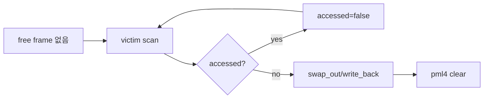

# 03 — 기능 2: Eviction and Accessed Bit

## 1. 구현 목적 및 필요성

### 이 기능이 무엇인가
free frame이 없을 때 victim frame을 선정하고 page 내용을 backing store로 내보내는 기능입니다.

### 왜 이걸 하는가
물리 메모리가 부족해도 프로세스가 필요한 page를 계속 claim할 수 있어야 합니다.

### 무엇을 연결하는가
frame table, `pml4_is_accessed()`, `pml4_set_accessed()`, `pml4_is_dirty()`, page type별 swap_out/write_back을 연결합니다.

### 완성의 의미
victim page의 데이터가 보존되고 pml4 mapping이 제거된 뒤 frame이 새 page에 재사용됩니다.

## 2. 가능한 구현 방식 비교

- 방식 A: clock 알고리즘
  - 장점: accessed bit를 사용해 최근 사용 page를 피함
  - 단점: hand 관리 필요
- 방식 B: 단순 FIFO
  - 장점: 구현 쉬움
  - 단점: 테스트 압박에서 비효율 가능
- 선택: accessed bit 기반 clock 권장

## 3. 시퀀스와 단계별 흐름

## 4. 기능별 가이드

### 4.1 Victim selection
- 위치: `vm/vm.c`
- accessed bit를 확인하고 기회를 한 번 더 줄 수 있습니다.

### 4.2 Evict
- 위치: `vm/vm.c`
- page type별로 backing store에 내용을 보존하고 mapping을 제거합니다.

## 5. 구현 주석

### 5.1 `vm_get_victim()`

#### 5.1.1 clock victim 선정
- 위치: `vm/vm.c`
- 역할: eviction할 frame을 선택한다.
- 규칙 1: accessed bit가 켜진 page는 bit를 내리고 지나간다.
- 규칙 2: pinned 또는 eviction 금지 page가 있다면 건너뛴다.
- 금지 1: 현재 claim 중인 frame을 victim으로 고르지 않는다.

### 5.2 `vm_evict_frame()`

#### 5.2.1 victim page 내보내기
- 위치: `vm/vm.c`
- 역할: victim page 내용을 backing store에 저장하고 frame을 비운다.
- 규칙 1: page type별 `swap_out` 또는 write-back 정책을 호출한다.
- 규칙 2: pml4 mapping을 제거한다.
- 금지 1: mapping을 남긴 채 frame을 재사용하지 않는다.

## 6. 테스팅 방법

- swap/page-merge 계열 테스트
- mmap dirty page eviction 회귀
- pml4 accessed/dirty bit 로그 확인
