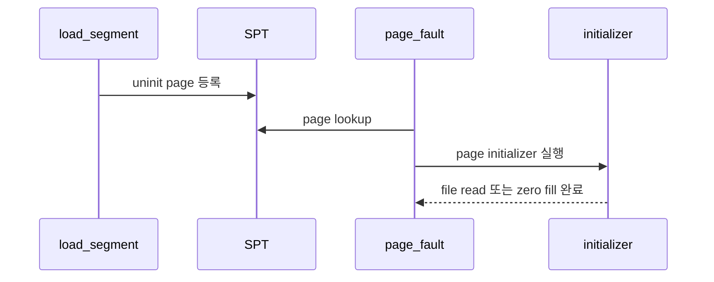

# 01 — Lazy Loading/Anonymous Page 전체 개념과 동작 흐름

이 문서는 lazy loading과 anonymous page의 큰 흐름을 잡기 위한 개요 문서입니다.

---

## 1) 한 문장으로 설명하면

**"지금 당장 물리 메모리를 채우지 않고, page fault가 난 순간 필요한 페이지 내용을 만드는 방식"**입니다.

핵심은 load 시점에는 SPT entry만 만들고, 실제 file read 또는 zero fill은 fault 시점에 한다는 점입니다.

---

## 2) 왜 필요한가

실행 파일의 모든 segment를 즉시 읽으면 시작 비용과 메모리 사용량이 커집니다.  
lazy loading은 접근한 page만 실제 frame에 올려 메모리를 아낍니다.

anonymous page는 파일에 직접 대응하지 않는 heap/stack/zero page를 표현하고, 메모리 부족 시 swap 대상으로 관리됩니다.

---

## 3) 동작 시퀀스

1. executable load가 segment별 page 정보를 aux에 저장한다.
2. SPT에는 uninit page가 등록된다.
3. page fault가 발생하면 page claim 후 initializer가 실행된다.
4. page type이 anonymous/file 등 최종 타입으로 바뀐다.

---

## 4) 반드시 분리해서 이해할 개념

- **uninit page**: 아직 최종 타입으로 초기화되지 않은 lazy page
- **initializer**: fault 시점에 실제 page 내용을 채우는 함수
- **anonymous page**: file backing이 없는 page, swap 대상
- **executable lazy page**: file offset/read_bytes/zero_bytes를 가진 lazy page

---

## 5) 자주 틀리는 지점

- aux를 stack 지역 변수로 만들어 fault 시점에 깨짐
- read_bytes/zero_bytes 계산이 page boundary에서 어긋남
- initializer 실패 시 frame/page 상태를 롤백하지 않음
- anonymous page를 file-backed page처럼 write-back하려고 함

---

## 6) 학습 순서

1. `02-feature-uninit-page-and-initializer.md`
2. `03-feature-executable-lazy-load.md`
3. `04-feature-anonymous-page.md`

---

## 7) 구현 전 체크 질문

- aux가 fault 시점까지 살아 있는 저장소에 있는가?
- executable lazy page의 read_bytes/zero_bytes가 page boundary 기준으로 계산되는가?
- uninit page가 claim 중 정확히 한 번만 최종 타입으로 초기화되는가?
- anonymous page와 file-backed page의 swap/write-back 정책을 구분했는가?
