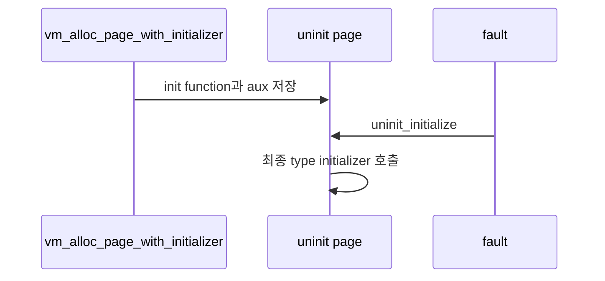
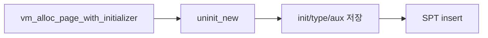
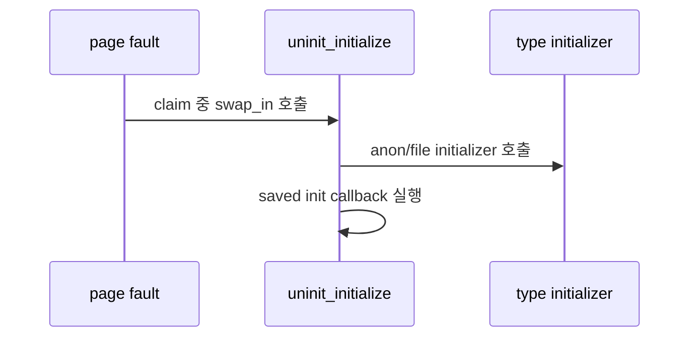
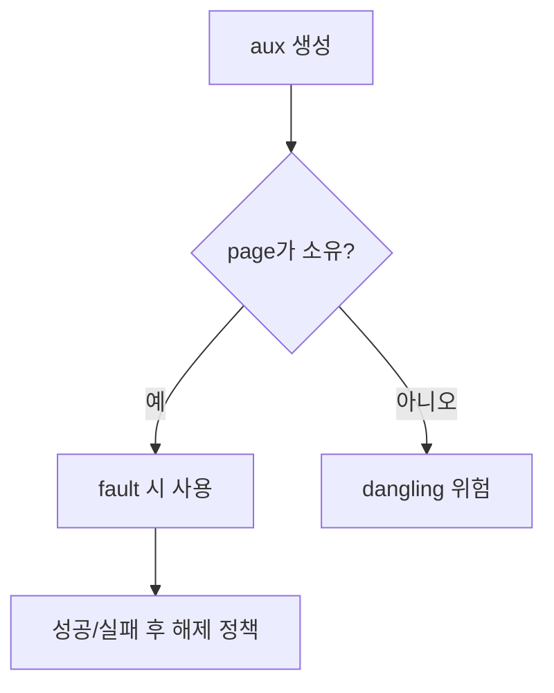

# 02 — 기능 1: Uninit Page와 Initializer

## 1. 구현 목적 및 필요성

### 이 기능이 무엇인가
uninit page는 SPT에 먼저 등록되고, fault 시점에 initializer를 통해 실제 타입으로 변환되는 page입니다.

### 왜 이걸 하는가
lazy loading은 load 시점에는 파일 정보를 보존하고 실제 메모리 채우기를 미룹니다.

### 무엇을 연결하는가
`vm_alloc_page_with_initializer()`, `uninit_new()`, `uninit_initialize()`, page type별 initializer를 연결합니다.

### 완성의 의미
fault가 발생한 page가 initializer를 한 번 실행해 올바른 타입과 내용으로 claim됩니다.

## 2. 가능한 구현 방식 비교

- 방식 A: aux를 heap에 복사해 page가 소유
  - 장점: fault 시점까지 안전
  - 단점: 실패 경로에서 free 책임 필요
- 방식 B: load 함수 지역 주소를 넘김
  - 장점: 단순
  - 단점: fault 시점에 dangling pointer
- 선택: 방식 A

## 3. 시퀀스와 단계별 흐름

## 4. 기능별 가이드 (개념/흐름 + 구현 주석 위치)

### 4.1 기능 A: uninit page metadata 보관
#### 개념 설명
uninit page는 아직 anonymous/file page로 확정 실행되지 않은 lazy page입니다. load 시점에는 실제 I/O를 하지 않고, fault 시점에 필요한 initializer와 aux를 page 안에 안전하게 보관해야 합니다.

#### 시퀀스 및 흐름

1. page 생성 시 최종 VM type을 정한다.
2. fault 시점에 사용할 init callback과 aux를 저장한다.
3. uninit page 상태로 SPT에 먼저 등록한다.

#### 구현 주석 (보면 되는 함수/구조체)
- 위치: `vm/vm.c`의 `vm_alloc_page_with_initializer()`
- 위치: `vm/uninit.c`의 `uninit_new()`
- 위치: `include/vm/uninit.h`의 `struct uninit_page`

### 4.2 기능 B: fault 시점 initializer 실행
#### 개념 설명
uninit page는 claim될 때 한 번만 최종 page type으로 변환되어야 합니다. 이때 type별 initializer가 page operation을 바꾸고, 저장해 둔 init callback이 frame 내용을 채웁니다.

#### 시퀀스 및 흐름

1. `page->uninit`에서 저장된 type, initializer, aux를 꺼낸다.
2. anonymous/file initializer로 `page->operations`를 최종 타입으로 바꾼다.
3. 저장된 init callback을 실행하고 성공 여부를 claim 경로로 반환한다.

#### 구현 주석 (보면 되는 함수/구조체)
- 위치: `vm/uninit.c`의 `uninit_initialize()`
- 위치: `vm/anon.c`의 `anon_initializer()`, `vm/file.c`의 `file_backed_initializer()`

### 4.3 기능 C: aux 수명과 실패 경로
#### 개념 설명
lazy loading의 aux는 load 함수가 끝난 뒤 fault 시점까지 살아 있어야 합니다. stack 지역 변수 주소를 aux로 넘기면 fault 때 dangling pointer가 되므로, page가 소유하거나 명확한 해제 경로를 가져야 합니다.

#### 시퀀스 및 흐름

1. aux는 heap 또는 page 수명에 맞는 저장소에 둔다.
2. SPT insert 실패, initializer 실패, destroy 경로에서 aux 해제를 고려한다.
3. 같은 aux를 여러 page가 공유한다면 reference/count 또는 별도 복사 정책을 정한다.

#### 구현 주석 (보면 되는 함수/구조체)
- 위치: `userprog/process.c`의 lazy segment aux 생성 지점
- 위치: `vm/uninit.c`의 `uninit_destroy()`

## 5. 구현 주석

### 5.1 `vm_alloc_page_with_initializer()`

#### 5.1.1 `vm_alloc_page_with_initializer()`에서 uninit lazy page 생성
- 수정 위치: `vm/vm.c`의 `vm_alloc_page_with_initializer()`
- 역할: uninit page를 만들고 SPT에 등록한다.
- 규칙 1: page va는 page-aligned 주소여야 한다.
- 규칙 2: init/aux/final type을 fault 시점까지 보존한다.
- 금지 1: page 생성 직후 file read를 수행하지 않는다.

구현 체크 순서:
1. `upage`를 page-aligned 주소로 정규화하고 SPT 중복 여부를 확인한다.
2. VM type에 맞는 최종 initializer와 aux를 `uninit_new()`에 넘겨 page를 만든다.
3. 생성한 page를 `spt_insert_page()`에 넣고 실패 시 할당한 자원을 정리한다.

### 5.2 `uninit_initialize()`

#### 5.2.1 `uninit_initialize()`에서 최종 page initializer 호출
- 수정 위치: `vm/uninit.c`의 `uninit_initialize()`
- 역할: uninit page를 anonymous/file page로 초기화한다.
- 규칙 1: initializer 성공 후 page operation이 최종 타입으로 바뀐다.
- 규칙 2: 실패하면 claim 실패로 전파한다.
- 금지 1: initializer를 중복 실행하지 않는다.

구현 체크 순서:
1. `page->uninit`에서 저장된 init 함수, aux, 최종 type을 꺼낸다.
2. type별 initializer를 호출해 `page->operations`를 최종 page type으로 바꾼다.
3. 저장된 init callback을 실행하고 실패 여부를 `vm_do_claim_page()`로 전파한다.

## 6. 테스팅 방법

- lazy executable load 테스트
- page fault가 두 번 났을 때 initializer 중복 실행 여부 확인
