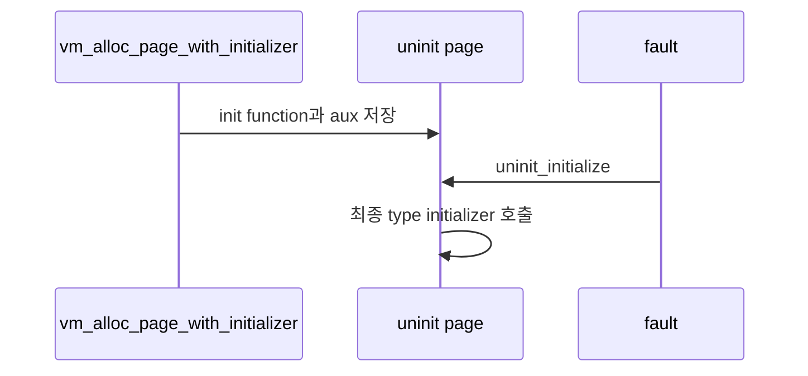

# 02 — 기능 1: Uninit Page와 Initializer

## 1. 구현 목적 및 필요성

### 이 기능이 무엇인가
uninit page는 SPT에 먼저 등록되고, fault 시점에 initializer를 통해 실제 타입으로 변환되는 page입니다.

### 왜 이걸 하는가
lazy loading은 load 시점에는 파일 정보를 보존하고 실제 메모리 채우기를 미룹니다.

### 무엇을 연결하는가
`vm_alloc_page_with_initializer()`, `uninit_new()`, `uninit_initialize()`, page type별 initializer를 연결합니다.

### 완성의 의미
fault가 발생한 page가 initializer를 한 번 실행해 올바른 타입과 내용으로 claim됩니다.

## 2. 가능한 구현 방식 비교

- 방식 A: aux를 heap에 복사해 page가 소유
  - 장점: fault 시점까지 안전
  - 단점: 실패 경로에서 free 책임 필요
- 방식 B: load 함수 지역 주소를 넘김
  - 장점: 단순
  - 단점: fault 시점에 dangling pointer
- 선택: 방식 A

## 3. 시퀀스와 단계별 흐름

## 4. 기능별 가이드

### 4.1 Uninit metadata
- 위치: `vm/uninit.c`, `include/vm/uninit.h`
- initializer, aux, final type 정보를 보관합니다.

### 4.2 Initializer 실행
- 위치: `vm/uninit.c`
- claim 중 한 번만 실행되어야 합니다.

## 5. 구현 주석

### 5.1 `vm_alloc_page_with_initializer()`

#### 5.1.1 lazy page 생성
- 위치: `vm/vm.c`
- 역할: uninit page를 만들고 SPT에 등록한다.
- 규칙 1: page va는 page-aligned 주소여야 한다.
- 규칙 2: init/aux/final type을 fault 시점까지 보존한다.
- 금지 1: page 생성 직후 file read를 수행하지 않는다.

### 5.2 `uninit_initialize()`

#### 5.2.1 최종 initializer 호출
- 위치: `vm/uninit.c`
- 역할: uninit page를 anonymous/file page로 초기화한다.
- 규칙 1: initializer 성공 후 page operation이 최종 타입으로 바뀐다.
- 규칙 2: 실패하면 claim 실패로 전파한다.
- 금지 1: initializer를 중복 실행하지 않는다.

## 6. 테스팅 방법

- lazy executable load 테스트
- page fault가 두 번 났을 때 initializer 중복 실행 여부 확인
