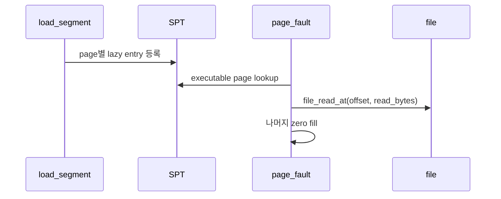

# 03 — 기능 2: Executable Lazy Load

## 1. 구현 목적 및 필요성

### 이 기능이 무엇인가
ELF segment의 page들을 즉시 읽지 않고 SPT에 lazy page로 등록한 뒤, fault 시점에 파일에서 읽는 기능입니다.

### 왜 이걸 하는가
필요한 code/data page만 메모리에 올려 실행 시작 비용과 메모리 사용량을 줄입니다.

### 무엇을 연결하는가
`load_segment()`, `lazy_load_segment()`, file offset, read_bytes, zero_bytes, writable 정보를 연결합니다.

### 완성의 의미
프로그램이 접근한 executable page가 정확한 파일 내용과 zero fill 상태로 로드됩니다.

## 2. 가능한 구현 방식 비교

- 방식 A: page마다 aux를 별도로 생성
  - 장점: offset/read_bytes가 독립적이고 안전
  - 단점: aux 해제 관리 필요
- 방식 B: segment 전체 aux를 공유
  - 장점: 메모리 사용이 적음
  - 단점: page별 offset 계산 실수 위험
- 선택: page별 aux를 명확히 둔다.

## 3. 시퀀스와 단계별 흐름

## 4. 기능별 가이드

### 4.1 Segment split
- 위치: `userprog/process.c`
- page별 `read_bytes`와 `zero_bytes`를 계산합니다.

### 4.2 Lazy loader
- 위치: `userprog/process.c` 또는 `vm/file.c`
- file offset 기준으로 읽고 남은 영역을 zero fill합니다.

## 5. 구현 주석

### 5.1 `load_segment()`

#### 5.1.1 lazy page 등록
- 위치: `userprog/process.c`
- 역할: ELF segment를 page 단위 lazy page로 등록한다.
- 규칙 1: page_read_bytes는 PGSIZE 이하로 계산한다.
- 규칙 2: page_zero_bytes는 `PGSIZE - page_read_bytes`가 된다.
- 규칙 3: writable bit를 page metadata에 보존한다.
- 금지 1: load 시점에 모든 segment를 즉시 `file_read`하지 않는다.

### 5.2 `lazy_load_segment()`

#### 5.2.1 fault 시점 file read
- 위치: `userprog/process.c`
- 역할: aux에 저장된 file/ofs/read_bytes로 frame 내용을 채운다.
- 규칙 1: `file_read_at()` 또는 seek/read 정책을 일관되게 사용한다.
- 규칙 2: read_bytes 이후는 zero fill한다.
- 금지 1: file offset을 전역 seek 상태에 의존해 꼬이게 하지 않는다.

## 6. 테스팅 방법

- 기본 userprog 실행
- lazy-load 관련 VM 테스트
- page boundary가 있는 executable segment 테스트
