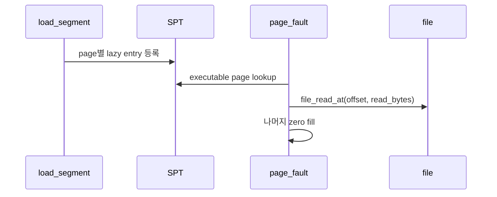
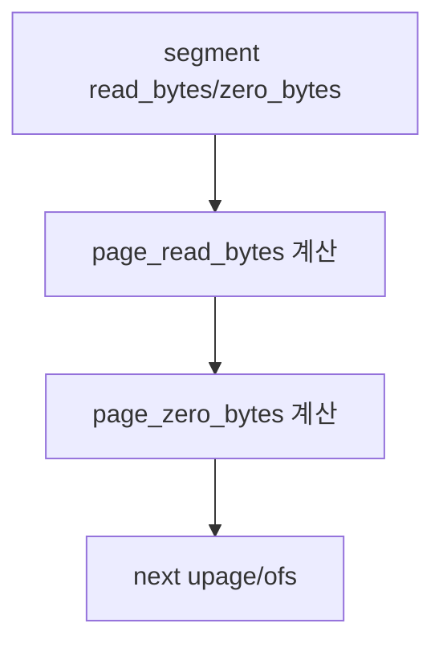
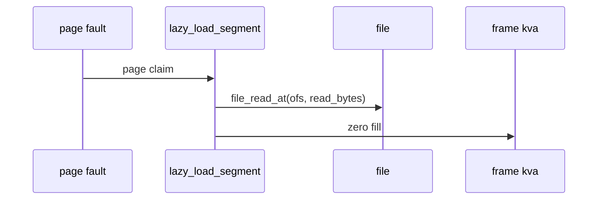

# 03 — 기능 2: Executable Lazy Load

## 1. 구현 목적 및 필요성

### 이 기능이 무엇인가
ELF segment의 page들을 즉시 읽지 않고 SPT에 lazy page로 등록한 뒤, fault 시점에 파일에서 읽는 기능입니다.

### 왜 이걸 하는가
필요한 code/data page만 메모리에 올려 실행 시작 비용과 메모리 사용량을 줄입니다.

### 무엇을 연결하는가
`load_segment()`, `lazy_load_segment()`, file offset, read_bytes, zero_bytes, writable 정보를 연결합니다.

### 완성의 의미
프로그램이 접근한 executable page가 정확한 파일 내용과 zero fill 상태로 로드됩니다.

## 2. 가능한 구현 방식 비교

- 방식 A: page마다 aux를 별도로 생성
  - 장점: offset/read_bytes가 독립적이고 안전
  - 단점: aux 해제 관리 필요
- 방식 B: segment 전체 aux를 공유
  - 장점: 메모리 사용이 적음
  - 단점: page별 offset 계산 실수 위험
- 선택: page별 aux를 명확히 둔다.

## 3. 시퀀스와 단계별 흐름

## 4. 기능별 가이드 (개념/흐름 + 구현 주석 위치)

### 4.1 기능 A: ELF segment를 page 단위로 분할
#### 개념 설명
ELF segment는 page보다 클 수 있고, 마지막 page는 파일 내용과 zero fill 영역이 섞일 수 있습니다. lazy loading을 하려면 `load_segment()`가 각 page별 read/zero 크기를 정확히 계산해야 합니다.

#### 시퀀스 및 흐름

1. 현재 page에서 파일로부터 읽을 byte 수를 PGSIZE 이하로 제한한다.
2. 나머지 byte 수는 zero fill 영역으로 계산한다.
3. 다음 page로 넘어갈 때 upage, file offset, 남은 byte 수를 함께 갱신한다.

#### 구현 주석 (보면 되는 함수/구조체)
- 위치: `userprog/process.c`의 `load_segment()`
- 위치: `threads/vaddr.h`의 `PGSIZE`

### 4.2 기능 B: executable lazy page 등록
#### 개념 설명
프로그램 로드 시점에는 executable page를 바로 읽지 않고 SPT에 lazy entry만 등록합니다. 각 entry는 나중에 fault가 났을 때 어느 file offset에서 몇 byte를 읽을지 알 수 있어야 합니다.

#### 시퀀스 및 흐름

1. page별 file, offset, read_bytes, zero_bytes를 aux에 담는다.
2. writable bit를 page metadata에 보존한다.
3. `lazy_load_segment()`를 initializer callback으로 등록한다.

#### 구현 주석 (보면 되는 함수/구조체)
- 위치: `userprog/process.c`의 `load_segment()`
- 위치: `vm/vm.c`의 `vm_alloc_page_with_initializer()`

### 4.3 기능 C: fault 시점 file read와 zero fill
#### 개념 설명
실제 파일 내용은 page fault가 발생해 frame이 준비된 뒤 읽습니다. 읽은 영역 뒤의 zero 영역을 반드시 0으로 채워야 bss나 partial page 테스트에서 쓰레기 값이 보이지 않습니다.

#### 시퀀스 및 흐름

1. aux에서 file offset과 read/zero 크기를 꺼낸다.
2. frame kva에 read_bytes만큼 파일 내용을 읽는다.
3. 남은 zero_bytes 영역을 0으로 채우고 실패 시 claim 실패로 반환한다.

#### 구현 주석 (보면 되는 함수/구조체)
- 위치: `userprog/process.c`의 `lazy_load_segment()`
- 위치: filesys file read API

## 5. 구현 주석

### 5.1 `load_segment()`

#### 5.1.1 `load_segment()`에서 executable page를 lazy entry로 등록
- 수정 위치: `userprog/process.c`의 `load_segment()`
- 역할: ELF segment를 page 단위 lazy page로 등록한다.
- 규칙 1: page_read_bytes는 PGSIZE 이하로 계산한다.
- 규칙 2: page_zero_bytes는 `PGSIZE - page_read_bytes`가 된다.
- 규칙 3: writable bit를 page metadata에 보존한다.
- 금지 1: load 시점에 모든 segment를 즉시 `file_read`하지 않는다.

구현 체크 순서:
1. segment의 남은 `read_bytes`와 `zero_bytes`에서 현재 page의 read/zero 크기를 계산한다.
2. file, offset, read_bytes, zero_bytes를 담은 page별 aux를 준비한다.
3. `vm_alloc_page_with_initializer()`에 `lazy_load_segment()`와 aux를 넘겨 lazy page를 등록한다.

### 5.2 `lazy_load_segment()`

#### 5.2.1 `lazy_load_segment()`에서 fault 시점에 file read 수행
- 수정 위치: `userprog/process.c`의 `lazy_load_segment()`
- 역할: aux에 저장된 file/ofs/read_bytes로 frame 내용을 채운다.
- 규칙 1: `file_read_at()` 또는 seek/read 정책을 일관되게 사용한다.
- 규칙 2: read_bytes 이후는 zero fill한다.
- 금지 1: file offset을 전역 seek 상태에 의존해 꼬이게 하지 않는다.

구현 체크 순서:
1. aux에서 file, offset, read_bytes, zero_bytes를 꺼낸다.
2. `page->frame->kva` 또는 전달받은 kva에 file 내용을 read_bytes만큼 읽는다.
3. 나머지 zero_bytes 영역을 0으로 채우고 aux 해제 책임을 처리한다.

## 6. 테스팅 방법

- 기본 userprog 실행
- lazy-load 관련 VM 테스트
- page boundary가 있는 executable segment 테스트
