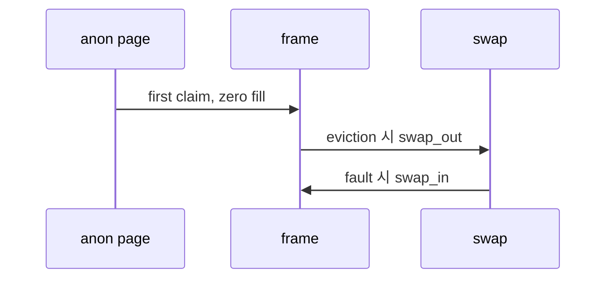

# 04 — 기능 3: Anonymous Page

## 1. 구현 목적 및 필요성

### 이 기능이 무엇인가
파일에 직접 대응하지 않는 유저 페이지를 anonymous page로 관리하는 기능입니다.

### 왜 이걸 하는가
stack growth, zero page, heap 성격의 페이지는 파일에서 다시 읽을 수 없으므로 eviction 시 swap에 저장해야 합니다.

### 무엇을 연결하는가
`anon_initializer()`, `anon_swap_in()`, `anon_swap_out()`, stack growth, frame eviction을 연결합니다.

### 완성의 의미
anonymous page는 처음에는 zero page로 동작하고, eviction 후에도 swap에서 정확히 복구됩니다.

## 2. 가능한 구현 방식 비교

- 방식 A: anonymous page에 swap slot index를 저장
  - 장점: swap in/out 상태 추적이 명확
  - 단점: slot 해제 규칙 필요
- 방식 B: frame에만 swap 정보를 저장
  - 장점: loaded 상태에서는 단순
  - 단점: evicted page 복구가 어려움
- 선택: page metadata에 swap slot 상태를 둔다.

## 3. 시퀀스와 단계별 흐름

## 4. 기능별 가이드

### 4.1 Anonymous initializer
- 위치: `vm/anon.c`
- page operations와 swap metadata를 초기화합니다.

### 4.2 Swap 연결
- 위치: `vm/anon.c`
- frame eviction 시 swap out, fault claim 시 swap in을 수행합니다.

## 5. 구현 주석

### 5.1 `anon_initializer()`

#### 5.1.1 anonymous page 초기화
- 위치: `vm/anon.c`
- 역할: anonymous page operation과 type-specific metadata를 세팅한다.
- 규칙 1: 최초 claim은 zero-filled page가 되어야 한다.
- 규칙 2: swap slot이 없다는 상태를 명확히 표현한다.
- 금지 1: anonymous page를 file write-back 대상으로 처리하지 않는다.

### 5.2 `anon_swap_in()` / `anon_swap_out()`

#### 5.2.1 swap in/out
- 위치: `vm/anon.c`
- 역할: anonymous page 내용을 swap disk에 저장/복구한다.
- 규칙 1: swap out 성공 시 page가 slot을 소유한다.
- 규칙 2: swap in 성공 시 slot을 해제한다.
- 금지 1: swap slot bitmap과 page metadata를 따로 놀게 하지 않는다.

## 6. 테스팅 방법

- stack growth 이후 메모리 내용 유지
- swap 관련 테스트
- eviction 후 anonymous page 재접근 테스트
