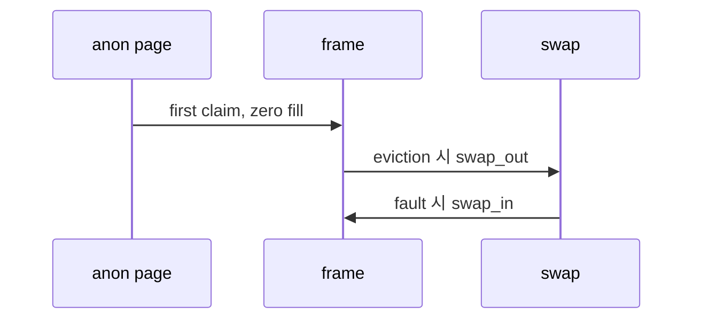
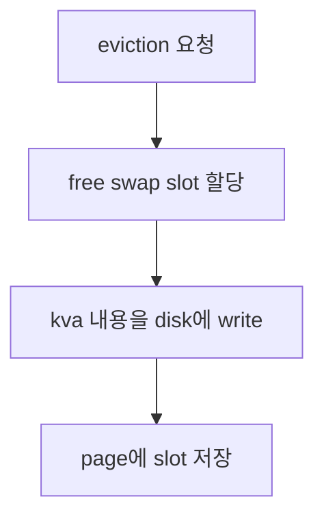

# 04 — 기능 3: Anonymous Page

## 1. 구현 목적 및 필요성
### 이 기능이 무엇인가
파일에 직접 대응하지 않는 유저 페이지를 anonymous page로 관리하는 기능입니다.
### 왜 이걸 하는가 (문제 맥락)
stack growth, zero page, heap 성격의 페이지는 파일에서 다시 읽을 수 없으므로 eviction 시 swap에 저장해야 합니다.
### 무엇을 연결하는가 (기술 맥락)
`pintos/vm/anon.c`의 `anon_initializer()`, `anon_swap_in()`, `anon_swap_out()`, stack growth, frame eviction 경로를 연결합니다.
### 완성의 의미 (결과 관점)
anonymous page는 처음에는 zero page로 동작하고, eviction 후에도 swap에서 정확히 복구됩니다.

## 2. 가능한 구현 방식 비교
- 방식 A: anonymous page에 swap slot index를 저장
  - 장점: swap in/out 상태 추적이 명확
  - 단점: slot 해제 규칙 필요
- 방식 B: frame에만 swap 정보를 저장
  - 장점: loaded 상태에서는 단순
  - 단점: evicted page 복구가 어려움
- 선택: page metadata에 swap slot 상태를 둔다.

## 3. 시퀀스와 단계별 흐름

1. 초기 claim에서 zero 또는 일반 로드한다.
2. eviction에서 swap에 쓴다.
3. 재 fault에서 swap에서 읽는다.

## 4. 기능별 가이드 (개념/흐름 + 구현 주석 위치)
### 4.1 기능 A: anonymous page operation 설정
#### 개념 설명
anonymous page는 backing file이 없는 page입니다. 따라서 page operation을 anonymous 전용으로 설정하고, eviction 후 복구할 수 있도록 swap metadata를 준비해야 합니다.
#### 시퀀스 및 흐름

1. page operation table을 `anon_ops`로 바꾼다.
2. swap slot이 아직 없다는 상태를 page metadata에 저장한다.
3. 최초 claim에서는 file read 없이 zero-filled page로 시작한다.
#### 구현 주석 (보면 되는 함수/구조체)
- 위치: `pintos/vm/anon.c`의 `anon_initializer()`
- 위치: `pintos/include/vm/anon.h`의 `struct anon_page`

### 4.2 기능 B: anonymous page swap out
#### 개념 설명
anonymous page는 파일에서 다시 읽을 수 없으므로 eviction 시 현재 frame 내용을 swap disk에 저장해야 합니다. 저장 성공 후 page는 어떤 swap slot에 내용이 있는지 기억해야 합니다.
#### 시퀀스 및 흐름

1. swap bitmap에서 빈 slot을 할당한다.
2. frame kva의 PGSIZE 내용을 swap disk에 기록한다.
3. page metadata에 slot 번호를 남긴다.
#### 구현 주석 (보면 되는 함수/구조체)
- 위치: `pintos/vm/anon.c`의 `anon_swap_out()`
- 위치: swap bitmap과 disk sector 계산 코드

### 4.3 기능 C: anonymous page swap in
#### 개념 설명
swap out된 anonymous page에 다시 접근하면 page fault가 발생합니다. claim 과정에서 저장된 swap slot을 읽어 frame에 복구하고, 복구가 끝난 slot은 재사용 가능하게 해제해야 합니다.
#### 시퀀스 및 흐름

1. page metadata에 저장된 slot 번호를 확인한다.
2. swap disk에서 frame kva로 PGSIZE만큼 읽는다.
3. 읽기 성공 후 bitmap slot을 해제하고 page slot 상태를 초기화한다.
#### 구현 주석 (보면 되는 함수/구조체)
- 위치: `pintos/vm/anon.c`의 `anon_swap_in()`
- 위치: `pintos/vm/vm.c`의 claim 경로

## 5. 구현 주석 (위치별 정리)
### 5.1 `anon_initializer()`
- 위치: `pintos/vm/anon.c`의 `anon_initializer()`
- 역할: anonymous page operation과 type-specific metadata를 세팅한다.
- 규칙 1: 최초 claim은 zero-filled page가 되어야 한다.
- 규칙 2: swap slot이 없다는 상태를 명확히 표현한다.
- 금지 1: anonymous page를 file write-back 대상으로 처리하지 않는다.

구현 체크 순서:
1. `page->operations`를 `anon_ops`로 설정한다.
2. `page->anon` 안의 swap slot 상태를 "없음" 값으로 초기화한다.
3. 최초 claim 경로에서 frame 내용이 zero page로 시작하는지 확인한다.

### 5.2 `anon_swap_out()`
- 위치: `pintos/vm/anon.c`의 `anon_swap_out()`
- 역할: eviction되는 anonymous page 내용을 swap disk에 저장한다.
- 규칙 1: swap out 성공 시 page가 slot을 소유한다.
- 금지 1: 같은 page가 여러 swap slot을 동시에 소유하지 않는다.

구현 체크 순서:
1. swap bitmap에서 free slot을 하나 할당한다.
2. frame kva의 PGSIZE 내용을 swap disk에 sector 단위로 쓴다.
3. page metadata에 slot 번호를 저장하고 swap out 성공 여부를 반환한다.

### 5.3 `anon_swap_in()`
- 위치: `pintos/vm/anon.c`의 `anon_swap_in()`
- 역할: swap out된 anonymous page 내용을 다시 frame에 읽어 온다.
- 규칙 1: swap in 성공 시 slot을 해제한다.
- 금지 1: swap slot bitmap과 page metadata를 따로 놀게 하지 않는다.

구현 체크 순서:
1. page metadata에 저장된 swap slot 번호가 유효한지 확인한다.
2. 해당 slot의 PGSIZE 내용을 전달받은 kva로 sector 단위로 읽는다.
3. bitmap slot을 해제하고 page metadata의 slot 상태를 "없음"으로 되돌린다.

## 6. 테스팅 방법
- stack growth 이후 메모리 내용 유지
- swap 관련 테스트
- eviction 후 anonymous page 재접근 테스트
