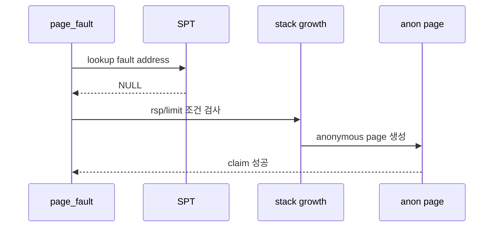

# 01 — Stack Growth 전체 개념과 동작 흐름

이 문서는 stack growth를 처음 볼 때 필요한 큰 그림을 잡기 위한 개요 문서입니다.

---

## 1) Stack Growth를 한 문장으로 설명하면

**"현재 스택 근처의 합법적인 page fault를 anonymous page 생성으로 복구하는 기능"**입니다.

핵심은 모든 SPT miss를 stack으로 허용하지 않고, rsp와 최대 스택 크기 기준으로 제한하는 것입니다.

---

## 2) 왜 필요한가

사용자 스택은 실행 중 함수 호출, 지역 변수, push 동작으로 아래 방향으로 자랄 수 있습니다.  
초기 stack page만 매핑되어 있으면 정상적인 stack 접근도 page fault가 날 수 있습니다.

---

## 3) 동작 시퀀스

1. page fault에서 SPT lookup이 실패한다.
2. fault address가 user stack으로 확장 가능한지 검사한다.
3. 가능하면 anonymous page를 SPT에 등록하고 claim한다.
4. 불가능하면 잘못된 접근으로 종료한다.

---

## 4) 반드시 분리해서 이해할 개념

- **SPT miss**: 아직 page metadata가 없는 상태
- **stack growth 가능 fault**: rsp 근처, user stack 범위 안의 접근
- **invalid access**: kernel address, 너무 아래 주소, 권한 위반 접근

---

## 5) 자주 틀리는 지점

- rsp와 너무 멀리 떨어진 주소를 stack으로 허용
- 최대 stack 크기 제한을 두지 않음
- kernel address 방향 접근을 stack growth로 처리
- stack page를 anonymous page가 아닌 다른 타입으로 생성

---

## 6) 학습 순서

1. `02-feature-fault-address-and-rsp.md`
2. `03-feature-stack-limit-and-invalid-access.md`
