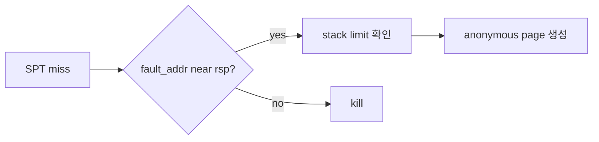

# 02 — 기능 1: Fault Address와 RSP 기준

## 1. 구현 목적 및 필요성

### 이 기능이 무엇인가
page fault 주소가 현재 user stack pointer 근처인지 확인해 stack growth 가능성을 판정하는 기능입니다.

### 왜 이걸 하는가
CPU의 push나 함수 호출은 rsp 바로 아래 주소에 접근할 수 있습니다. 이 접근은 SPT에 없어도 정상일 수 있습니다.

### 무엇을 연결하는가
`page_fault()`, `struct intr_frame.rsp`, `vm_try_handle_fault()`, `vm_stack_growth()`를 연결합니다.

### 완성의 의미
정상 stack 접근은 anonymous page 생성으로 복구되고, 임의의 낮은 주소 접근은 종료됩니다.

## 2. 가능한 구현 방식 비교

- 방식 A: `fault_addr >= rsp - 8` 같은 근접 조건 사용
  - 장점: push 계열 접근을 허용
  - 단점: 조건 상수를 팀에서 확정해야 함
- 방식 B: stack 범위 안이면 모두 허용
  - 장점: 구현이 쉬움
  - 단점: 잘못된 포인터를 stack으로 오판
- 선택: rsp 근접 조건과 stack limit을 함께 적용한다.

## 3. 시퀀스와 단계별 흐름

## 4. 기능별 가이드

### 4.1 fault address
- 위치: `userprog/exception.c`
- CR2에서 얻은 fault address를 VM 경로로 전달합니다.

### 4.2 rsp
- 위치: `userprog/exception.c`, `vm/vm.c`
- user mode fault에서는 intr_frame의 rsp를, kernel mode user access fault에서는 저장된 user rsp 정책을 확인합니다.

## 5. 구현 주석

### 5.1 `vm_try_handle_fault()`

#### 5.1.1 stack growth 판정
- 위치: `vm/vm.c`
- 역할: SPT miss인 fault를 stack growth로 복구할 수 있는지 판단한다.
- 규칙 1: fault address는 user address여야 한다.
- 규칙 2: fault address가 rsp 근처여야 한다.
- 규칙 3: 최대 stack 크기를 넘지 않아야 한다.
- 금지 1: 모든 SPT miss를 stack growth로 처리하지 않는다.

## 6. 테스팅 방법

- stack growth 단일 테스트
- bad pointer 계열 회귀
- syscall buffer가 stack 근처 boundary를 넘는 경우
