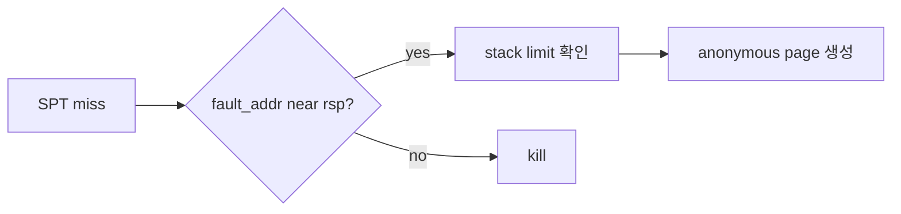
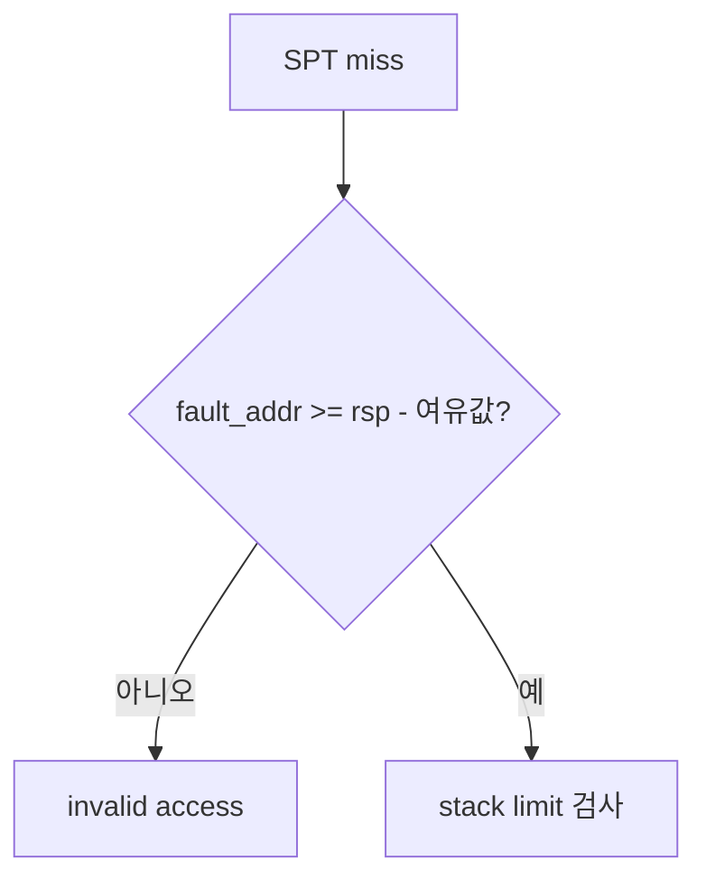
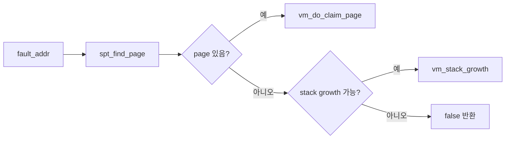

# 02 — 기능 1: Fault Address와 RSP 기준

## 1. 구현 목적 및 필요성

### 이 기능이 무엇인가
page fault 주소가 현재 user stack pointer 근처인지 확인해 stack growth 가능성을 판정하는 기능입니다.

### 왜 이걸 하는가
CPU의 push나 함수 호출은 rsp 바로 아래 주소에 접근할 수 있습니다. 이 접근은 SPT에 없어도 정상일 수 있습니다.

### 무엇을 연결하는가
`page_fault()`, `struct intr_frame.rsp`, `vm_try_handle_fault()`, `vm_stack_growth()`를 연결합니다.

### 완성의 의미
정상 stack 접근은 anonymous page 생성으로 복구되고, 임의의 낮은 주소 접근은 종료됩니다.

## 2. 가능한 구현 방식 비교

- 방식 A: `fault_addr >= rsp - 8` 같은 근접 조건 사용
  - 장점: push 계열 접근을 허용
  - 단점: 조건 상수를 팀에서 확정해야 함
- 방식 B: stack 범위 안이면 모두 허용
  - 장점: 구현이 쉬움
  - 단점: 잘못된 포인터를 stack으로 오판
- 선택: rsp 근접 조건과 stack limit을 함께 적용한다.

## 3. 시퀀스와 단계별 흐름

## 4. 기능별 가이드 (개념/흐름 + 구현 주석 위치)

### 4.1 기능 A: fault address 전달
#### 개념 설명
stack growth 판단의 출발점은 실제로 fault가 난 주소입니다. page fault handler는 CR2에서 얻은 fault address를 VM fault handler로 정확히 넘겨야 합니다.

#### 시퀀스 및 흐름

1. page fault 진입 시 fault address를 읽는다.
2. user/write/not-present 여부를 함께 계산한다.
3. VM handler가 stack growth 여부를 판단할 수 있도록 인자를 보존한다.

#### 구현 주석 (보면 되는 함수/구조체)
- 위치: `userprog/exception.c`의 `page_fault()`
- 위치: `vm/vm.c`의 `vm_try_handle_fault()`

### 4.2 기능 B: rsp 근접 조건
#### 개념 설명
정상적인 stack 접근은 현재 user stack pointer 근처에서 발생합니다. `push`나 함수 호출은 `rsp` 바로 아래를 건드릴 수 있으므로, fault address가 rsp 근처인지 확인해야 합니다.

#### 시퀀스 및 흐름

1. user mode fault에서는 `intr_frame.rsp`를 기준으로 삼는다.
2. kernel mode에서 user memory를 접근하다 fault난 경우 저장된 user rsp 정책을 확인한다.
3. rsp 근처가 아니면 임의 포인터 접근으로 보고 stack growth를 거부한다.

#### 구현 주석 (보면 되는 함수/구조체)
- 위치: `vm/vm.c`의 `vm_try_handle_fault()`
- 위치: `userprog/exception.c`의 fault context 판별

### 4.3 기능 C: 기존 page claim과 stack growth 분기
#### 개념 설명
모든 page fault가 stack growth는 아닙니다. 먼저 SPT에서 기존 page를 찾아 claim하고, 없는 경우에만 rsp와 stack limit 조건을 검사해 새 stack page를 만들지 결정해야 합니다.

#### 시퀀스 및 흐름

1. not-present fault인지 먼저 확인한다.
2. SPT hit이면 stack growth가 아니라 기존 lazy/swapped page claim으로 처리한다.
3. SPT miss일 때만 stack growth 조건을 평가한다.

#### 구현 주석 (보면 되는 함수/구조체)
- 위치: `vm/vm.c`의 `vm_try_handle_fault()`
- 위치: `vm/vm.c`의 `spt_find_page()`, `vm_stack_growth()`

## 5. 구현 주석

### 5.1 `vm_try_handle_fault()`

#### 5.1.1 `vm_try_handle_fault()`에서 stack growth 가능 여부 판정
- 수정 위치: `vm/vm.c`의 `vm_try_handle_fault()`
- 역할: SPT miss인 fault를 stack growth로 복구할 수 있는지 판단한다.
- 규칙 1: fault address는 user address여야 한다.
- 규칙 2: fault address가 rsp 근처여야 한다.
- 규칙 3: 최대 stack 크기를 넘지 않아야 한다.
- 금지 1: 모든 SPT miss를 stack growth로 처리하지 않는다.

구현 체크 순서:
1. `not_present`, `user`, `write` 조건과 fault address가 user vaddr인지 먼저 검증한다.
2. `spt_find_page()` 결과가 있으면 기존 page claim 경로로 보내고, 없으면 stack growth 후보인지 판단한다.
3. fault address가 rsp 근처이고 stack 하한 안에 있으면 `vm_stack_growth()`를 호출한 뒤 claim한다.

## 6. 테스팅 방법

- stack growth 단일 테스트
- bad pointer 계열 회귀
- syscall buffer가 stack 근처 boundary를 넘는 경우
