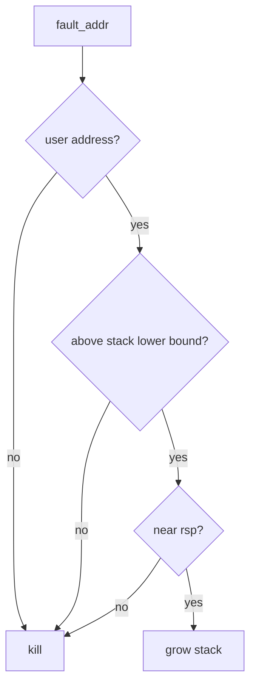
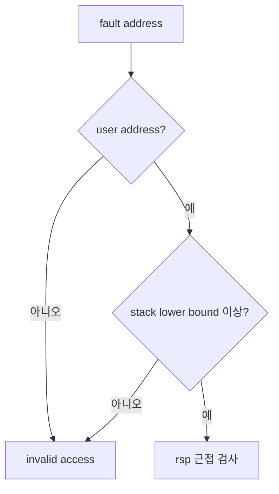
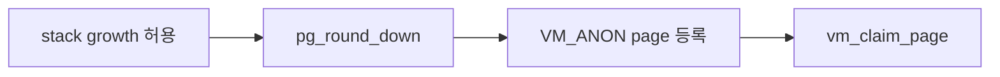
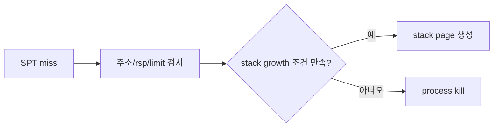

# 03 — 기능 2: Stack Limit과 Invalid Access

## 1. 구현 목적 및 필요성

### 이 기능이 무엇인가
stack growth가 허용되는 최대 범위와 명백히 잘못된 접근을 구분하는 기능입니다.

### 왜 이걸 하는가
제한 없이 stack을 늘리면 잘못된 포인터 접근이 정상 메모리처럼 복구됩니다.

### 무엇을 연결하는가
`USER_STACK`, stack maximum size, `is_user_vaddr()`, SPT miss 정책을 연결합니다.

### 완성의 의미
정상 stack 확장은 통과하고, 너무 낮은 주소나 kernel address 접근은 종료됩니다.

## 2. 가능한 구현 방식 비교

- 방식 A: `USER_STACK - max_stack_size` 하한을 둔다.
  - 장점: 명확하고 테스트 추적이 쉬움
  - 단점: limit 상수를 정확히 맞춰야 함
- 방식 B: page 수로만 제한한다.
  - 장점: 구현 가능
  - 단점: 주소 기준 디버깅이 어려움
- 선택: 주소 하한과 page 단위 생성을 함께 사용한다.

## 3. 시퀀스와 단계별 흐름

## 4. 기능별 가이드 (개념/흐름 + 구현 주석 위치)

### 4.1 기능 A: stack lower bound 적용
#### 개념 설명
stack growth는 무한히 허용되면 안 됩니다. `USER_STACK`에서 최대 stack 크기를 뺀 하한을 두고, 그보다 낮은 주소는 잘못된 접근으로 처리해야 합니다.

#### 시퀀스 및 흐름

1. fault address가 user virtual address인지 확인한다.
2. `USER_STACK - max_stack_size`보다 낮은 주소를 거부한다.
3. 하한 검사를 통과한 주소만 rsp 근접 조건으로 넘긴다.

#### 구현 주석 (보면 되는 함수/구조체)
- 위치: `vm/vm.c`의 `vm_try_handle_fault()`
- 위치: stack maximum size 상수 정의 위치

### 4.2 기능 B: anonymous stack page 생성
#### 개념 설명
정상 stack growth로 판정되면 fault address가 속한 page를 anonymous writable page로 등록해야 합니다. page 단위로 만들지 않으면 같은 stack page 내부 접근에서 SPT lookup이 흔들릴 수 있습니다.

#### 시퀀스 및 흐름

1. fault address를 page boundary로 내린다.
2. anonymous writable page를 SPT에 등록한다.
3. 즉시 claim해서 fault를 복구한다.

#### 구현 주석 (보면 되는 함수/구조체)
- 위치: `vm/vm.c`의 `vm_stack_growth()`
- 위치: `vm/vm.c`의 `vm_alloc_page()`, `vm_claim_page()`

### 4.3 기능 C: invalid access 차단
#### 개념 설명
SPT miss를 모두 stack으로 취급하면 bad pointer 테스트가 통과하지 못합니다. kernel address, 너무 낮은 주소, rsp와 무관한 주소는 stack growth가 아니라 프로세스 종료 경로로 보내야 합니다.

#### 시퀀스 및 흐름

1. not-present fault가 아닌 write-protect fault와 구분한다.
2. kernel address와 NULL 근처 주소를 거부한다.
3. stack 조건 실패 시 false를 반환해 page fault handler가 종료 처리하도록 한다.

#### 구현 주석 (보면 되는 함수/구조체)
- 위치: `vm/vm.c`의 `vm_try_handle_fault()`
- 위치: `userprog/exception.c`의 fault 실패 처리

## 5. 구현 주석

### 5.1 `vm_stack_growth()`

#### 5.1.1 `vm_stack_growth()`에서 anonymous stack page 생성
- 수정 위치: `vm/vm.c`의 `vm_stack_growth()`
- 역할: stack page를 SPT에 등록하고 claim한다.
- 규칙 1: page-aligned fault address로 생성한다.
- 규칙 2: type은 anonymous page여야 한다.
- 규칙 3: writable page로 만든다.
- 금지 1: 같은 upage를 중복 insert하지 않는다.

구현 체크 순서:
1. fault address를 `pg_round_down()`으로 stack page 기준 주소로 정규화한다.
2. `vm_alloc_page(VM_ANON | VM_MARKER_0, upage, true)` 또는 팀 구현의 anonymous page 생성 함수를 호출한다.
3. 생성 성공 후 `vm_claim_page(upage)`로 즉시 frame을 붙여 fault를 복구한다.

## 6. 테스팅 방법

- stack growth 테스트
- stack overflow/invalid pointer 테스트
- swap과 함께 stack page 내용 유지 확인
