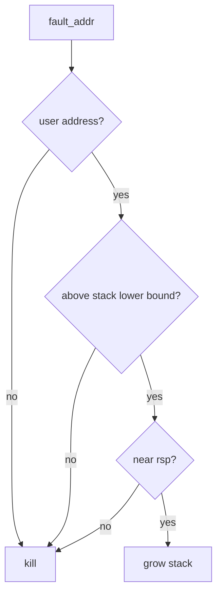

# 03 — 기능 2: Stack Limit과 Invalid Access

## 1. 구현 목적 및 필요성

### 이 기능이 무엇인가
stack growth가 허용되는 최대 범위와 명백히 잘못된 접근을 구분하는 기능입니다.

### 왜 이걸 하는가
제한 없이 stack을 늘리면 잘못된 포인터 접근이 정상 메모리처럼 복구됩니다.

### 무엇을 연결하는가
`USER_STACK`, stack maximum size, `is_user_vaddr()`, SPT miss 정책을 연결합니다.

### 완성의 의미
정상 stack 확장은 통과하고, 너무 낮은 주소나 kernel address 접근은 종료됩니다.

## 2. 가능한 구현 방식 비교

- 방식 A: `USER_STACK - max_stack_size` 하한을 둔다.
  - 장점: 명확하고 테스트 추적이 쉬움
  - 단점: limit 상수를 정확히 맞춰야 함
- 방식 B: page 수로만 제한한다.
  - 장점: 구현 가능
  - 단점: 주소 기준 디버깅이 어려움
- 선택: 주소 하한과 page 단위 생성을 함께 사용한다.

## 3. 시퀀스와 단계별 흐름

## 4. 기능별 가이드

### 4.1 Stack lower bound
- 위치: `vm/vm.c`
- `USER_STACK`에서 최대 stack 크기를 뺀 주소보다 아래는 거부합니다.

### 4.2 Invalid access
- 위치: `userprog/exception.c`, `vm/vm.c`
- write/read/not-present 조건과 함께 kill 여부를 판정합니다.

## 5. 구현 주석

### 5.1 `vm_stack_growth()`

#### 5.1.1 anonymous stack page 생성
- 위치: `vm/vm.c`
- 역할: stack page를 SPT에 등록하고 claim한다.
- 규칙 1: page-aligned fault address로 생성한다.
- 규칙 2: type은 anonymous page여야 한다.
- 규칙 3: writable page로 만든다.
- 금지 1: 같은 upage를 중복 insert하지 않는다.

## 6. 테스팅 방법

- stack growth 테스트
- stack overflow/invalid pointer 테스트
- swap과 함께 stack page 내용 유지 확인
