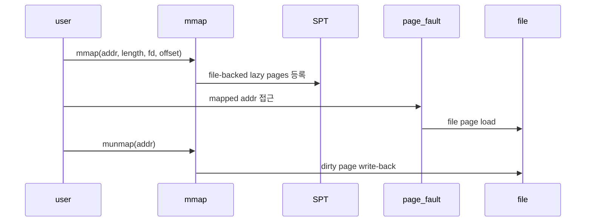

# 01 — Memory Mapped Files 전체 개념과 동작 흐름

이 문서는 mmap/munmap과 file-backed page의 큰 흐름을 잡기 위한 개요 문서입니다.

---

## 1) mmap을 한 문장으로 설명하면

**"파일의 특정 범위를 프로세스 가상 주소 범위에 lazy file-backed page로 연결하는 기능"**입니다.

핵심은 syscall 순간에 파일 전체를 읽지 않고, SPT에 mapping metadata를 등록한 뒤 fault 시점에 로드한다는 점입니다.

---

## 2) 왜 필요한가

파일을 read/write syscall로 복사하지 않고도, 메모리 접근처럼 파일 내용을 다룰 수 있게 합니다.  
수정된 page는 `munmap` 또는 process exit에서 파일에 반영되어야 합니다.

---

## 3) 동작 시퀀스

---

## 4) 반드시 분리해서 이해할 개념

- **mapping range**: mmap syscall 하나가 만든 주소 범위
- **file-backed page**: file/ofs/read_bytes/zero_bytes를 가진 page
- **dirty write-back**: 수정된 page만 파일에 반영
- **fd vs reopened file**: fd close와 mapping 수명을 분리하기 위한 file 객체

---

## 5) 자주 틀리는 지점

- addr 정렬/NULL/overlap 검증 누락
- fd close 후 mmap page가 파일을 잃음
- partial page의 zero fill 또는 write-back 범위 오류
- munmap과 process exit에서 중복 write/free

---

## 6) 학습 순서

1. `02-feature-mmap-validation-and-registration.md`
2. `03-feature-file-backed-page-load.md`
3. `04-feature-munmap-and-write-back.md`

---

## 7) 구현 전 체크 질문

- mmap addr, length, fd, overlap 실패 조건을 등록 전에 모두 검사하는가?
- fd close와 mmap page의 file 수명을 분리했는가?
- partial page의 zero fill과 write-back 길이를 구분하는가?
- munmap과 process exit에서 같은 page를 중복 정리하지 않는가?
