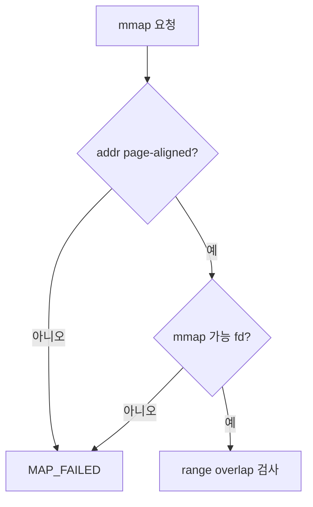
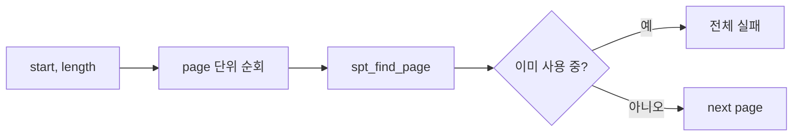

# 02 — 기능 1: Mmap Validation and Registration

## 1. 구현 목적 및 필요성

### 이 기능이 무엇인가
`mmap` syscall 인자를 검증하고, 파일 범위를 page 단위 file-backed lazy page로 SPT에 등록하는 기능입니다.

### 왜 이걸 하는가
잘못된 주소나 이미 사용 중인 range를 허용하면 SPT와 pml4 상태가 깨집니다.

### 무엇을 연결하는가
`sys_mmap()`, fd table, `file_reopen()`, SPT insert, file-backed page initializer를 연결합니다.

### 완성의 의미
유효한 mmap은 시작 주소를 반환하고, 실패 조건은 `NULL` 또는 명세된 실패값으로 처리됩니다.

## 2. 가능한 구현 방식 비교

- 방식 A: mmap metadata를 별도 list로 관리
  - 장점: munmap(addr)에서 range 순회가 쉬움
  - 단점: SPT와 중복 상태 관리 필요
- 방식 B: SPT만 보고 munmap
  - 장점: 구조가 단순
  - 단점: mapping 단위 경계 추적이 어려움
- 선택: 팀 구현 상황에 맞추되, range 경계는 반드시 추적한다.

## 3. 시퀀스와 단계별 흐름

## 4. 기능별 가이드 (개념/흐름 + 구현 주석 위치)

### 4.1 기능 A: mmap syscall 인자 검증
#### 개념 설명
`mmap`은 사용자 주소 공간에 파일 내용을 연결하므로 주소, 길이, fd, offset 조건이 틀리면 SPT와 file 상태가 함께 깨집니다. 등록 전에 실패 조건을 먼저 걸러야 합니다.

#### 시퀀스 및 흐름

1. `addr`가 NULL이 아니고 page-aligned인지 확인한다.
2. `length > 0`, file length, offset 조건을 확인한다.
3. fd가 열린 regular file인지 확인한다.

#### 구현 주석 (보면 되는 함수/구조체)
- 위치: `userprog/syscall.c`의 `sys_mmap()`
- 위치: fd table lookup helper

### 4.2 기능 B: mmap range overlap 검사
#### 개념 설명
새 mmap range가 이미 SPT에 등록된 page와 겹치면 기존 page metadata를 덮어쓰게 됩니다. range 전체를 page 단위로 검사한 뒤 하나라도 사용 중이면 mmap 전체를 실패시켜야 합니다.

#### 시퀀스 및 흐름

1. mmap 대상 주소 범위를 page 단위로 나눈다.
2. 각 upage에 대해 SPT entry 존재 여부를 확인한다.
3. 하나라도 겹치면 page 등록을 시작하지 않는다.

#### 구현 주석 (보면 되는 함수/구조체)
- 위치: `userprog/syscall.c`의 `sys_mmap()`
- 위치: `vm/vm.c`의 `spt_find_page()`

### 4.3 기능 C: file-backed lazy page 등록
#### 개념 설명
mmap은 syscall 시점에 파일 전체를 읽는 기능이 아니라 file-backed lazy page를 SPT에 등록하는 기능입니다. 각 page는 fault 시점에 읽을 file offset과 byte 수를 기억해야 합니다.

#### 시퀀스 및 흐름

1. fd close와 독립되도록 file 객체 수명을 분리한다.
2. file range를 page 단위로 쪼개 offset/read_bytes/zero_bytes를 계산한다.
3. `vm_alloc_page_with_initializer(VM_FILE, ...)`로 각 page를 SPT에 등록한다.

#### 구현 주석 (보면 되는 함수/구조체)
- 위치: `vm/file.c`의 `do_mmap()`
- 위치: `vm/vm.c`의 `vm_alloc_page_with_initializer()`

## 5. 구현 주석

### 5.1 `sys_mmap()`

#### 5.1.1 `sys_mmap()`에서 mmap syscall 인자 검증
- 수정 위치: `userprog/syscall.c`의 `sys_mmap()`
- 역할: 사용자 mmap 요청이 유효한지 판단한다.
- 규칙 1: addr는 NULL이 아니고 page-aligned여야 한다.
- 규칙 2: length는 0보다 커야 한다.
- 규칙 3: fd는 mmap 가능한 열린 파일이어야 한다.
- 금지 1: 이미 SPT에 page가 있는 range를 덮어쓰지 않는다.

구현 체크 순서:
1. syscall 인자 `addr`, `length`, `writable`, `fd`, `offset`을 꺼내 기본 유효성을 검사한다.
2. fd table에서 mmap 가능한 file을 찾고 file length와 offset 조건을 확인한다.
3. 대상 address range를 page 단위로 훑어 SPT overlap이 없으면 `do_mmap()`으로 넘긴다.

### 5.2 `do_mmap()`

#### 5.2.1 `do_mmap()`에서 page별 file-backed lazy page 등록
- 수정 위치: `vm/file.c`의 `do_mmap()`
- 역할: file range를 page 단위 lazy page로 등록한다.
- 규칙 1: page마다 file offset/read_bytes/zero_bytes를 보존한다.
- 규칙 2: fd close와 독립되도록 file 수명을 관리한다.
- 금지 1: syscall 시점에 파일 전체를 미리 읽지 않는다.

구현 체크 순서:
1. `file_reopen()` 등으로 mmap page들이 사용할 file 수명을 분리한다.
2. length를 page 단위로 나누며 각 page의 offset/read_bytes/zero_bytes aux를 만든다.
3. `vm_alloc_page_with_initializer(VM_FILE, ...)`로 등록하고 실패 시 이미 등록한 range를 정리한다.

## 6. 테스팅 방법

- mmap invalid address/fd/length 테스트
- mmap overlap 테스트
- close-after-mmap 테스트
