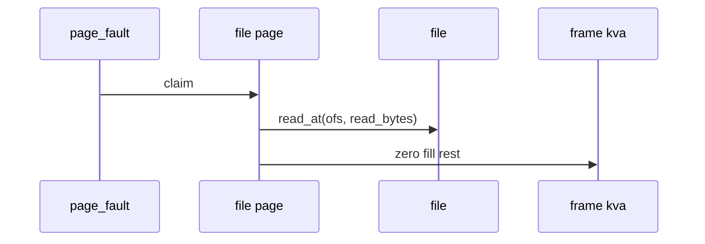

# 03 — 기능 2: File-backed Page Load

## 1. 구현 목적 및 필요성

### 이 기능이 무엇인가
mmap된 file-backed page가 fault 시점에 파일에서 내용을 읽고 남은 영역을 zero fill하는 기능입니다.

### 왜 이걸 하는가
mmap도 lazy loading이므로 실제 파일 내용은 접근한 page만 frame에 올라와야 합니다.

### 무엇을 연결하는가
`file_backed_initializer()`, `file_backed_swap_in()`, file offset, read_bytes, zero_bytes를 연결합니다.

### 완성의 의미
mapped address를 읽으면 파일 내용과 같은 bytes가 보이고, 파일 길이를 넘는 page 영역은 zero입니다.

## 2. 가능한 구현 방식 비교

- 방식 A: file page aux에 offset/read_bytes를 저장
  - 장점: fault 처리 단순
  - 단점: aux 수명 관리 필요
- 방식 B: mapping 전체 metadata에서 page별 계산
  - 장점: 중복 정보 감소
  - 단점: fault 때 계산 실수 가능
- 선택: page별 정보를 명확히 저장한다.

## 3. 시퀀스와 단계별 흐름

## 4. 기능별 가이드

### 4.1 File page initializer
- 위치: `vm/file.c`
- file-backed page operation을 설정합니다.

### 4.2 Swap in
- 위치: `vm/file.c`
- file page의 "swap in"은 파일에서 다시 읽는 동작입니다.

## 5. 구현 주석

### 5.1 `file_backed_swap_in()`

#### 5.1.1 file page 로드
- 위치: `vm/file.c`
- 역할: file-backed page 내용을 frame에 채운다.
- 규칙 1: 저장된 offset에서 read_bytes만큼 읽는다.
- 규칙 2: 나머지 zero_bytes 영역은 0으로 채운다.
- 금지 1: file length 밖의 영역을 쓰레기 값으로 남기지 않는다.

## 6. 테스팅 방법

- mmap-read 테스트
- partial page 테스트
- close-after-mmap 회귀
