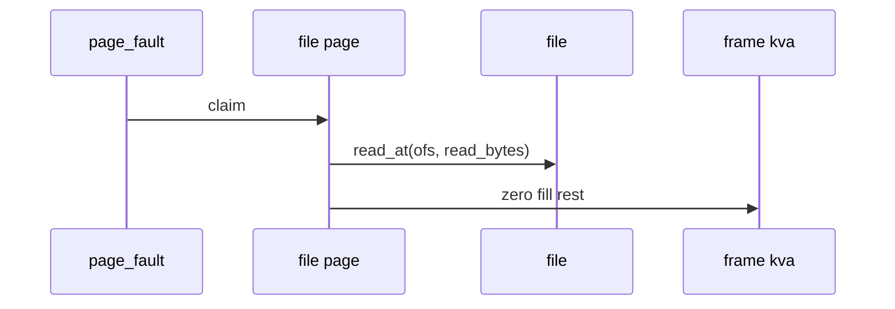
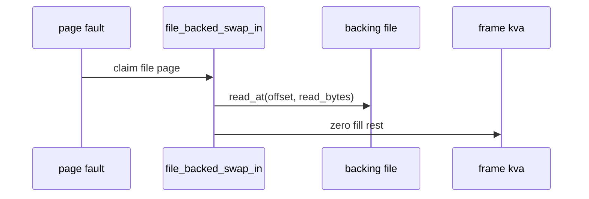
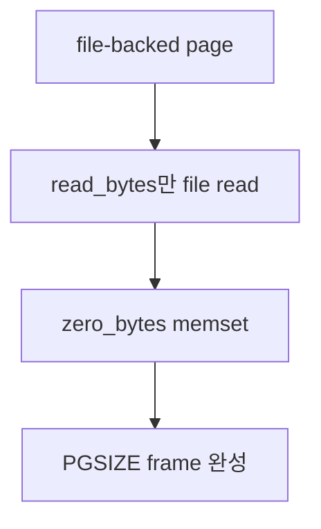

# 03 — 기능 2: File-backed Page Load

## 1. 구현 목적 및 필요성

### 이 기능이 무엇인가
mmap된 file-backed page가 fault 시점에 파일에서 내용을 읽고 남은 영역을 zero fill하는 기능입니다.

### 왜 이걸 하는가
mmap도 lazy loading이므로 실제 파일 내용은 접근한 page만 frame에 올라와야 합니다.

### 무엇을 연결하는가
`file_backed_initializer()`, `file_backed_swap_in()`, file offset, read_bytes, zero_bytes를 연결합니다.

### 완성의 의미
mapped address를 읽으면 파일 내용과 같은 bytes가 보이고, 파일 길이를 넘는 page 영역은 zero입니다.

## 2. 가능한 구현 방식 비교

- 방식 A: file page aux에 offset/read_bytes를 저장
  - 장점: fault 처리 단순
  - 단점: aux 수명 관리 필요
- 방식 B: mapping 전체 metadata에서 page별 계산
  - 장점: 중복 정보 감소
  - 단점: fault 때 계산 실수 가능
- 선택: page별 정보를 명확히 저장한다.

## 3. 시퀀스와 단계별 흐름

## 4. 기능별 가이드 (개념/흐름 + 구현 주석 위치)

### 4.1 기능 A: file-backed page operation 설정
#### 개념 설명
file-backed page는 anonymous page와 달리 backing file이 있습니다. fault나 eviction에서 file 전용 swap-in/out 정책을 쓰도록 page operation table을 file-backed 전용으로 설정해야 합니다.

#### 시퀀스 및 흐름

1. file-backed page initializer에서 operation table을 설정한다.
2. page별 file, offset, read_bytes, zero_bytes metadata를 보존한다.
3. claim 시 file-backed `swap_in()`이 호출될 수 있게 연결한다.

#### 구현 주석 (보면 되는 함수/구조체)
- 위치: `vm/file.c`의 `file_backed_initializer()`
- 위치: `include/vm/file.h`의 `struct file_page`

### 4.2 기능 B: fault 시점 file read
#### 개념 설명
mmap page는 접근하기 전까지 frame에 올라오지 않습니다. fault가 나면 저장해 둔 file offset에서 필요한 byte만 읽고, page의 나머지 영역은 zero fill해야 합니다.

#### 시퀀스 및 흐름

1. `page->file` metadata에서 file offset과 read/zero 크기를 확인한다.
2. frame kva에 read_bytes만큼 파일 내용을 읽는다.
3. 남은 zero_bytes 영역을 0으로 채운다.

#### 구현 주석 (보면 되는 함수/구조체)
- 위치: `vm/file.c`의 `file_backed_swap_in()`
- 위치: filesys file read API

### 4.3 기능 C: partial page와 file length 경계
#### 개념 설명
파일 끝이 page 중간에서 끝나는 경우 나머지 영역은 파일 내용이 아니라 0이어야 합니다. 이 경계를 놓치면 mmap read 테스트에서 쓰레기 값이 보이거나 파일 크기를 잘못 해석합니다.

#### 시퀀스 및 흐름

1. read_bytes가 PGSIZE를 넘지 않는지 확인한다.
2. zero fill 범위가 `kva + read_bytes`부터 시작하는지 확인한다.
3. file length 밖의 영역을 읽거나 쓰지 않는다.

#### 구현 주석 (보면 되는 함수/구조체)
- 위치: `vm/file.c`의 `file_backed_swap_in()`
- 위치: mmap aux 또는 file_page metadata 정의

## 5. 구현 주석

### 5.1 `file_backed_swap_in()`

#### 5.1.1 `file_backed_swap_in()`에서 file-backed page 로드
- 수정 위치: `vm/file.c`의 `file_backed_swap_in()`
- 역할: file-backed page 내용을 frame에 채운다.
- 규칙 1: 저장된 offset에서 read_bytes만큼 읽는다.
- 규칙 2: 나머지 zero_bytes 영역은 0으로 채운다.
- 금지 1: file length 밖의 영역을 쓰레기 값으로 남기지 않는다.

구현 체크 순서:
1. `page->file` metadata에서 file, offset, read_bytes, zero_bytes를 확인한다.
2. 전달받은 kva에 file 내용을 read_bytes만큼 읽는다.
3. read 이후 남은 zero_bytes 영역을 0으로 채우고 read 실패 시 false를 반환한다.

## 6. 테스팅 방법

- mmap-read 테스트
- partial page 테스트
- close-after-mmap 회귀
