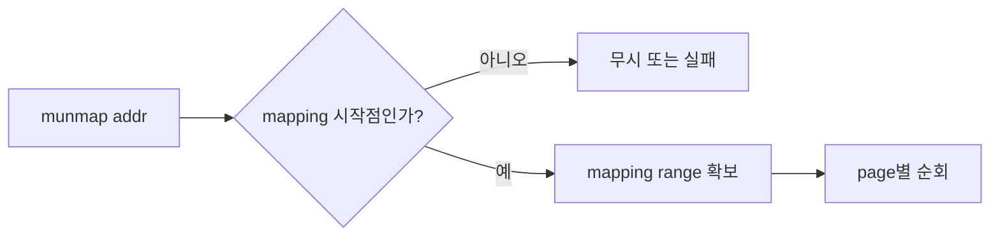
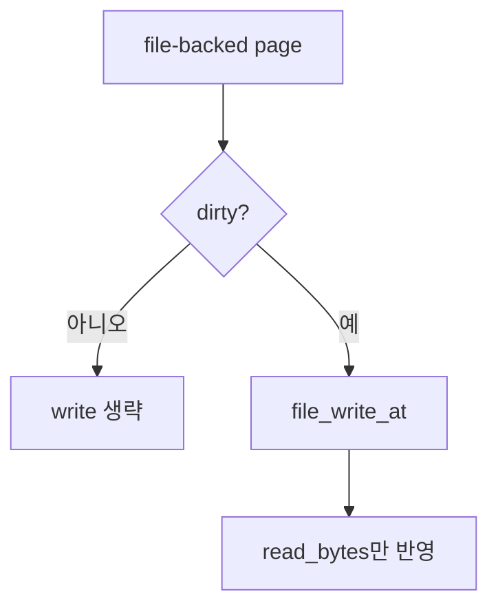

# 04 — 기능 3: Munmap and Write-back

## 1. 구현 목적 및 필요성

### 이 기능이 무엇인가
`munmap` 또는 process exit에서 mmap range를 해제하고 dirty file-backed page를 파일에 반영하는 기능입니다.

### 왜 이걸 하는가
mmap으로 수정한 내용은 명시적 write syscall 없이도 파일에 저장되어야 합니다.

### 무엇을 연결하는가
`sys_munmap()`, mapping metadata, pml4 dirty bit, `file_backed_swap_out()`, SPT destroy를 연결합니다.

### 완성의 의미
dirty page는 실제 file bytes 범위만 write-back되고, clean page는 write 없이 정리됩니다.

## 2. 가능한 구현 방식 비교

- 방식 A: munmap에서 mapping range를 순회
  - 장점: syscall 단위 cleanup이 명확
  - 단점: metadata 필요
- 방식 B: SPT 전체에서 addr가 속한 page만 추적
  - 장점: 단순
  - 단점: 같은 mmap range 전체 해제가 어려움
- 선택: mapping range 기준 순회 권장

## 3. 시퀀스와 단계별 흐름

## 4. 기능별 가이드 (개념/흐름 + 구현 주석 위치)

### 4.1 기능 A: munmap range 찾기
#### 개념 설명
`munmap(addr)`는 단일 page만 해제하는 것이 아니라 해당 addr로 시작한 mmap range 전체를 해제해야 합니다. 따라서 mapping 시작 주소, page 개수, file metadata를 찾는 기준이 필요합니다.

#### 시퀀스 및 흐름

1. addr가 mmap으로 반환된 시작 주소인지 확인한다.
2. mapping metadata 또는 SPT 정보로 range 전체를 찾는다.
3. 같은 mapping이 두 번 해제되지 않도록 상태를 정리한다.

#### 구현 주석 (보면 되는 함수/구조체)
- 위치: `userprog/syscall.c`의 `sys_munmap()`
- 위치: `vm/file.c`의 `do_munmap()`

### 4.2 기능 B: dirty page write-back
#### 개념 설명
mmap된 file-backed page가 수정되었다면 `munmap`이나 process exit 시 backing file에 반영해야 합니다. clean page는 write할 필요가 없고, zero fill 영역까지 파일에 쓰면 안 됩니다.

#### 시퀀스 및 흐름

1. pml4 dirty bit 또는 page dirty 상태를 확인한다.
2. dirty page만 backing file의 원래 offset에 쓴다.
3. write 길이는 실제 file-backed byte 범위로 제한한다.

#### 구현 주석 (보면 되는 함수/구조체)
- 위치: `vm/file.c`의 `file_backed_swap_out()`
- 위치: pml4 dirty bit helper

### 4.3 기능 C: SPT 제거와 exit cleanup 통합
#### 개념 설명
munmap과 process exit은 둘 다 file-backed page cleanup을 수행할 수 있습니다. 같은 page를 두 번 write-back하거나 두 번 free하지 않도록, SPT 제거와 destroy hook의 책임을 분리해야 합니다.

#### 시퀀스 및 흐름

1. page별 write-back 후 pml4 mapping을 제거한다.
2. SPT entry와 page 자원을 한 번만 해제한다.
3. process exit에서 남은 mmap page도 같은 규칙으로 정리한다.

#### 구현 주석 (보면 되는 함수/구조체)
- 위치: `vm/file.c`의 `do_munmap()`, `file_backed_destroy()`
- 위치: `vm/vm.c`의 `supplemental_page_table_kill()`

## 5. 구현 주석

### 5.1 `sys_munmap()`

#### 5.1.1 `sys_munmap()`에서 munmap syscall 인자와 mapping 시작점 확인
- 수정 위치: `userprog/syscall.c`의 `sys_munmap()`
- 역할: 사용자 munmap 요청을 검증하고 실제 해제 함수로 넘긴다.
- 규칙 1: addr는 mmap으로 반환된 mapping 시작 주소여야 한다.
- 규칙 2: 유효한 mapping이면 `do_munmap()`으로 위임한다.
- 금지 1: 이미 munmap된 range를 다시 정리하지 않는다.

구현 체크 순서:
1. `sys_munmap()`에서 addr로 mapping metadata 또는 SPT range 시작점을 찾는다.
2. addr가 mapping 시작 주소가 아니거나 이미 해제된 range면 실패/무시 정책을 적용한다.
3. 유효한 요청이면 `do_munmap(addr)`로 넘겨 page 단위 cleanup을 수행하게 한다.

### 5.2 `do_munmap()`

#### 5.2.1 `do_munmap()`에서 mapping range의 page를 순회 정리
- 수정 위치: `vm/file.c`의 `do_munmap()`
- 역할: mmap range의 모든 page를 write-back하고 SPT에서 제거한다.
- 규칙 1: dirty page는 file에 반영한다.
- 규칙 2: SPT entry와 mapping metadata를 제거한다.
- 금지 1: 같은 page를 munmap과 exit에서 중복 cleanup하지 않는다.

구현 체크 순서:
1. addr에 해당하는 mapping range와 page 개수를 찾는다.
2. range의 각 page를 순회하며 dirty 여부에 따라 write-back 함수를 호출한다.
3. 각 page의 pml4 mapping, SPT entry, mapping metadata를 한 번씩만 제거한다.

### 5.3 `file_backed_swap_out()`

#### 5.3.1 `file_backed_swap_out()`에서 dirty file-backed page write-back
- 수정 위치: `vm/file.c`의 `file_backed_swap_out()`
- 역할: eviction되는 file-backed dirty page를 backing file에 기록한다.
- 규칙 1: write-back 길이는 read_bytes 또는 실제 file bytes 범위다.
- 규칙 2: clean page는 write하지 않는다.
- 금지 1: zero fill 영역까지 파일 크기를 잘못 늘리지 않는다.

구현 체크 순서:
1. pml4 dirty bit 또는 page dirty 상태를 확인해 write-back 필요 여부를 결정한다.
2. dirty이면 file offset부터 실제 file-backed byte 수만큼만 write한다.
3. write-back 후 pml4 mapping과 frame 연결이 eviction 흐름에서 해제되는지 확인한다.

### 5.4 `file_backed_destroy()`

#### 5.4.1 `file_backed_destroy()`에서 file-backed page 최종 cleanup
- 수정 위치: `vm/file.c`의 `file_backed_destroy()`
- 역할: process exit 또는 SPT destroy에서 file-backed page 자원을 정리한다.
- 규칙 1: 아직 반영되지 않은 dirty page가 있으면 write-back 정책과 연결한다.
- 규칙 2: file/mapping metadata 수명 정리를 한 번만 수행한다.
- 금지 1: 이미 `do_munmap()`에서 정리한 page를 다시 write-back하지 않는다.

구현 체크 순서:
1. page가 loaded 상태인지, dirty write-back이 필요한 상태인지 확인한다.
2. 필요한 경우 `file_backed_swap_out()`과 같은 write-back 규칙을 재사용한다.
3. file reference, aux, mapping metadata 해제 책임이 중복되지 않는지 확인한다.

## 6. 테스팅 방법

- mmap-write 테스트
- munmap write-back 테스트
- process exit write-back 테스트
- mmap clean page 회귀
