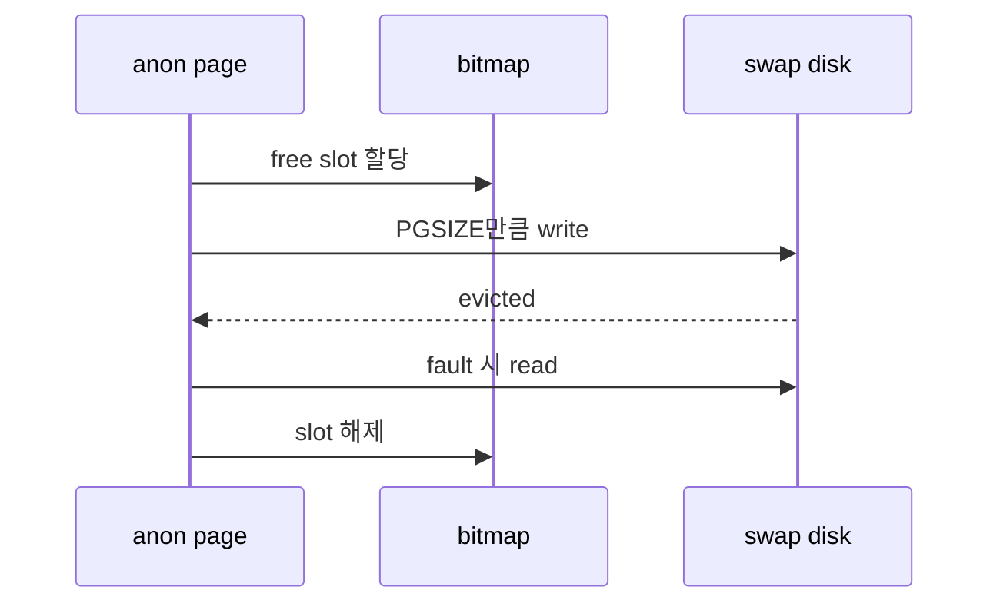
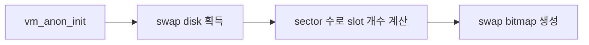
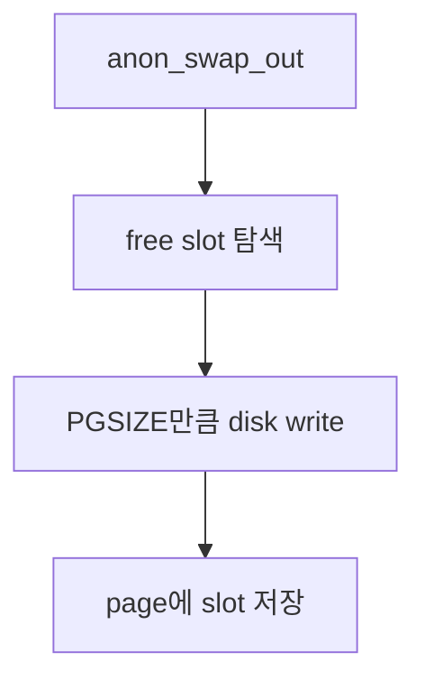

# 01 — 기능 1: Anonymous Swap In/Out

## 1. 구현 목적 및 필요성
### 이 기능이 무엇인가
anonymous page를 eviction할 때 swap disk에 저장하고, 다시 fault가 나면 swap disk에서 복구하는 기능입니다.
### 왜 이걸 하는가 (문제 맥락)
anonymous page는 파일에서 다시 읽을 수 없으므로 eviction 시 내용을 보존할 별도 backing store가 필요합니다.
### 무엇을 연결하는가 (기술 맥락)
swap disk, bitmap, `pintos/vm/anon.c`의 `vm_anon_init()`, `anon_swap_out()`, `anon_swap_in()`, page destroy, `devices/disk.h`를 연결합니다.
### 완성의 의미 (결과 관점)
anonymous page는 eviction 이후에도 내용이 손실되지 않고, swap slot은 누수 없이 재사용됩니다.

## 2. 가능한 구현 방식 비교
- 방식 A: bitmap으로 swap slot 관리
  - 장점: Pintos 자료구조와 잘 맞음
  - 단점: 락 필요
- 방식 B: free list로 slot 관리
  - 장점: 할당/해제 명확
  - 단점: disk sector 계산을 따로 관리해야 함
- 선택: bitmap 방식

## 3. 시퀀스와 단계별 흐름

1. init에서 disk·bitmap을 준비한다.
2. swap out 시 slot 할당 후 write한다.
3. swap in 후 slot을 반납한다.

## 4. 기능별 가이드 (개념/흐름 + 구현 주석 위치)
### 4.1 기능 A: swap disk와 slot table 초기화
#### 개념 설명
swap은 anonymous page를 임시로 저장할 backing store입니다. disk sector를 PGSIZE 단위 slot으로 묶고, 어떤 slot이 비어 있는지 bitmap으로 관리해야 합니다.
#### 시퀀스 및 흐름

1. Pintos swap disk를 얻는다.
2. disk sector 수를 PGSIZE 단위 slot 개수로 변환한다.
3. slot 사용 여부를 추적할 bitmap과 lock을 초기화한다.
#### 구현 주석 (보면 되는 함수/구조체)
- 위치: `pintos/vm/anon.c`의 `vm_anon_init()`
- 위치: `pintos/devices/disk.h`와 `pintos/lib/kernel/bitmap.h`

### 4.2 기능 B: anonymous page swap out
#### 개념 설명
free frame이 부족하면 anonymous page의 현재 내용을 swap disk에 저장해야 합니다. page는 저장된 slot 번호를 기억해야 나중에 같은 내용을 복구할 수 있습니다.
#### 시퀀스 및 흐름

1. bitmap에서 free slot을 할당한다.
2. frame kva를 sector 단위로 나누어 PGSIZE만큼 기록한다.
3. page metadata에 slot 번호를 저장한다.
#### 구현 주석 (보면 되는 함수/구조체)
- 위치: `pintos/vm/anon.c`의 `anon_swap_out()`
- 위치: swap slot sector 계산 helper

### 4.3 기능 C: anonymous page swap in
#### 개념 설명
swap out된 page에 다시 접근하면 swap disk에 저장된 내용을 새 frame으로 읽어 와야 합니다. 읽기가 끝난 slot은 더 이상 page가 소유하지 않으므로 bitmap에서 해제합니다.
#### 시퀀스 및 흐름

1. page metadata의 slot 번호가 유효한지 확인한다.
2. 해당 slot의 sector들을 frame kva로 읽는다.
3. 성공 후 slot을 해제하고 page metadata를 초기 상태로 되돌린다.
#### 구현 주석 (보면 되는 함수/구조체)
- 위치: `pintos/vm/anon.c`의 `anon_swap_in()`
- 위치: `pintos/vm/vm.c`의 `vm_do_claim_page()`

## 5. 구현 주석 (위치별 정리)
### 5.1 `vm_anon_init()`
- 위치: `pintos/vm/anon.c`의 `vm_anon_init()`
- 역할: swap disk와 slot bitmap을 초기화한다.
- 규칙 1: 한 slot은 PGSIZE만큼의 sector 묶음이다.
- 규칙 2: bitmap 접근은 동기화한다.
- 금지 1: swap disk가 없는데 swap을 성공 처리하지 않는다.

구현 체크 순서:
1. `disk_get` 등 PintOS swap disk를 얻는 코드를 확인한다.
2. disk sector 수를 PGSIZE 단위 slot 개수로 나누어 bitmap을 만든다.
3. swap bitmap과 관련 lock을 초기화하고 disk 없음/slot 없음 실패 정책을 정한다.

### 5.2 `anon_swap_out()`
- 위치: `pintos/vm/anon.c`의 `anon_swap_out()`
- 역할: anonymous page 내용을 swap disk에 저장한다.
- 규칙 1: swap out 시 free slot을 할당한다.
- 금지 1: 같은 page가 여러 slot을 동시에 소유하지 않는다.

구현 체크 순서:
1. bitmap에서 free slot을 잡고 slot 번호를 page metadata에 기록한다.
2. frame kva를 PGSIZE만큼 sector 단위로 swap disk에 쓴다.
3. 모든 sector write가 끝난 뒤 frame이 비워졌음을 eviction 흐름과 맞춘다.

### 5.3 `anon_swap_in()`
- 위치: `pintos/vm/anon.c`의 `anon_swap_in()`
- 역할: swap disk에 저장된 anonymous page 내용을 frame에 복구한다.
- 규칙 1: swap in 성공 후 slot을 해제한다.
- 금지 1: slot 해제 전에 page metadata를 잃어버리지 않는다.

구현 체크 순서:
1. page metadata에서 swap slot 번호를 읽고 유효성을 확인한다.
2. 해당 slot의 sector들을 kva로 PGSIZE만큼 읽는다.
3. bitmap slot을 해제한 뒤 page metadata의 slot 상태를 초기화한다.

## 6. 테스팅 방법
- swap-* 테스트
- page-merge-* 테스트
- process exit 후 swap slot 누수 확인
