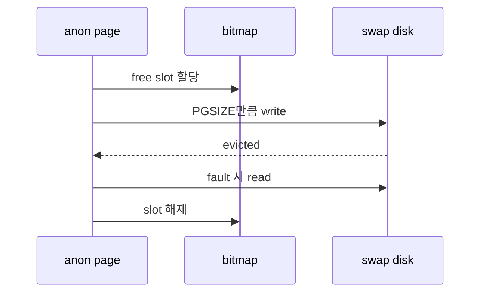

# 04 — 기능 3: Anonymous Swap In/Out

## 1. 구현 목적 및 필요성

### 이 기능이 무엇인가
anonymous page를 eviction할 때 swap disk에 저장하고, 다시 fault가 나면 swap disk에서 복구하는 기능입니다.

### 왜 이걸 하는가
anonymous page는 파일에서 다시 읽을 수 없으므로 eviction 시 내용을 보존할 별도 backing store가 필요합니다.

### 무엇을 연결하는가
swap disk, bitmap, `anon_swap_out()`, `anon_swap_in()`, page destroy를 연결합니다.

### 완성의 의미
anonymous page는 eviction 이후에도 내용이 손실되지 않고, swap slot은 누수 없이 재사용됩니다.

## 2. 가능한 구현 방식 비교

- 방식 A: bitmap으로 swap slot 관리
  - 장점: Pintos 자료구조와 잘 맞음
  - 단점: 락 필요
- 방식 B: free list로 slot 관리
  - 장점: 할당/해제 명확
  - 단점: disk sector 계산을 따로 관리해야 함
- 선택: bitmap 방식

## 3. 시퀀스와 단계별 흐름

## 4. 기능별 가이드

### 4.1 Swap table
- 위치: `vm/anon.c`
- swap disk sector 범위와 bitmap slot을 연결합니다.

### 4.2 Swap in/out
- 위치: `vm/anon.c`
- page 단위로 disk read/write를 수행합니다.

## 5. 구현 주석

### 5.1 `vm_anon_init()`

#### 5.1.1 swap table 초기화
- 위치: `vm/anon.c`
- 역할: swap disk와 slot bitmap을 초기화한다.
- 규칙 1: 한 slot은 PGSIZE만큼의 sector 묶음이다.
- 규칙 2: bitmap 접근은 동기화한다.
- 금지 1: swap disk가 없는데 swap을 성공 처리하지 않는다.

### 5.2 `anon_swap_out()` / `anon_swap_in()`

#### 5.2.1 page 단위 disk I/O
- 위치: `vm/anon.c`
- 역할: anonymous page 내용을 swap disk에 저장/복구한다.
- 규칙 1: swap out 시 free slot을 할당한다.
- 규칙 2: swap in 성공 후 slot을 해제한다.
- 금지 1: 같은 page가 여러 slot을 동시에 소유하지 않는다.

## 6. 테스팅 방법

- swap-* 테스트
- page-merge-* 테스트
- process exit 후 swap slot 누수 확인
