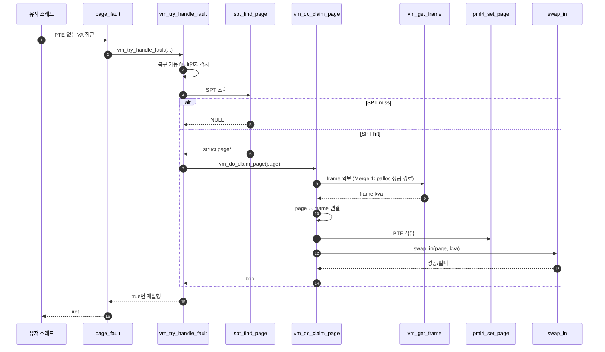

# Merge 1 – Frame Claim + Lazy Loading

## 1. 목표

```text
page fault가 났을 때 SPT에서 찾은 page를 실제 frame에 올리고,
page table에 매핑한 뒤, lazy loading으로 내용을 채운다.
```

### 1.1 전체 시퀀스 (E2E)

**이 폴더 = Merge 1**이다. 아래는 lazy fault 복구를 **가로로 한 슬라이스**로 펼친 end-to-end 뼈대다 (`userprog/exception.c`, `vm/vm.c`). **`vm_do_claim_page` 안만 확대한 그림**은 **`A - Frame Claim.md`** §2를 보면 된다. 구현을 쪼갤 순서는 **§2 (이 문서)** 를 따른다.



Merge 1에서 먼저 맞추는 것은 위 **직선 경로**다. user pool이 가득 차서 `palloc`이 실패할 때의 **`vm_evict_frame` / swap 복원**은 **Merge 4** 폴더(`Merge 4 - Eviction + Swap In-Out`)에서 이어 붙인다.

### 1.2 한 줄로 읽는 순서

아래는 **§1.1** 다이어그램을 번호만 바꾼 것이다.

1. 유저가 아직 매핑되지 않은 VA에 접근하면 page fault.
2. `page_fault()` → `vm_try_handle_fault()`.
3. `spt_find_page()`로 `struct page*` 확보 (SPT = 커널용 설명서).
4. `vm_do_claim_page(page)`: `vm_get_frame` → page–frame 연결 → `pml4_set_page` → `swap_in`.
5. `swap_in`이 lazy 쪽 **내용 채움**을 담당 (uninit·파일 읽기 등은 **`B - …`**, **`C - …`** 문서).
6. 성공 시 같은 명령 재실행, 이번엔 PTE로 통과.

직관: **SPT = 무엇을 올릴지**, **frame + PTE = 슬롯 열기**, **`swap_in` = 슬롯 채우기**. (풀 고갈·희생자 선택·swap out은 여기서 깊게 안 가도 된다.)

## 2. 이상적인 내부 머지 순서

```text
1. B - Uninit Page와 Initializer
2. A - Frame Claim
3. C - Executable Segment Lazy Loading
4. D - 초기 Stack Page
```

이유:

```text
B가 page 타입 전환과 swap_in 연결을 먼저 잡아야 한다.
A가 frame 확보와 page table 매핑을 잡으면 C/D가 실제 page를 올릴 수 있다.
C는 실행 파일 lazy loading, D는 초기 stack이라 A/B 이후에 붙이는 것이 안정적이다.
```

## 3. 완료 기준

```text
빌드 성공
기본 user program 실행 가능
lazy-anon 또는 lazy-file 흐름 진입 확인
Project 2 기본 테스트가 크게 깨지지 않는지 확인
```

## 4. 함수별 구현 주석 (틀만 — 상세는 분업 문서 §4)

**원칙**: 주석은 **지금 이 함수가 책임질 경계**만 적는다. 아직 없는 머지(Merge 2 스택 확장, Merge 3 mmap, Merge 4 eviction/swap out 등)나 **다른 파일이 맡을 일**을 앞쪽 함수 주석에 쓰지 않는다. 구현 순서는 **§2**와 같다.

| 순서 | 문서 | §4에 모아 둔 함수 |
|------|------|-------------------|
| 1 | `B - Uninit Page와 Initializer.md` | `vm_alloc_page_with_initializer`, `spt_insert_page`, `uninit_initialize`, `anon_initializer`, `file_backed_initializer`, `swap_in` |
| 2 | `A - Frame Claim.md` | `page_fault`, `vm_try_handle_fault`, `spt_find_page`, `vm_get_frame`, `vm_claim_page`, `vm_do_claim_page` |
| 3 | `C - Executable Segment Lazy Loading.md` | `load_segment`, `lazy_load_segment` |
| 4 | `D - 초기 Stack Page.md` | `setup_stack` |

각 분업 문서 §4는 **동일 목차 템플릿(4.1~4.6)** 을 사용한다.

| 번호 | 이름 | 용도 |
|------|------|------|
| 4.1 | 구현 대상 함수 목록 | 문서 범위 함수 고정 |
| 4.2 | 공통 구조체/필드 계약 | 함수 밖 전역 전제 고정 |
| 4.3 | 함수별 구현 주석 (고정안) | 추상/1단계/2단계 주석 |
| 4.4 | 함수 간 연결 순서 | 호출 체인 고정 |
| 4.5 | 실패 처리/롤백 규칙 | 예외/실패 시 행동 고정 |
| 4.6 | 완료 체크리스트 | 구현 완료 판정 고정 |

각 함수 주석은 같은 함수에 대해 **세 겹**으로 적어 둔다.

| 겹 | 이름 | 용도 |
|----|------|------|
| **추상** | 함수 위 한 줄 `/* … */` | Merge 1 안에서의 책임 경계만 (다른 머지·타 함수 업무 금지). |
| **1단계 구체** | 불릿 목록 | 이 레포 스켈레톤에 실제로 등장하는 심볼(`thread_current()->spt`, `hash_insert`, `pml4_set_page`, `uninit_new` 등)로 무엇을 하는지 한 단계만 내려간 설명. |
| **2단계 구체** | 번호 단계 | 호출 순서·분기·매크로 전개 수준(예: `swap_in` → `page->operations->swap_in`)까지 적어 구현 시 범위 이탈 방지. |

전체 VM을 한 함수에서 끝내라는 뜻이 아니다. **본문 기준**은 `pintos/vm/vm.c`, `vm/uninit.c`, `vm/anon.c`, `vm/file.c`, `userprog/process.c`( `#ifdef VM` 블록 ), `userprog/exception.c` 다.
