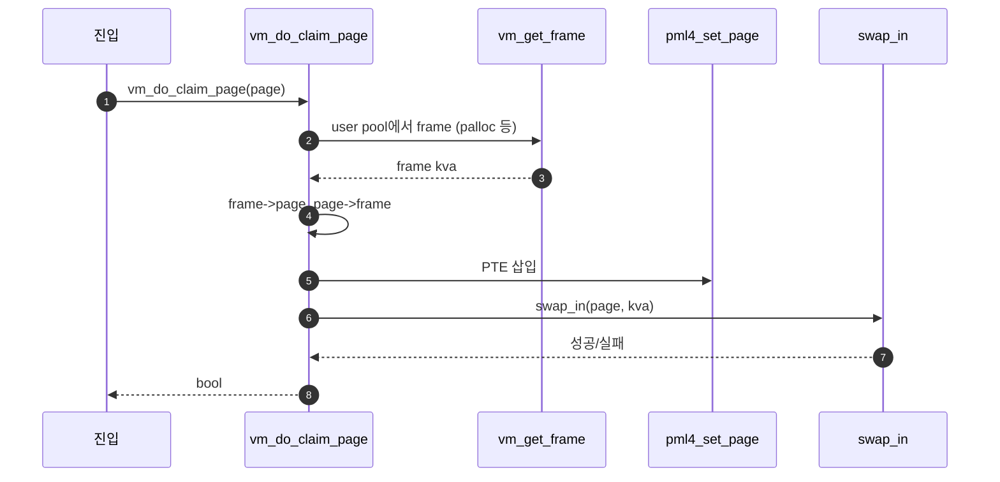

# A – Frame Claim

## 1. 개요 (목표·이유·수정 위치·의존성)

```text
목표
- frame을 확보하고 page와 연결한 뒤 page table에 매핑한다.

이유
- SPT에 page가 있어도 page table에 매핑이 없으면 유저 프로그램은 접근할 수 없다.

수정/추가 위치
- include/vm/vm.h
  - struct frame 필드 보강
- vm/vm.c
  - frame_table
  - vm_get_frame()
  - vm_claim_page()
  - vm_do_claim_page()

의존성
- B의 uninit/lazy 흐름이 있어야 swap_in 이후가 자연스럽게 이어진다.
- C의 lazy_load_segment가 있어야 실행 파일 내용을 실제로 채울 수 있다.
```

## 2. 시퀀스

**분업 A**에서 먼저 잡을 뼈대만 그린다: `vm_do_claim_page` 안에서 frame 확보 → 연결 → PTE → `swap_in` 호출. (`vm/vm.c`)



`vm_claim_page(va)`는 `spt_find_page`로 `page`를 얻은 뒤 위와 같이 `vm_do_claim_page`로 합류한다. **`vm_get_frame`이 palloc 실패할 때 eviction을 부르는 코드**는 **Merge 4** 폴더 문서에서 완성한다.

## 3. 단계별 설명 (이 문서 범위)

1. **진입**: fault 경로는 `vm_do_claim_page(page)` 직행, VA만 있으면 `vm_claim_page` → `spt_find_page` 후 동일.
2. **`vm_get_frame`**: `PAL_USER` 등으로 물리 슬롯 하나와 대응되는 `kva` 확보. frame table에 올려두면 이후(Merge 4) 역참조에 쓴다.
3. **연결**: `frame->page`, `page->frame`.
4. **`pml4_set_page`**: 현재 스레드 PT에 유저 VA → 해당 `kva` 매핑.
5. **`swap_in`**: kva 버퍼 채움. 세부는 **`B - Uninit Page와 Initializer.md`**, **`C - Executable Segment Lazy Loading.md`**. 이 문서(A)는 “호출까지”가 경계다.

## 4. 구현 주석 가이드

### 4.1 구현 대상 함수 목록

- `page_fault` (`userprog/exception.c`)
- `vm_try_handle_fault` (`vm/vm.c`)
- `spt_find_page` (`vm/vm.c`)
- `vm_get_frame` (`vm/vm.c`)
- `vm_claim_page` (`vm/vm.c`)
- `vm_do_claim_page` (`vm/vm.c`)

### 4.2 공통 구조체/필드 계약

- `thread_current ()->spt`에서 `struct page`를 조회한다.
- `struct frame { void *kva; struct page *page; }`를 사용한다.
- `vm_do_claim_page`에서 `frame->page`, `page->frame`를 항상 쌍으로 맞춘다.
- `pml4_set_page (thread_current ()->pml4, page->va, frame->kva, page->writable)`를 매핑 계약으로 사용한다.
- `swap_in` 내부 구현(UNINIT 전환, 파일 read)은 B/C 담당이다.

### 4.3 함수별 구현 주석 (고정안)

`A`는 **frame 확보 → `page`↔`frame` 연결 → `pml4_set_page` → `swap_in(page, kva)`** 까지다.

#### `page_fault` (`userprog/exception.c`)

**추상**

```c
/* Merge1-A: fault_addr·원인(not_present/write/user)만 꺼낸 뒤 vm_try_handle_fault에 넘긴다. true면 복구 완료로 그대로 return. false면 기존 kill/exit 경로. */
```

**1단계 구체**

- `fault_addr = (void *) rcr2();` 후 `intr_enable()`.
- `f->error_code`에서 `PF_P`, `PF_W`, `PF_U` 비트로 `not_present`, `write`, `user` 결정.
- `#ifdef VM`에서만 `vm_try_handle_fault(f, fault_addr, user, write, not_present)` 호출.

**2단계 구체**

1. `not_present`, `write`, `user` 플래그 계산 (스켈레톤 139–142행 근처).
2. `if (vm_try_handle_fault (...)) return;` — 성공 시 유저 명령 재실행을 위해 인터럽트 리턴으로 복귀.
3. Merge1 범위에서는 **`vm_try_handle_fault` 내부에 스택 growth·kernel fault 정책을 새로 넣지 않음**(Merge2·예외 정책과 분리).

---

#### `vm_try_handle_fault` (`vm/vm.c`)

**추상**

```c
/* Merge1-A: 유효한 lazy fault면 SPT에서 page를 찾아 vm_do_claim_page만 호출한다. SPT miss 스택 확장·vm_stack_growth는 Merge2 전용으로 여기 두지 않는다. */
```

**1단계 구체**

- `struct supplemental_page_table *spt = &thread_current ()->spt;`
- `void *va = pg_round_down (addr);`
- `page = spt_find_page (spt, va)` — NULL이면 Merge1에서는 보통 실패 처리(Merge2에서 stack 후보로 확장).
- 쓰기 보호/WP, 잘못된 접근 등은 스켈레톤의 `vm_handle_wp` 등과 분리해 조기 `false`.

**2단계 구체**

1. 복구 불가 조건(커널 모드 fault 정책, 잘못된 write 등)이면 `return false` — **스켈레톤 TODO 채우기**.
2. `page = spt_find_page (&thread_current ()->spt, pg_round_down (addr));`
3. `if (page == NULL) return false;` — Merge1 완성 전까지 stack은 미구현이어도 됨.
4. `return vm_do_claim_page (page);` — **스켈레톤이 `page` 없이 claim을 호출하면 안 됨**(반드시 위에서 조회).

---

#### `spt_find_page` (`vm/vm.c`) — `vm_claim_page`와 짝

**추상**

```c
/* Merge1-A: VA를 내림 정렬한 키로 spt->hash에서 struct page*를 찾는다. frame 유무와 무관하다. */
```

**1단계 구체**

- `va = pg_round_down (va);` 후 임시 `struct page temp; temp.va = va;`
- `hash_find (&spt->hash, &temp.elem)` → `hash_entry (..., struct page, elem)`.

**2단계 구체**

1. `temp.va = pg_round_down (va);`
2. `e = hash_find (&spt->hash, &temp.elem);`
3. `return e == NULL ? NULL : hash_entry (e, struct page, elem);`

---

#### `vm_get_frame` (`vm/vm.c`)

**추상**

```c
/* Merge1-A: PAL_USER로 palloc한 kva를 struct frame에 넣고 반환한다. 풀 고갈 시 vm_evict_frame은 Merge4에서 연결—여기서는 NULL 반환으로 두지 말고 스켈레톤 ASSERT 전제에 맞춰 한 슬롯을 확보하는 최소 구현 또는 스텁 분기만 명시. */
```

**1단계 구체**

- `palloc_get_page (PAL_USER)` — 필요 시 `PAL_ZERO`.
- `struct frame *f = malloc (sizeof *f); f->kva = kpage; f->page = NULL;`
- 팀이 쓰면 **전역 `frame_table`**에 등록해 victim 탐색 시 역참조(Merge4).

**2단계 구체**

1. `void *kva = palloc_get_page (PAL_USER);`
2. `if (kva == NULL) { ... Merge4: vm_evict_frame ... }` — Merge1에서는 **eviction 없이** 실패 처리만 할 수도 있음(테스트 제약에 따름).
3. `frame->kva = kva; frame->page = NULL;`
4. `ASSERT (frame != NULL); ASSERT (frame->page == NULL);` 만족 후 `return frame`.

---

#### `vm_claim_page` (`vm/vm.c`)

**추상**

```c
/* Merge1-A: 유저 VA만 알 때 SPT로 struct page*를 얻어 vm_do_claim_page에 위임한다. lazy_load_segment는 호출하지 않는다. */
```

**1단계 구체**

- `page = spt_find_page (&thread_current ()->spt, pg_round_down (va));`
- NULL이면 `false`.

**2단계 구체**

1. `struct page *p = spt_find_page (&thread_current ()->spt, pg_round_down (va));`
2. `if (p == NULL) return false;`
3. `return vm_do_claim_page (p);`

---

#### `vm_do_claim_page` (`vm/vm.c`)

**추상**

```c
/* Merge1-A: vm_get_frame → frame/page 링크 → pml4_set_page(유저VA→kva) → swap_in(page, kva). 파일 읽기·UNINIT 해체는 swap_in 체인(B/C). */
```

**1단계 구체**

- `struct frame *fr = vm_get_frame ();`
- `fr->page = page; page->frame = fr;`
- `pml4_set_page (thread_current ()->pml4, page->va, fr->kva, page->writable);` — 매핑 순서는 팀 정책에 따라 `swap_in` 전이 일반적.
- `return swap_in (page, fr->kva);` — 매크로 전개.

**2단계 구체**

1. `struct frame *frame = vm_get_frame ();` 실패 시 `false`.
2. `frame->page = page; page->frame = frame;`
3. `if (!pml4_set_page (thread_current ()->pml4, page->va, frame->kva, page->writable)) return false;` — 이미 매핑된 경우 등 처리.
4. `return swap_in (page, frame->kva);` → UNINIT이면 `uninit_initialize` → C면 `lazy_load_segment`까지 이어질 수 있음.
5. **하지 않음**: `uninit_new`, `file_read` 직접 호출, `lazy_load_segment` 직접 호출.

### 4.4 함수 간 연결 순서 (호출 체인)

1. `page_fault`가 `fault_addr`, `error_code`를 파싱한다.
2. `vm_try_handle_fault`가 `spt_find_page`로 대상 `page`를 찾는다.
3. `vm_claim_page` 또는 직접 `vm_do_claim_page`로 claim 경로에 들어간다.
4. `vm_do_claim_page`가 `vm_get_frame` → 링크 연결 → `pml4_set_page` → `swap_in`을 순차 수행한다.

### 4.5 실패 처리/롤백 규칙

- `spt_find_page`가 `NULL`이면 즉시 `false`를 반환한다.
- `vm_get_frame` 실패 시 claim을 중단하고 `false`를 반환한다.
- `pml4_set_page` 실패 시 `swap_in`을 호출하지 않는다.
- `swap_in` 실패 시 `false`를 반환하고, 후속 rollback 상세는 Merge 2~4에서 확장한다.

### 4.6 완료 체크리스트

- fault 경로에서 `vm_try_handle_fault`가 실제로 호출된다.
- SPT hit 시 `vm_do_claim_page`까지 도달한다.
- `pml4_set_page` 성공 후 `swap_in`이 호출된다.
- Merge 1 범위에서 eviction, stack growth 코드를 섞지 않았다.
