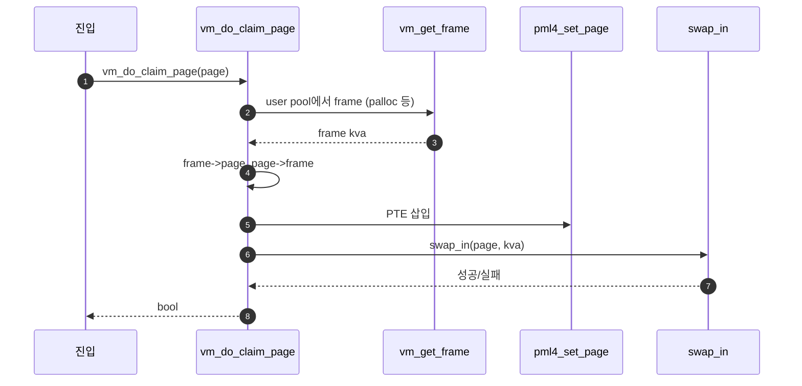
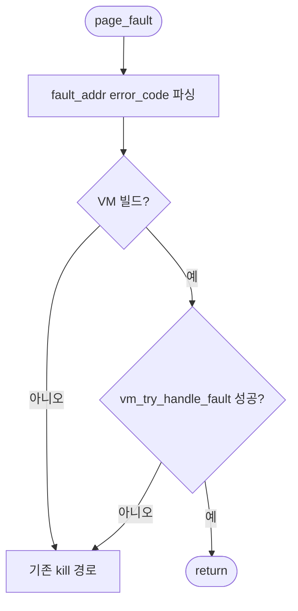
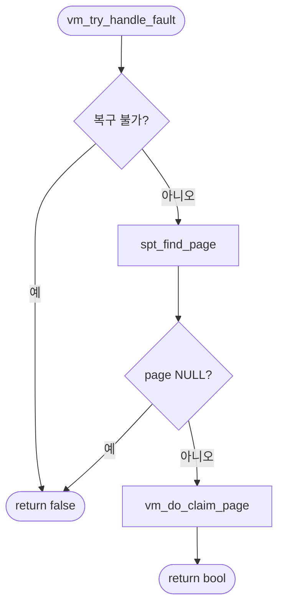
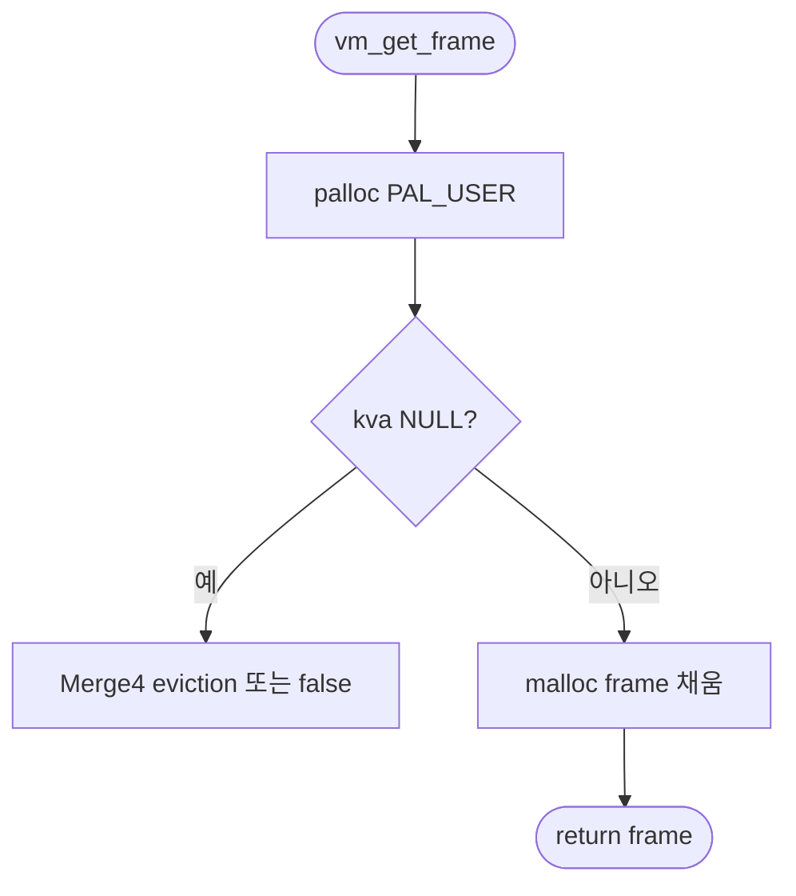
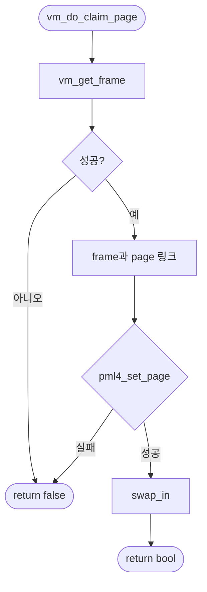

# A – Frame Claim

## 1. 개요 (목표·이유·수정 위치·의존성)

```text
목표
- frame을 확보하고 page와 연결한 뒤 page table에 매핑한다.

이유
- SPT에 page가 있어도 page table에 매핑이 없으면 유저 프로그램은 접근할 수 없다.

수정/추가 위치
- include/vm/vm.h
  - struct frame 필드 보강
- vm/vm.c
  - frame_table
  - vm_get_frame()
  - vm_claim_page()
  - vm_do_claim_page()

의존성
- B의 uninit/lazy 흐름이 있어야 swap_in 이후가 자연스럽게 이어진다.
- C의 lazy_load_segment가 있어야 실행 파일 내용을 실제로 채울 수 있다.
```

## 2. 시퀀스

**분업 A**에서 먼저 잡을 뼈대만 그린다: `vm_do_claim_page` 안에서 frame 확보 → 연결 → PTE → `swap_in` 호출. (`vm/vm.c`)



`vm_claim_page(va)`는 `spt_find_page`로 `page`를 얻은 뒤 위와 같이 `vm_do_claim_page`로 합류한다. **`vm_get_frame`이 palloc 실패할 때 eviction을 부르는 코드**는 **Merge 4** 폴더 문서에서 완성한다.

## 3. 단계별 설명 (이 문서 범위)

1. **진입**: fault 경로는 `vm_do_claim_page(page)` 직행, VA만 있으면 `vm_claim_page` → `spt_find_page` 후 동일.
2. **`vm_get_frame`**: `PAL_USER` 등으로 물리 슬롯 하나와 대응되는 `kva` 확보. frame table에 올려두면 이후(Merge 4) 역참조에 쓴다.
3. **연결**: `frame->page`, `page->frame`.
4. **`pml4_set_page`**: 현재 스레드 PT에 유저 VA → 해당 `kva` 매핑.
5. **`swap_in`**: kva 버퍼 채움. 세부는 **`B - Uninit Page와 Initializer.md`**, **`C - Executable Segment Lazy Loading.md`**. 이 문서(A)는 “호출까지”가 경계다.

## 4. 구현 주석 가이드

### 4.1 구현 대상 함수 목록

- `page_fault` (`userprog/exception.c`)
- `vm_try_handle_fault` (`vm/vm.c`)
- `spt_find_page` (`vm/vm.c`)
- `vm_get_frame` (`vm/vm.c`)
- `vm_claim_page` (`vm/vm.c`)
- `vm_do_claim_page` (`vm/vm.c`)

### 4.2 공통 구조체/필드 계약

- `thread_current ()->spt`에서 `struct page`를 조회한다.
- `struct frame { void *kva; struct page *page; }`를 사용한다.
- `vm_do_claim_page`에서 `frame->page`, `page->frame`를 항상 쌍으로 맞춘다.
- `pml4_set_page (thread_current ()->pml4, page->va, frame->kva, page->writable)`를 매핑 계약으로 사용한다.
- `swap_in` 내부 구현(UNINIT 전환, 파일 read)은 B/C 담당이다.

### 4.3 함수별 구현 주석 (고정안)

`A`는 **frame 확보 → `page`↔`frame` 연결 → `pml4_set_page` → `swap_in(page, kva)`** 까지다.

#### §4.3.0 (이 문서)

[Merge 1 `00-서론.md`](00-%EC%84%9C%EB%A1%A0.md) §4.3.0과 동일. **플로우차트(B안)**: fault·SPT miss·claim 실패처럼 분기가 두드러지는 함수만 아래에 둔다.

---

#### `page_fault` (`userprog/exception.c`)

Merge 1–A에서 이 함수는 **fault 주소·원인 비트를 뽑아 `vm_try_handle_fault`에 넘기고**, 복구되면 그대로 return 한다.

**흐름**

1. `fault_addr = (void *) rcr2();` 후 `intr_enable()`.
2. `f->error_code`의 `PF_P`, `PF_W`, `PF_U`로 `not_present`, `write`, `user`를 정한다.
3. `#ifdef VM`에서만 `vm_try_handle_fault(f, fault_addr, user, write, not_present)` 호출한다.
4. `true`이면 `return` — 같은 유저 명령을 재실행하기 위함이다.
5. Merge 1 범위에서 **`vm_try_handle_fault` 안에 스택 growth·kernel fault 확장 정책을 새로 넣지 않는다**(Merge 2와 분리).

**플로우차트**



---

#### `vm_try_handle_fault` (`vm/vm.c`)

Merge 1–A에서 이 함수는 **유효한 lazy fault이면** `spt_find_page`로 `page`를 찾아 **`vm_do_claim_page`만** 호출한다. SPT miss 시 스택 확장·`vm_stack_growth`는 Merge 2 전용이다.

**흐름**

1. `struct supplemental_page_table *spt = &thread_current()->spt;` `void *va = pg_round_down(addr);`
2. 복구 불가 조건(커널 모드 fault 정책, 잘못된 write 등)이면 `return false` — 스켈레톤 TODO를 채운다.
3. `page = spt_find_page(spt, va);`
4. Merge 1에서는 `page == NULL`이면 `return false`로 둘 수 있다(stack은 Merge 2).
5. `return vm_do_claim_page(page);` — `page` 없이 claim을 호출하면 안 된다.

**플로우차트**



---

#### `spt_find_page` (`vm/vm.c`)

`vm_claim_page`와 짝을 이룬다. **VA를 페이지 정렬한 키로 SPT 해시에서 `struct page*`를 찾는다.** frame 매핑 여부와 무관하다.

**흐름**

1. `va = pg_round_down(va);`
2. 임시 `struct page temp; temp.va = va;`
3. `hash_find(&spt->hash, &temp.elem)` → 있으면 `hash_entry(e, struct page, elem)` 반환, 없으면 `NULL`.

---

#### `vm_get_frame` (`vm/vm.c`)

Merge 1–A에서 **`PAL_USER`로 물리 슬롯을 하나 잡아 `struct frame`으로 감싼다.** 풀 고갈 시 `vm_evict_frame`은 Merge 4에서 연결한다.

**흐름**

1. `palloc_get_page(PAL_USER)` (필요 시 `PAL_ZERO`). 실패 시 Merge 4의 eviction 경로 또는 팀 정책대로 처리한다.
2. `struct frame *f = malloc(sizeof *f);` `f->kva = kpage;` `f->page = NULL;`
3. 팀 규약대로 **전역 `frame_table`**에 등록하면 Merge 4 victim 탐색에 역참조할 수 있다.
4. `ASSERT(frame != NULL); ASSERT(frame->page == NULL);` 만족 후 `return frame`.

**플로우차트**



---

#### `vm_claim_page` (`vm/vm.c`)

유저 VA만 알 때 **SPT로 `struct page*`를 얻어 `vm_do_claim_page`에 위임한다.** `lazy_load_segment`는 호출하지 않는다.

**흐름**

1. `p = spt_find_page(&thread_current()->spt, pg_round_down(va));`
2. `p == NULL`이면 `return false`.
3. `return vm_do_claim_page(p);`

---

#### `vm_do_claim_page` (`vm/vm.c`)

**`vm_get_frame` → 링크 → `pml4_set_page` → `swap_in(page, kva)`** 한 덩어리. 파일 읽기·UNINIT 해체는 `swap_in` 체인(B/C).

**흐름**

1. `frame = vm_get_frame();` 실패 시 `return false`.
2. `frame->page = page;` `page->frame = frame;`
3. `pml4_set_page(thread_current()->pml4, page->va, frame->kva, page->writable)` 실패 시 `return false` — 이미 매핑 등.
4. `return swap_in(page, frame->kva);` — UNINIT이면 `uninit_initialize` 등으로 이어질 수 있다.
5. **하지 않음 (A 경계)**: `uninit_new`, `file_read` 직접, `lazy_load_segment` 직접.

**플로우차트**



### 4.4 함수 간 연결 순서 (호출 체인)

1. `page_fault`가 `fault_addr`, `error_code`를 파싱한다.
2. `vm_try_handle_fault`가 `spt_find_page`로 대상 `page`를 찾는다.
3. `vm_claim_page` 또는 직접 `vm_do_claim_page`로 claim 경로에 들어간다.
4. `vm_do_claim_page`가 `vm_get_frame` → 링크 연결 → `pml4_set_page` → `swap_in`을 순차 수행한다.

### 4.5 실패 처리/롤백 규칙

- `spt_find_page`가 `NULL`이면 즉시 `false`를 반환한다.
- `vm_get_frame` 실패 시 claim을 중단하고 `false`를 반환한다.
- `pml4_set_page` 실패 시 `swap_in`을 호출하지 않는다.
- `swap_in` 실패 시 `false`를 반환하고, 후속 rollback 상세는 Merge 2~4에서 확장한다.

### 4.6 완료 체크리스트

- fault 경로에서 `vm_try_handle_fault`가 실제로 호출된다.
- SPT hit 시 `vm_do_claim_page`까지 도달한다.
- `pml4_set_page` 성공 후 `swap_in`이 호출된다.
- Merge 1 범위에서 eviction, stack growth 코드를 섞지 않았다.
