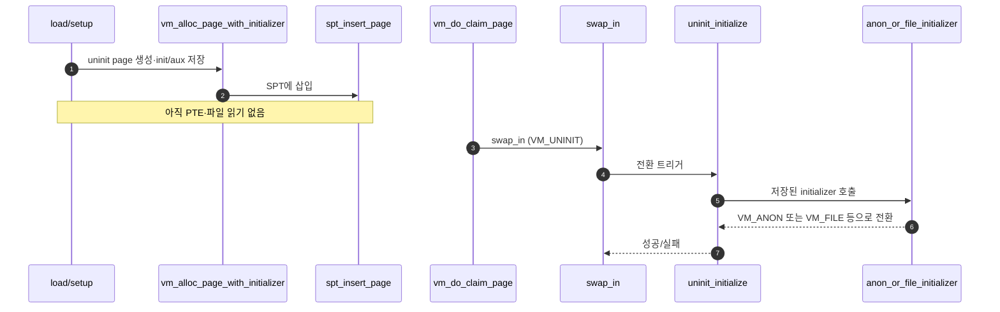

# B – Uninit Page와 Initializer

## 1. 개요 (목표·이유·수정 위치·의존성)

```text
목표
- uninit page를 첫 page fault 때 실제 anon/file page로 전환한다.

이유
- Project 3는 page를 처음부터 메모리에 올리지 않고, 필요할 때 초기화하는 lazy loading 구조다.

수정/추가 위치
- vm/vm.c
  - vm_alloc_page_with_initializer()
- vm/uninit.c
  - uninit_initialize()
- vm/anon.c
  - anon_initializer()
- vm/file.c
  - file_backed_initializer()

의존성
- A의 vm_do_claim_page가 swap_in을 호출해야 이 흐름이 실행된다.
- C가 넘겨주는 init/aux가 있어야 file segment lazy load가 가능하다.
```

## 2. 시퀀스

로드 시점에는 **uninit + SPT 등록**만 하고, 첫 fault에서 **`swap_in` → `uninit_initialize` → 타입별 initializer**로 실제 타입으로 바꾼다.



## 3. 단계별 설명 (이 문서 범위)

1. **`vm_alloc_page_with_initializer`**: 목표 타입과 나중에 쓸 `init`/`aux`를 uninit page에 심는다.
2. **`spt_insert_page`**: fault 때 찾을 수 있게 SPT에만 올린다.
3. **첫 fault**: **`A - Frame Claim.md`** 의 `vm_do_claim_page` 뒤 `swap_in`이 uninit 경로로 들어온다.
4. **`uninit_initialize`**: `page_operations`를 anon/file 등으로 갈아끼운 뒤 실제 initializer를 호출한다.
5. **C와의 경계**: 실행 파일 세그먼트는 **`C - Executable Segment Lazy Loading.md`** 에서 `lazy_load_segment`를 init으로 넘기는 식으로 연결한다.

## 4. 구현 주석 가이드

### 4.1 구현 대상 함수 목록

- `vm_alloc_page_with_initializer` (`vm/vm.c`)
- `spt_insert_page` (`vm/vm.c`)
- `uninit_initialize` (`vm/uninit.c`)
- `anon_initializer` (`vm/anon.c`)
- `file_backed_initializer` (`vm/file.c`)
- `swap_in` 호출 계약 (`include/vm/vm.h` 매크로 관점)

### 4.2 공통 구조체/필드 계약

- `struct page`는 생성 시 `operations = &uninit_ops`로 시작한다.
- `struct uninit_page`에는 `init`, `type`, `aux`, `page_initializer`를 보관한다.
- `spt_insert_page`는 `spt->hash`에 등록만 담당한다(PTE/프레임 금지).
- `swap_in(page, kva)`는 `page->operations->swap_in(page, kva)`로 전개된다.

### 4.3 함수별 구현 주석 (고정안)

**이 문서(B)가 먼저**다. frame·`pml4_set_page`·실행 파일 `file_read` 본문은 A/C 담당.

#### `vm_alloc_page_with_initializer` (`vm/vm.c`)

**추상**

```c
/* Merge1-B: 목표 타입·writable·init·aux를 담은 VM_UNINIT page를 만들어 현재 스레드 SPT에만 넣는다. frame/PTE/palloc은 하지 않는다. */
```

**1단계 구체**

- `thread_current()`의 `struct supplemental_page_table *spt`를 쓴다.
- `upage`는 `pg_round_down` 기준으로 이미 있으면 실패 (`spt_find_page`).
- `ASSERT (VM_TYPE(type) != VM_UNINIT)` — 최종 타입만 넘긴다.
- `uninit_new()`로 `page->operations = &uninit_ops`, `page->uninit`에 `init`, 목표 `type`, `aux`, 타입별 `page_initializer`(예: `anon_initializer`, `file_backed_initializer`)를 심는다.
- `spt_insert_page(spt, page)`만 호출해 `hash_insert(&spt->hash, &page->elem)` 경로로 들어간다.

**2단계 구체**

1. `struct supplemental_page_table *spt = &thread_current ()->spt;`
2. `va = pg_round_down (upage);` 후 `if (spt_find_page (spt, va) != NULL) goto err;`
3. `struct page *page = malloc (sizeof *page);` (또는 팀 규약 할당자)
4. `uninit_new (page, upage, init, type, aux, <타입별 initializer 함수 포인터>);`
   - `<타입별 initializer 함수 포인터>`는 `type`으로 분기해 선택한다.
   - 예: `VM_ANON -> anon_initializer`, `VM_FILE -> file_backed_initializer`.
   - 분기 코드가 길면 `select_initializer_by_type(type)` 같은 `static` 헬퍼로 빼도 된다(반환값은 `vm_initializer *` 계열 함수 포인터).
5. `page->writable = writable;` (스켈레톤은 `uninit_new` 밖에서 줄 수 있음)
6. `return spt_insert_page (spt, page);` — 실패 시 할당 해제 후 `false`

---

#### `spt_insert_page` (`vm/vm.c`)

**추상**

```c
/* Merge1-B: page->va가 PGSIZE 정렬일 때만 spt->hash에 삽입한다. PTE·frame과 무관하다. */
```

**1단계 구체**

- `pg_ofs (page->va) != 0` 이면 거절.
- `hash_insert (&spt->hash, &page->elem)` — 이미 같은 VA 키가 있으면 삽입 실패(NULL 아님).

**2단계 구체**

1. `if (pg_ofs (page->va) != 0) return false;`
2. `return hash_insert (&spt->hash, &page->elem) == NULL;` — 성공 시 새 원소만 `NULL` 반환.

---

#### `uninit_initialize` (`vm/uninit.c`, `uninit_ops.swap_in`)

**추상**

```c
/* Merge1-B: 첫 fault 시점에만 불린다. uninit에 저장된 page_initializer와 선택적 init 콜백으로 타입을 바꾼다. kva는 이미 매핑된 커널 버퍼이다. */
```

**1단계 구체**

- 매크로 `swap_in(page, kva)`는 `page->operations->swap_in(page, kva)`이며, UNINIT일 때 가리키는 함수가 이 함수다.
- 스켈레톤: `uninit->page_initializer (page, uninit->type, kva)` 후 `(init ? init (page, aux) : true)` — 순서 바꾸면 anon/file 연동이 깨질 수 있음.
- `page_initializer` 안에서 `page->operations`가 `anon_ops`/`file_ops`로 바뀐다.

**2단계 구체**

1. `struct uninit_page *u = &page->uninit;`
2. `vm_initializer *init = u->init; void *aux = u->aux;` — 덮어쓰기 전에 복사.
3. `bool ok = u->page_initializer (page, u->type, kva);` — 내부에서 `anon_initializer`/`file_backed_initializer`가 `page->operations` 교체·세그먼트 필드 채움.
4. `return ok && (init ? init (page, aux) : true);` — `lazy_load_segment` 같은 두 번째 단계 콜백.

---

#### `anon_initializer` (`vm/anon.c`)

**추상**

```c
/* Merge1-B: UNINIT→ANON 전환 시 page_operations를 anon_ops로 바꾸고 page->anon 필드를 초기화한다. 디스크 read·스택 확장은 여기 범위 밖(Merge2/C의 swap_in 본문). */
```

**1단계 구체**

- `page->operations = &anon_ops;`
- `struct anon_page *ap = &page->anon;` — 필드는 이후 `anon_swap_in`/`anon_swap_out`(Merge4)에서 사용.

**2단계 구체**

1. `page->operations = &anon_ops;`
2. `memset` 또는 명시적 초기화로 `page->anon` 채움 (예: swap 슬롯 번호는 처음엔 “없음”).
3. `return true;` — 실패 조건 없으면 성공.
4. **하지 않음**: `vm_stack_growth`, user `rsp` 저장, 추가 PTE.

---

#### `file_backed_initializer` (`vm/file.c`)

**추상**

```c
/* Merge1-B: UNINIT→VM_FILE 전환 시 file_ops를 붙이고 page->file에 파일·오프셋 등 aux를 복사해 둔다. file_read와 mmap syscall은 호출하지 않는다. */
```

**1단계 구체**

- `page->operations = &file_ops;`
- `struct file_page *fp = &page->file;` — ELF 세그먼트면 `aux`에서 `struct file*`, `ofs`, `read_bytes`, `zero_bytes` 등을 꺼내 저장(Merge1-C의 aux 구조체와 맞출 것).

**2단계 구체**

1. `page->operations = &file_ops;`
2. `aux`를 캐스트해 `file_page` 필드 채움 (예: `file_reopen` 여부는 팀 규약).
3. **하지 않음**: `file_read`/`filesys_read`(그건 `file_backed_swap_in` 또는 C의 `lazy_load_segment`), `do_munmap`(Merge3).

---

#### `swap_in` (매크로, `include/vm/vm.h`)

코드에는 매크로 한 줄만 있다. 주석은 **`vm_do_claim_page` 안의 한 줄** 또는 타입별 `*_swap_in`에 붙인다.

**추상**

```c
/* Merge1-B + A 경계: vm_do_claim_page가 pml4까지 세운 뒤 호출. 의미는 page->operations->swap_in(page, frame->kva) 한 번이다. */
```

**1단계 구체**

- 전개: `(page)->operations->swap_in ((page), (void *) frame에서 나온 kva)`.
- UNINIT: `uninit_initialize` → initializer 체인.
- 이미 ANON/FILE이면 `anon_swap_in`/`file_backed_swap_in`이 kva를 채움(Merge1에서는 anon은 보통 0 또는 기존 내용, file은 read).

**2단계 구체**

1. `vm_do_claim_page` 마지막: `return swap_in (page, frame->kva);`
2. UNINIT 경로: `uninit_ops.swap_in` → `uninit_initialize` → `anon_initializer` 또는 `file_backed_initializer` → (선택) `init(page,aux)` 예: `lazy_load_segment`
3. ANON 경로(Merge4 전): `anon_swap_in`에서 스왑 디스크가 없으면 전부 0 채우기 등 최소 동작만.
4. **하지 않음**: `palloc`, `pml4_set_page`, `vm_get_frame` — 이미 위에서 끝남.

### 4.4 함수 간 연결 순서 (호출 체인)

1. `load_segment`/`setup_stack`가 `vm_alloc_page_with_initializer`를 호출한다.
2. `vm_alloc_page_with_initializer`가 `uninit_new` + `spt_insert_page`를 수행한다.
3. fault 후 A의 `vm_do_claim_page`가 `swap_in(page, kva)`를 호출한다.
4. UNINIT이면 `uninit_initialize`가 `page_initializer` + `init` 콜백을 순서대로 실행한다.

### 4.5 실패 처리/롤백 규칙

- 중복 VA(`spt_find_page != NULL`)면 즉시 실패한다.
- `malloc page` 또는 `spt_insert_page` 실패 시 할당 자원을 해제하고 `false`를 반환한다.
- `page_initializer` 또는 `init` 콜백 실패 시 `swap_in`은 실패를 반환한다.
- B 범위에서는 PTE/프레임 rollback을 직접 하지 않는다(A 경로 책임).

### 4.6 완료 체크리스트

- SPT에는 UNINIT page만 등록되고 즉시 매핑되지 않는다.
- 첫 fault에서 `uninit_initialize`가 실제로 실행된다.
- `page->operations`가 UNINIT에서 ANON/FILE로 전환된다.
- B 범위 코드에 `pml4_set_page`/`palloc_get_page`가 섞여 있지 않다.
