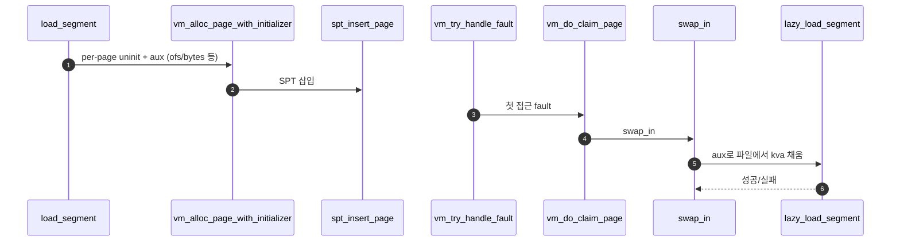

# C – Executable Segment Lazy Loading

## 1. 개요 (목표·이유·수정 위치·의존성)

```text
목표
- 실행 파일 segment를 즉시 읽지 않고, page fault 때 읽도록 등록한다.

이유
- lazy loading의 핵심은 필요한 page만 실제 메모리에 올리는 것이다.

수정/추가 위치
- userprog/process.c
  - load_segment()
  - lazy_load_segment()
  - segment load용 aux 구조체

의존성
- B의 vm_alloc_page_with_initializer가 init/aux를 저장해야 한다.
- A의 frame claim과 page table 매핑이 되어야 lazy_load_segment가 kva에 내용을 채울 수 있다.
```

## 2. 시퀀스

`load_segment`가 **즉시 파일 읽기 대신** uninit 등록만 하고, fault 후 **슬롯(`kva`)이 생긴 뒤** `lazy_load_segment`가 파일 바이트를 채운다.



## 3. 단계별 설명 (이 문서 범위)

1. **`load_segment`**: 세그먼트를 page 단위로 나누고 page마다 aux를 만든다.
2. **`vm_alloc_page_with_initializer`**: `lazy_load_segment`를 init으로 묶어 **`B - Uninit Page와 Initializer.md`** 와 같은 uninit 등록 경로로 넣는다.
3. **첫 접근**: **`00-서론.md` §1.1** 과 같이 fault → claim → `swap_in`까지 온 뒤, file-backed/uninit 분기에서 **`lazy_load_segment`가 `read`로 `kva`를 채운다**.
4. **zero_bytes 등**: ELF의 bss 쪽은 aux 정보에 따라 0으로 채우는 식으로 같은 함수에서 처리하는 경우가 많다.

## 4. 구현 주석 가이드

### 4.1 구현 대상 함수 목록

- `load_segment` (`userprog/process.c`)
- `lazy_load_segment` (`userprog/process.c`)

### 4.2 공통 구조체/필드 계약

- per-page aux 구조체를 사용한다(예: `file`, `ofs`, `read_bytes`, `zero_bytes`).
- `load_segment`는 SPT 등록만 수행하고 직접 물리 매핑하지 않는다.
- `lazy_load_segment`는 `page->frame->kva`에만 쓰며, 새 페이지를 할당하지 않는다.
- 실행 파일 세그먼트의 기본 타입은 `VM_FILE` 고정안을 사용한다.

### 4.3 함수별 구현 주석 (고정안)

C는 **`load_segment`에서 page당 aux 생성 + SPT 등록**, **`lazy_load_segment`에서 실제 파일 바이트 채움**으로 고정한다.

#### `load_segment` (`userprog/process.c`, `#ifdef VM`)

**추상**

```c
/* Merge1-C: FILE의 ofs~ 구간을 PGSIZE 단위로 나누고, 페이지마다 lazy_load_segment가 읽을 정보를 aux에 실어 vm_alloc_page_with_initializer만 호출한다. 즉시 file_read로 세그먼트 전체를 올리지 않는다. */
```

**1단계 구체**

- 루프: `page_read_bytes`, `page_zero_bytes = PGSIZE - page_read_bytes` (스켈레톤 1226–1227행 패턴).
- 매 페이지 `void *aux`에 `{ struct file *file, off_t page_ofs, size_t read_n, size_t zero_n }` 같은 구조체를 `malloc`해 넣거나 정적 풀.
- `vm_alloc_page_with_initializer (타입, upage, writable, lazy_load_segment, aux)` — 타입은 **`VM_FILE` + `file_backed_initializer`** 권장; 스켈레톤의 `VM_ANON`은 과제에 맞게 교체.
- `upage`, `ofs`, `read_bytes`, `zero_bytes` 갱신 후 다음 페이지.

**2단계 구체**

1. `while (read_bytes > 0 || zero_bytes > 0)` 유지.
2. `page_read_bytes = min(read_bytes, PGSIZE);` `page_zero_bytes = PGSIZE - page_read_bytes` (zero_bytes가 크면 여러 페이지로 분할 주의 — 스켈레톤 ASSERT에 맞출 것).
3. `aux = create_segment_aux (file, ofs, page_read_bytes, page_zero_bytes);`
   - 코드에 함수가 없으면 `process.c`에 `static` 헬퍼로 추가하거나 이 줄을 인라인 `malloc + 필드 대입`으로 풀어서 구현한다.
   - 내부 필수 필드: `file`, `ofs`, `read_bytes`, `zero_bytes`.
   - `aux == NULL`이면 즉시 `return false;`.
4. `if (!vm_alloc_page_with_initializer (VM_FILE, upage, writable, lazy_load_segment, aux)) return false;`
5. `read_bytes -= …; zero_bytes -= …; upage += PGSIZE; ofs += page_read_bytes;`
6. **하지 않음**: `palloc`, `pml4_set_page`, `vm_claim_page`, 전 세그먼트 `file_read`.

---

#### `lazy_load_segment` (`userprog/process.c`)

**추상**

```c
/* Merge1-C: uninit_initialize 안에서 두 번째로 호출된다(init 콜백). 이미 vm_do_claim_page로 frame·PTE가 잡힌 뒤이므로 aux와 page->frame->kva로 파일 읽기·남은 바이트 0 채우기만 한다. */
```

**1단계 구체**

- 시그니처 `bool lazy_load_segment (struct page *page, void *aux)` — UNINIT가 아닌 시점: 앞 단계에서 `page_initializer`가 이미 `page`를 file/anon으로 바꿈.
- 바이트 채울 주소: `uint8_t *kva = (uint8_t *) page->frame->kva` (claim 직후).
- `aux`에서 `file`, `ofs`, 읽을 길이, zero 길이를 꺼내 `file_read_at` 또는 `file_seek`+`file_read`로 `kva`에 반영, 나머지 `memset(kva + read_n, 0, zero_n)`.

**2단계 구체**

1. `struct segment_aux *a = aux;` (팀 구조체 이름)
2. `void *kva = page->frame->kva;` — NULL이면 설계 오류(claim 전에 불림).
3. `off_t read_bytes = file_read_at (a->file, a->ofs, kva, a->read_n);` 가 `a->read_n`과 같지 않으면 `false`.
4. `memset ((uint8_t *) kva + a->read_n, 0, a->zero_n);`
5. `return true;`
6. **하지 않음**: `vm_alloc_page_with_initializer`, `spt_insert_page`, `vm_do_claim_page`, 새 `palloc`로 유저 매핑 만들기.

**호출 순서 상기**: `vm_do_claim_page` → `swap_in` → `uninit_initialize` → 먼저 `file_backed_initializer(page, type, kva)` 가 `page->operations`/`page->file` 세팅 → 그 다음 `lazy_load_segment(page, aux)` 가 파일 내용 채움(스켈레톤 `uninit_initialize` 순서와 일치시킬 것).

### 4.4 함수 간 연결 순서 (호출 체인)

1. `load_segment`가 페이지 단위 aux를 만든다.
2. `vm_alloc_page_with_initializer (VM_FILE, upage, writable, lazy_load_segment, aux)`로 UNINIT page를 SPT에 등록한다.
3. fault 후 A 경로에서 claim + `swap_in` 호출.
4. `uninit_initialize`가 `file_backed_initializer` 후 `lazy_load_segment`를 호출한다.

### 4.5 실패 처리/롤백 규칙

- `vm_alloc_page_with_initializer` 실패 시 즉시 `false` 반환하고 남은 세그먼트 등록을 중단한다.
- `lazy_load_segment`에서 `file_read_at` 결과가 기대 길이보다 작으면 `false`.
- `lazy_load_segment`는 실패 시에도 새 `palloc`/새 매핑 생성 시도를 하지 않는다.
- aux 해제 책임은 팀 규약으로 고정하되, `load_segment`와 `lazy_load_segment` 중 한쪽만 담당하도록 단일화한다.

### 4.6 완료 체크리스트

- `load_segment` 루프에서 page 단위 aux가 생성된다.
- `VM_FILE` 타입으로 SPT 등록이 이루어진다.
- 첫 fault에서 `lazy_load_segment`가 호출되고 `kva`를 채운다.
- C 범위 코드에 `pml4_set_page`, `vm_claim_page` 직접 호출이 없다.
