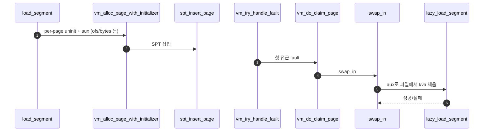
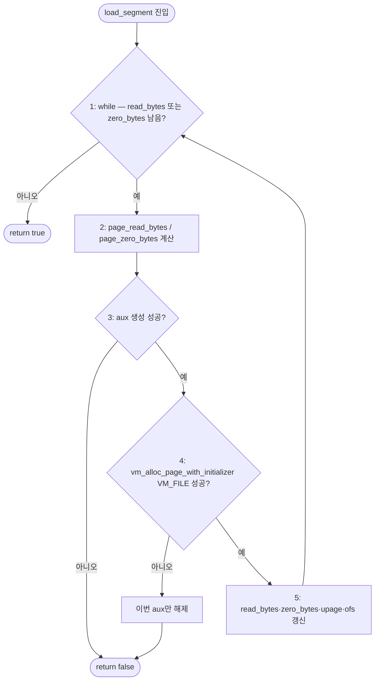
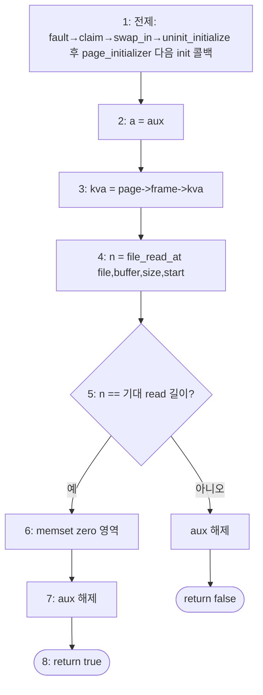

# C – Executable Segment Lazy Loading

## 1. 개요 (목표·이유·수정 위치·의존성)

```text
목표
- 실행 파일 segment를 즉시 읽지 않고, page fault 때 읽도록 등록한다.

이유
- lazy loading의 핵심은 필요한 page만 실제 메모리에 올리는 것이다.

수정/추가 위치
- userprog/process.c
  - load_segment()
  - lazy_load_segment()
  - segment load용 aux 구조체

의존성
- B의 vm_alloc_page_with_initializer가 init/aux를 저장해야 한다.
- A의 frame claim과 page table 매핑이 되어야 lazy_load_segment가 kva에 내용을 채울 수 있다.
```

## 2. 시퀀스

`load_segment`가 **즉시 파일 읽기 대신** uninit 등록만 하고, fault 후 **슬롯(`kva`)이 생긴 뒤** `lazy_load_segment`가 파일 바이트를 채운다.



## 3. 단계별 설명 (이 문서 범위)

1. **`load_segment`**: 세그먼트를 page 단위로 나누고 page마다 aux를 만든다.
2. **`vm_alloc_page_with_initializer`**: `lazy_load_segment`를 init으로 묶어 **`B - Uninit Page와 Initializer.md`** 와 같은 uninit 등록 경로로 넣는다.
3. **첫 접근**: **`00-서론.md` §1.1** 과 같이 fault → claim → `swap_in`까지 온 뒤, file-backed/uninit 분기에서 **`lazy_load_segment`가 `read`로 `kva`를 채운다**.
4. **zero_bytes 등**: ELF의 bss 쪽은 aux 정보에 따라 0으로 채우는 식으로 같은 함수에서 처리하는 경우가 많다.

## 4. 구현 주석 가이드

### 4.1 구현 대상 함수 목록

- `load_segment` (`userprog/process.c`)
- `lazy_load_segment` (`userprog/process.c`)

### 4.2 공통 구조체/필드 계약

- per-page aux 구조체를 사용한다(예: `file`, `ofs`, `read_bytes`, `zero_bytes`).
- `load_segment`는 SPT 등록만 수행하고 직접 물리 매핑하지 않는다.
- `lazy_load_segment`는 `page->frame->kva`에만 쓰며, 새 페이지를 할당하지 않는다.
- 실행 파일 세그먼트의 기본 타입은 `VM_FILE` 고정안을 사용한다.

### 4.3 함수별 구현 주석 (고정안)

C는 **`load_segment`에서 page당 aux 생성 + SPT 등록**, **`lazy_load_segment`에서 실제 파일 바이트 채움**으로 고정한다.

#### §4.3.0 이 문서에서의 적는 방식

- 함수마다 **1. 2. 3. … 번호 흐름** 한 덩어리로 적는다. 추상만 코드 펜스로 따로 두는 방식은 쓰지 않는다.
- 앞쪽 번호는 책임·맥락·호출 순서, 뒤쪽 번호는 조건·실제 API·실패·aux 해제처럼 리뷰할 디테일에 가깝게 둔다.
- 코드에 남길 한 줄 주석이 필요하면, 아래 흐름 **1번 앞 문장**을 그대로 옮겨도 된다.
- 각 함수마다 아래 **플로우차트**는 같은 절의 번호 흐름과 대응한다(6·9번 같은 “하지 않음”은 그림 밖 규칙으로만 둔다).
- **플로우차트(B안)**: 이 문서는 루프·실패 분기가 분명한 두 함수에만 차트를 넣었다. 다른 문서에서는 같은 기준으로 **필요할 때만** 추가한다.

---

#### `load_segment` (`userprog/process.c`, `#ifdef VM`)

Merge 1–C에서 이 함수는 **세그먼트를 페이지 단위로 쪼개 aux만 싣고 `vm_alloc_page_with_initializer`로 등록**한다. 파일 전체를 여기서 읽지 않는다.

**흐름**

1. `while (read_bytes > 0 || zero_bytes > 0)`로 남은 구간이 없을 때까지 반복한다. 한 번에 **한 유저 페이지**만 다룬다.
2. `page_read_bytes = read_bytes < PGSIZE ? read_bytes : PGSIZE`, `page_zero_bytes = PGSIZE - page_read_bytes`로 이번 페이지의 “파일에서 읽을 길이”와 “같은 페이지 안 0으로 채울 길이”를 정한다(상위 `ASSERT` 전제와 맞물린다).
3. `aux`에 `file`, `ofs`, 위 두 길이를 담는다. (`create_segment_aux` 등 팀 헬퍼, 또는 동등한 인라인 할당.) 필드 이름 예: `read_bytes`, `zero_bytes`. `aux == NULL`이면 즉시 `return false`.
4. `vm_alloc_page_with_initializer (VM_FILE, upage, writable, lazy_load_segment, aux)`를 호출해 해당 `upage`를 lazy 등록한다. **`page_initializer`(예: `file_backed_initializer`)는 B의 `vm_alloc` 구현**이 타입에 맞게 연결한다. 실패 시 **이번에 만든 aux만 해제**하고 `return false` (남은 페이지 등록 중단).
5. `read_bytes -= page_read_bytes`, `zero_bytes -= page_zero_bytes`, `upage += PGSIZE`, `ofs += page_read_bytes`로 다음 페이지로 넘어간다.
6. **하지 않음 (C 경계)**: `pml4_set_page`, `vm_claim_page`, 세그먼트 전체를 한 번에 읽는 `file_read` / `file_read_at`, 유저 물리 슬롯을 여기서 직접 확보하기.

**플로우차트**



위 그림에 없는 **6번(하지 않음)**은 이 함수 안에서 하지 말아야 할 일의 목록이다.

---

#### `lazy_load_segment` (`userprog/process.c`)

Merge 1–C에서 이 함수는 **이미 claim된 `page->frame->kva`에만** 파일 바이트를 읽어 넣고, aux가 말해 주는 만큼 뒤를 0으로 채운다. SPT·프레임·PTE를 새로 만들지 않는다.

**흐름**

1. 호출 위치는 **fault → claim → `swap_in` → `uninit_initialize`** 안이다. `vm/uninit.c`에서 **`page_initializer`가 먼저**, 그다음 **init 콜백(`lazy_load_segment`)** 순서와 맞출 것.
2. `struct segment_aux *a = aux`로 캐스팅한다. `aux == NULL`이면 설계 오류.
3. `void *kva = page->frame->kva`를 쓴다. `NULL`이면 claim 전 호출 등 설계 오류.
4. `include/filesys/file.h`: `off_t file_read_at (struct file *file, void *buffer, off_t size, off_t start);` — 예: `off_t n = file_read_at (a->file, kva, (off_t) a->read_bytes, a->ofs);`
5. `n != (off_t) a->read_bytes`이면 **§4.5 팀 규약대로 aux 해제** 후 `return false`.
6. `memset ((uint8_t *) kva + n, 0, a->zero_bytes);` (성공 시 읽은 끝 뒤부터 zero.)
7. 성공 시에도 **§4.5에 맞게 aux 해제** (`load_segment`와 해제 경로가 겹치지 않게).
8. `return true`.
9. **하지 않음 (C 경계)**: `vm_alloc_page_with_initializer`, `spt_insert_page`, `vm_do_claim_page`, 유저용 새 `palloc`로 별도 매핑 만들기.

**플로우차트**



**9번(하지 않음)**은 위 경로 밖에서 해서는 안 되는 작업 목록이다.

### 4.4 함수 간 연결 순서 (호출 체인)

1. `load_segment`가 페이지 단위 aux를 만든다.
2. `vm_alloc_page_with_initializer (VM_FILE, upage, writable, lazy_load_segment, aux)`로 UNINIT page를 SPT에 등록한다.
3. fault 후 A 경로에서 claim + `swap_in` 호출.
4. `uninit_initialize`가 `file_backed_initializer` 후 `lazy_load_segment`를 호출한다.

### 4.5 실패 처리/롤백 규칙

- `vm_alloc_page_with_initializer` 실패 시: **이번에 만든 aux만 해제**한 뒤 즉시 `false`, 남은 페이지 등록은 중단한다(§4.3 `load_segment` **흐름 4**와 동일).
- `lazy_load_segment`에서 `file_read_at` 결과가 기대 길이보다 작으면 `false`(aux는 §4.3 `lazy_load_segment` **흐름 5·7** 및 아래 단일화 규칙에 맞게 해제).
- `lazy_load_segment`는 실패 시에도 새 `palloc`/새 매핑 생성 시도를 하지 않는다.
- aux 해제 책임은 팀 규약으로 고정하되, `load_segment`와 `lazy_load_segment` 중 **경로가 겹치지 않게** 단일화한다(성공·실패·등록 실패 각각 한 번만 해제).

### 4.6 완료 체크리스트

- §4.3.0 방식대로 `load_segment` / `lazy_load_segment` 구현 주석을 **번호 흐름**으로 적는다(추상 전용 코드 펜스 없음).
- §4.3 각 함수의 **플로우차트**가 같은 절의 **번호 흐름**과 대응한다.
- `load_segment` 루프에서 page 단위 aux가 생성된다.
- `VM_FILE` 타입으로 SPT 등록이 이루어진다.
- 첫 fault에서 `lazy_load_segment`가 호출되고 `kva`를 채운다.
- C 범위 코드에 `pml4_set_page`, `vm_claim_page` 직접 호출이 없다.
