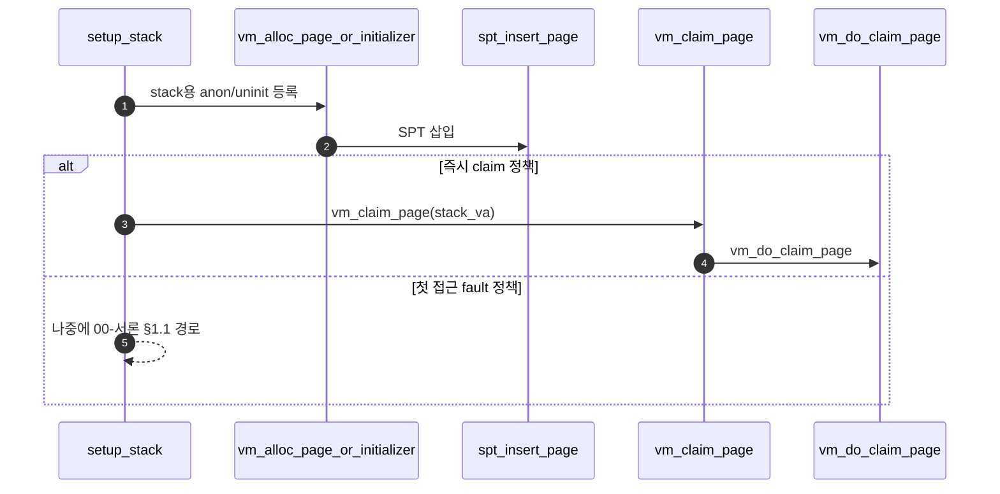

# D – 초기 Stack Page

## 1. 개요 (목표·이유·수정 위치·의존성)

```text
목표
- 첫 stack page를 만들고 argument passing이 정상 동작하도록 연결한다.

이유
- 유저 프로그램 시작 시 stack은 즉시 필요하며, Project 2 argument passing과 직접 연결된다.

수정/추가 위치
- userprog/process.c
  - setup_stack()
  - argument_stack 관련 흐름 확인
- 필요 시 vm/vm.c
  - vm_claim_page() 사용 흐름 확인

의존성
- A의 vm_claim_page/vm_do_claim_page가 필요하다.
- B의 anon initializer가 있어야 stack page를 anonymous page로 다룰 수 있다.
```

## 2. 시퀀스

`setup_stack`이 **첫 스택 page를 SPT에 올린 뒤**, 구현에 따라 즉시 `vm_claim_page`로 올리거나 fault 때 **`00-서론.md` §1.1** 경로로 합류한다.



## 3. 단계별 설명 (이 문서 범위)

1. **`setup_stack`**: user stack 상단 근처 VA에 맞는 **한 page**를 VM 서브시스템에 등록한다.
2. **B 연동**: stack은 보통 **anonymous** 취급이므로 **`B - Uninit Page와 Initializer.md`** 의 anon initializer 경로와 맞춘다.
3. **A 연동**: 등록 직후 `vm_claim_page`로 frame을 붙이면 **`A - Frame Claim.md`** 와 동일 claim 몸체를 재사용한다. lazy로 두면 **`00-서론.md` §1.1** fault 경로로 첫 접근 시 올린다.
4. **Project 2**: `argument_stack` 등은 이 stack page가 유효한 뒤에 쌓인다.

## 4. 구현 주석 가이드

### 4.1 구현 대상 함수 목록

- `setup_stack` (`userprog/process.c`)

### 4.2 공통 구조체/필드 계약

- 스택 시작 VA는 `stack_bottom = USER_STACK - PGSIZE`로 고정한다.
- 최초 스택 페이지 타입은 `VM_ANON`, writable `true`로 둔다.
- 성공 시 `if_->rsp = USER_STACK`를 설정한다.
- 동적 스택 확장(`vm_stack_growth`)은 Merge 2에서만 다룬다.

### 4.3 함수별 구현 주석 (고정안)

D는 **스택 1페이지 등록 + 즉시 claim + rsp 설정**으로 고정한다.

#### `setup_stack` (`userprog/process.c`, `#ifdef VM`)

**추상**

```c
/* Merge1-D: stack_bottom VA에 스택용 page를 anon/uninit 경로로 SPT에 넣고, 필요하면 즉시 vm_claim_page로 올린다. 성공 시 if_->rsp를 USER_STACK으로 맞춘다. vm_stack_growth는 Merge2. */
```

**1단계 구체**

- `void *stack_bottom = (uint8_t *) USER_STACK - PGSIZE;` — 스켈레톤 1247행.
- `vm_alloc_page_with_initializer (VM_ANON, stack_bottom, true, NULL, NULL)` 또는 스택 전용 initializer — 스택은 보통 anon·zero.
- 선택 A: 바로 `vm_claim_page (stack_bottom)` → 내부에서 `vm_do_claim_page` → 스택 프레임+PTE.
- 선택 B: SPT만 넣고 첫 접근 시 `00-서론` §1.1 fault 경로.
- 성공 시 `if_->rsp = (uint64_t) USER_STACK` — 인자 스택 쌓기 전제.

**2단계 구체**

1. `void *sb = ((uint8_t *) USER_STACK) - PGSIZE;`
2. `if (!vm_alloc_page_with_initializer (VM_ANON, sb, true, …)) return false;` — `anon_initializer`/`uninit_new` 조합은 B와 동일.
3. **즉시 매핑 정책**: `if (!vm_claim_page (sb)) return false;` — `vm_claim_page` → `spt_find_page` → `vm_do_claim_page`.
4. `if_->rsp = USER_STACK;` (또는 정렬 규약에 맞는 초기 rsp).
5. **하지 않음**: `vm_stack_growth`, user `rsp` 커널 저장 필드, fault 시 스택 범위 판별(Merge2).
6. 이후 `push_arguments` 등은 이 매핑이 살아 있는 상태에서만 호출.

### 4.4 함수 간 연결 순서 (호출 체인)

1. `setup_stack`가 `stack_bottom` 계산.
2. `vm_alloc_page_with_initializer (VM_ANON, stack_bottom, true, ...)`로 SPT 등록.
3. `vm_claim_page (stack_bottom)`로 즉시 매핑.
4. 성공 시 `if_->rsp = USER_STACK` 설정 후 인자 스택 경로로 진행.

### 4.5 실패 처리/롤백 규칙

- SPT 등록 실패 시 즉시 `false`.
- `vm_claim_page` 실패 시 즉시 `false`.
- 실패한 경우 `if_->rsp`를 설정하지 않는다.
- D 범위에서 추가 stack growth 복구를 시도하지 않는다.

### 4.6 완료 체크리스트

- `setup_stack`에서 `stack_bottom` 계산이 정확하다.
- `VM_ANON` 스택 페이지가 SPT에 등록된다.
- 즉시 `vm_claim_page`로 매핑이 완료된다.
- 성공 시 `if_->rsp = USER_STACK`이 보장된다.
