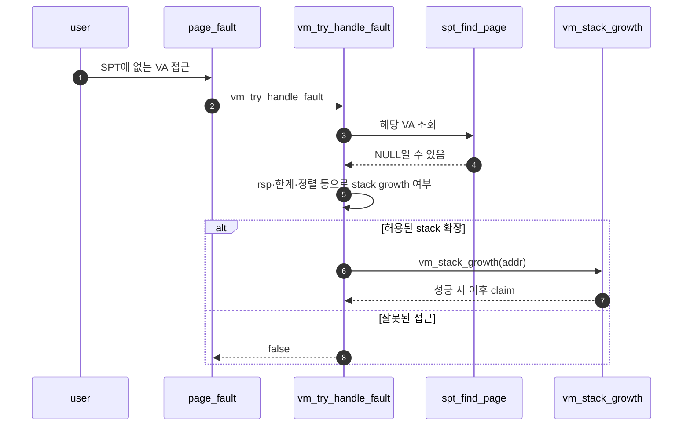
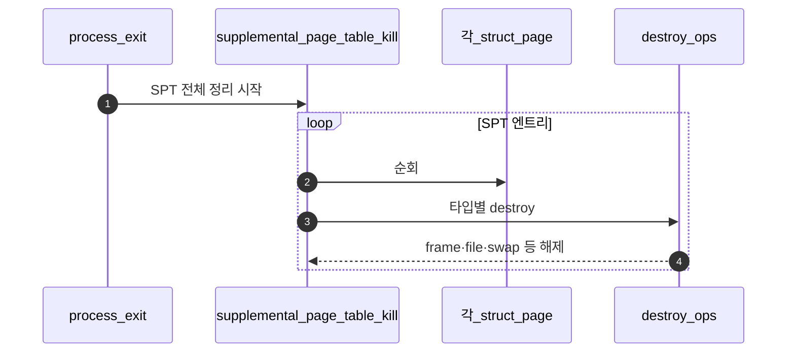

# Merge 2 – Stack Growth + Page Cleanup

## 1. 목표

```text
stack이 커지는 접근을 page fault에서 구분하고,
프로세스 종료 시 page 자원을 안전하게 정리한다.
```

### 1.1 전체 시퀀스 (E2E)

**이 폴더 = Merge 2**다. 사용자에게 보이는 큰 줄기는 **(1) 스택이 자라는 fault 처리**와 **(2) 프로세스 종료 시 SPT·page 정리** 두 축이다. 코드를 쪼개 넣는 **권장 순서**는 **§2**와 같다.

**축 1 — stack growth (page fault)**



**축 2 — exit / cleanup**



### 1.2 한 줄로 읽는 순서

1. **Stack**: SPT miss가 곧 invalid는 아니다. `vm_try_handle_fault`에서 **스택 범위·`rsp` 기준**으로 growth 가능 여부를 판별한다 (**`A - Stack Growth 판별.md`**).
2. **확장**: 조건을 통과하면 **`vm_stack_growth`**가 새 anon page를 만들고 **Merge 1**의 claim 경로로 붙인다 (**`B - Stack Growth 실행.md`**).
3. **Destroy**: `free(page)`만으로 부족한 타입별 정리는 **`destroy` 연산**에 모은다 (**`C - Page Destroy.md`**).
4. **Kill**: exit 시 **`supplemental_page_table_kill`**이 SPT를 순회하며 위 destroy를 호출한다 (**`D - SPT Kill.md`**).
5. **뒤 머지**: mmap·swap slot 정리는 **Merge 3·Merge 4** 폴더에서 두꺼워지며, Merge 2에서는 **호출 관계**만 맞춰도 된다.

## 2. 이상적인 내부 머지 순서

```text
1. C - Page Destroy
2. D - SPT Kill
3. B - Stack Growth 실행
4. A - Stack Growth 판별
```

이유:

```text
C/D의 cleanup 기반이 먼저 있어야 새 stack page도 종료 시 안전하게 정리된다.
B가 실제 stack page 생성 함수를 만든 뒤, A가 fault handler에서 호출하는 흐름이 자연스럽다.
A는 page fault 입구를 건드리므로 마지막에 붙이는 것이 안정적이다.
```

## 3. 완료 기준

```text
stack growth 관련 테스트 일부 통과 기대
프로세스 종료 시 page cleanup 흐름 확인
page fault가 stack인지 invalid access인지 구분 가능
```

## 4. 템플릿 규약

이 Merge의 `A~D` 문서 §4는 Merge 1과 동일한 템플릿을 사용한다.

- `4.1 구현 대상 함수 목록`
- `4.2 공통 구조체/필드 계약`
- `4.3 함수별 구현 주석 (고정안)`
- `4.4 함수 간 연결 순서 (호출 체인)`
- `4.5 실패 처리/롤백 규칙`
- `4.6 완료 체크리스트`

원칙은 동일하다: **앞 단계에서 뒷단 구현을 강요하지 않고**, 해당 분업 범위의 함수·연결·실패 규칙만 고정한다.
