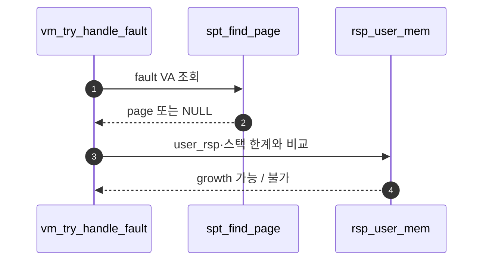
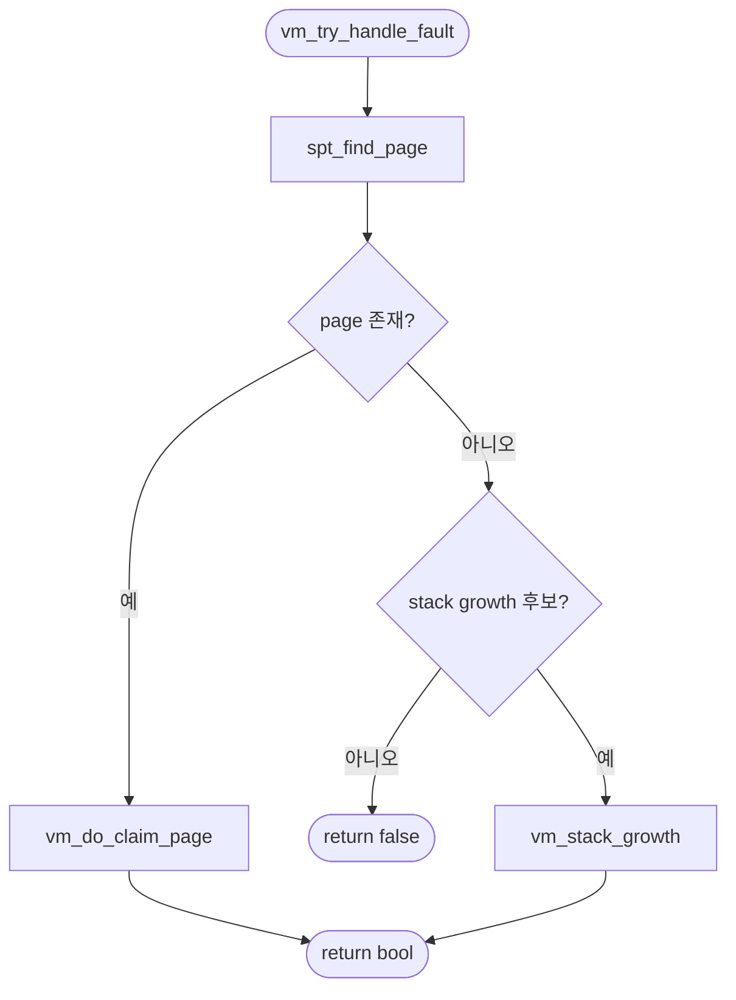

# A – Stack Growth 판별

## 1. 개요 (목표·이유·수정 위치·의존성)

```text
목표
- page fault가 stack growth로 처리 가능한 접근인지 판단한다.

이유
- SPT에 page가 없다고 전부 잘못된 접근은 아니며, stack 확장일 수 있다.

수정/추가 위치
- vm/vm.c
  - vm_try_handle_fault()
- userprog/syscall.c 또는 userprog/exception.c 관련 흐름
  - user rsp 저장 필요 여부 확인
- threads/thread.h
  - user rsp 저장 필드가 필요하면 추가

의존성
- B의 vm_stack_growth가 있어야 판별 후 실제 확장이 가능하다.
```

## 2. 시퀀스

`vm_try_handle_fault` 안에서 **fault 주소가 “스택으로 내려온 접근”인지**만 가른다. 실제 page 생성은 **`B - Stack Growth 실행.md`** 다.



## 3. 단계별 설명 (이 문서 범위)

1. **SPT hit**면 일반 lazy 경로(**`../Merge 1 - Frame Claim + Lazy Loading/00-서론.md` §1.1**)로 넘긴다.
2. **SPT miss**일 때만 stack 후보를 본다.
3. **정렬**: fault 주소는 보통 page 정렬된 범위로 본다.
4. **`rsp`**: 유저 `rsp`가 커널에 없으면 저장해 두는 설계가 필요할 수 있다 (이 문서 §1 본문 참고).

## 4. 구현 주석 가이드

### 4.1 구현 대상 함수 목록

- `vm_try_handle_fault` (`vm/vm.c`)
- (선택) `page_fault`에서 넘겨받는 `addr`, `user`, `write`, `not_present` 해석 블록
- (선택) `thread`의 user `rsp` 보관 필드 갱신 지점

### 4.2 공통 구조체/필드 계약

- `spt_find_page (spt, addr)`가 NULL일 때만 stack growth 후보를 판단한다.
- user stack 상한은 `USER_STACK`, 하한은 팀 정책(예: `USER_STACK - 1MB`)으로 고정한다.
- 판별 함수는 “허용/거절”만 결정하고 실제 페이지 생성은 B의 `vm_stack_growth`가 맡는다.
- Merge 2 범위에서는 mmap/file-backed 세부를 건드리지 않는다.

### 4.3 함수별 구현 주석 (고정안)

#### §4.3.0 (이 문서)

[Merge 1 `00-서론.md`](../Merge%201%20-%20Frame%20Claim%20+%20Lazy%20Loading/00-%EC%84%9C%EB%A1%A0.md) §4.3.0과 동일.

---

#### `vm_try_handle_fault` (`vm/vm.c`)

Merge 2–A에서 이 함수는 **SPT miss일 때 fault 주소가 stack growth 조건을 만족하는지 판별**하고, 만족하면 **`vm_stack_growth` 경로**로 넘긴다. 아니면 `false`다.

**흐름**

1. `page = spt_find_page(&thread_current()->spt, pg_round_down(addr));`
2. `page != NULL`이면 Merge 1 claim: `return vm_do_claim_page(page);`
3. `page == NULL`이면 `not_present`·`user` 등으로 stack 후보가 아닌 fault는 `return false;`
4. `addr`, `user_rsp`(또는 `f->rsp`/저장 필드), `USER_STACK`, `STACK_LIMIT`로 growth 가능성 판단 — `is_stack_access` 등 `static` 헬퍼로 빼도 된다.
5. 조건 통과 시 `return vm_stack_growth(pg_round_down(addr));` (또는 growth 후 claim 결과).
6. **하지 않음 (A 경계)**: destroy, kill, swap slot 정리.

**플로우차트**



### 4.4 함수 간 연결 순서 (호출 체인)

1. `page_fault`가 `vm_try_handle_fault`를 호출한다.
2. `vm_try_handle_fault`가 `spt_find_page`로 hit/miss를 가른다.
3. miss + stack 조건 통과 시 `vm_stack_growth`로 넘어간다.
4. growth 성공 시 fault 복구 결과를 true로 반환한다.

### 4.5 실패 처리/롤백 규칙

- stack 조건 불충족 시 즉시 `false`.
- `vm_stack_growth` 실패 시 `false`.
- A 범위에서는 부분 생성 페이지 정리까지 직접 하지 않는다(생성 실패 rollback은 B에서 처리).

### 4.6 완료 체크리스트

- SPT miss를 모두 invalid로 처리하지 않는다.
- stack 접근 판단이 `rsp`/한계/정렬 규칙으로 고정되어 있다.
- 허용 케이스만 B의 `vm_stack_growth`로 전달된다.
- Merge 2-A 코드에 mmap/eviction 구현이 섞여 있지 않다.
