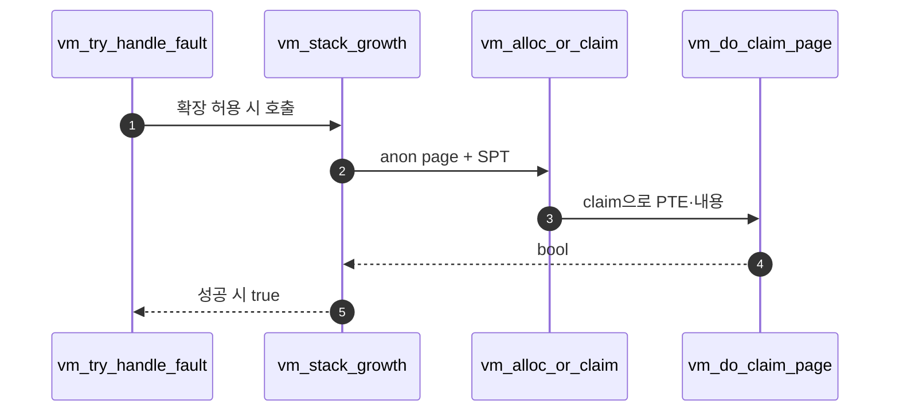

# B – Stack Growth 실행

## 1. 개요 (목표·이유·수정 위치·의존성)

```text
목표
- fault 주소에 해당하는 새 anonymous page를 할당하고 claim한다.

이유
- stack은 높은 주소에서 낮은 주소로 자라므로, 필요한 순간 새 page를 만들어야 한다.

수정/추가 위치
- vm/vm.c
  - vm_stack_growth()
  - VM_ANON page 할당
  - 1MB stack limit 검사

의존성
- A가 stack growth 조건을 정확히 판단해야 한다.
- Merge 1의 frame claim과 anon initializer가 필요하다.
```

## 2. 시퀀스

`vm_stack_growth`가 **새 stack page를 VM에 등록**하고, **Merge 1**의 `vm_claim_page` 등으로 frame을 붙여 fault를 복구한다.



## 3. 단계별 설명 (이 문서 범위)

1. **1MB 한도** 등 문서에 적은 정책을 여기서 검사한다.
2. **등록**: `vm_alloc_page_with_initializer` 등 Merge 1 패턴과 맞춘다.
3. **Claim**: fault를 끝내려면 곧바로 frame을 붙이거나, lazy면 다음 접근까지 맡긴다 (팀 정책).

## 4. 구현 주석 가이드

### 4.1 구현 대상 함수 목록

- `vm_stack_growth` (`vm/vm.c`)
- (연결) `vm_alloc_page_with_initializer` 호출 지점
- (연결) `vm_claim_page` 또는 `vm_do_claim_page` 호출 지점

### 4.2 공통 구조체/필드 계약

- 확장 대상 VA는 `pg_round_down (addr)`로 정렬한다.
- stack page는 `VM_ANON`, writable `true`를 기본값으로 고정한다.
- stack 한계(예: 1MB)는 B에서 강제한다.
- B는 생성/claim까지만 담당하고 종료 정리는 C/D에서 담당한다.

### 4.3 함수별 구현 주석 (고정안)

#### `vm_stack_growth` (`vm/vm.c`)

**추상**

```c
/* Merge2-B: fault 주소 페이지를 스택용 anon page로 등록하고, 즉시 claim해서 fault를 복구한다. */
```

**1단계 구체**

- `va = pg_round_down (addr)` 계산.
- stack limit 초과면 실패.
- `vm_alloc_page_with_initializer (VM_ANON, va, true, ...)` 호출.
- 성공 시 `vm_claim_page (va)`로 매핑 완료.

**2단계 구체**

1. `void *va = pg_round_down (addr);`
2. `if (!within_stack_limit (va, USER_STACK, STACK_LIMIT)) return false;`
   - `within_stack_limit`가 코드에 없으면 `vm.c` 내부 `static bool` 헬퍼로 추가한다.
   - 판정식은 `USER_STACK - STACK_LIMIT <= va && va < USER_STACK`로 고정한다.
   - 이 헬퍼는 “범위 검사만” 담당하고 할당/claim은 하지 않는다.
3. `if (!vm_alloc_page_with_initializer (VM_ANON, va, true, NULL, NULL)) return false;`
4. `if (!vm_claim_page (va)) return false;`
5. `return true;`
6. **하지 않음**: SPT 전체 kill, 타입별 destroy, swap slot reclaim.

### 4.4 함수 간 연결 순서 (호출 체인)

1. A의 `vm_try_handle_fault`가 stack 후보를 허용한다.
2. B의 `vm_stack_growth`가 anon page를 SPT에 등록한다.
3. 이어서 claim 경로를 호출해 PTE/내용을 준비한다.
4. 성공 시 fault 처리 함수가 true를 반환한다.

### 4.5 실패 처리/롤백 규칙

- limit 검사 실패 시 아무 것도 등록하지 않고 `false`.
- 등록 성공 후 claim 실패 시 `spt_remove_page` 또는 팀 규약 rollback으로 찌꺼기를 제거.
- B 범위에서는 종료 시 전역 cleanup까지 수행하지 않는다.

### 4.6 완료 체크리스트

- `vm_stack_growth`가 정렬/한계/등록/claim 순서를 지킨다.
- 성공 시 같은 VA 재접근에서 fault가 재발하지 않는다.
- 실패 시 SPT에 깨진 엔트리가 남지 않는다.
- Merge 2-B 코드에 eviction 로직이 섞여 있지 않다.
