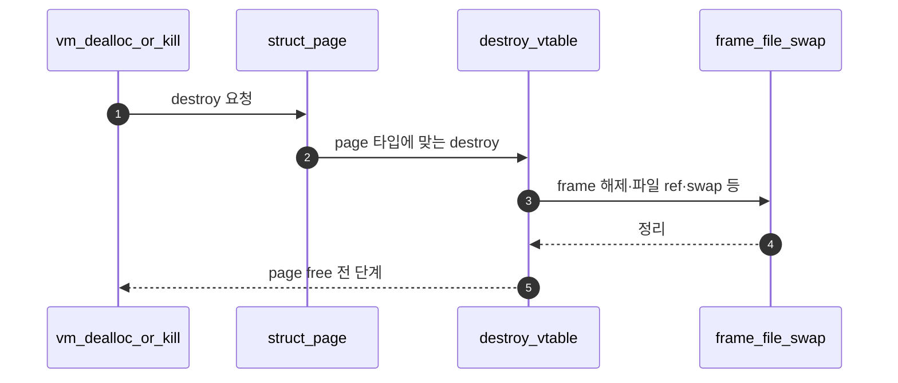

# C – Page Destroy

## 1. 개요 (목표·이유·수정 위치·의존성)

```text
목표
- page 타입별 destroy 함수를 구현해 page가 가진 자원을 정리한다.

이유
- free(page)만 하면 file/swap/frame 같은 부가 자원이 남을 수 있다.

수정/추가 위치
- vm/uninit.c
  - uninit_destroy()
- vm/anon.c
  - anon_destroy()
- vm/file.c
  - file_backed_destroy() 초안 확인

의존성
- D의 supplemental_page_table_kill이 destroy(page)를 호출한다.
- Merge 4 이후 swap slot 정리 로직과 연결된다.
```

## 2. 시퀀스

`vm_dealloc_page` 또는 타입별 경로에서 **`destroy(page)`**가 호출되면, `page_operations`에 매달린 **uninit/anon/file `destroy`**가 자원을 푼다.



## 3. 단계별 설명 (이 문서 범위)

1. **역할**: `free(page)` 전에 **타입별 부가 자원**을 모은다.
2. **호출자**: eviction·munmap·`supplemental_page_table_kill` 등이 공통으로 탄다.
3. **Merge 4**: anon swap 슬롯 해제 등은 Merge 4 폴더에서 두꺼워진다.

## 4. 구현 주석 가이드

### 4.1 구현 대상 함수 목록

- `uninit_destroy` (`vm/uninit.c`)
- `anon_destroy` (`vm/anon.c`)
- `file_backed_destroy` (`vm/file.c`)
- (호출 경로) `vm_dealloc_page`의 `destroy(page)` 매크로

### 4.2 공통 구조체/필드 계약

- `destroy(page)`는 `page->operations->destroy(page)`로 호출된다.
- 각 destroy는 자기 타입 자원만 정리하고 `free(page)`는 호출하지 않는다.
- `page->frame` 연계 자원 해제는 중복 호출 방지 규약을 지킨다.
- Merge 2 범위에서는 swap slot reclaim 세부를 과도하게 확장하지 않는다.

### 4.3 함수별 구현 주석 (고정안)

#### §4.3.0 (이 문서)

[Merge 1 `00-서론.md`](../Merge%201%20-%20Frame%20Claim%20+%20Lazy%20Loading/00-%EC%84%9C%EB%A1%A0.md) §4.3.0과 동일. 타입별 destroy는 선형이 많아 **플로우차트 생략**해도 된다.

---

#### `uninit_destroy` (`vm/uninit.c`)

UNINIT이 **fault 없이 종료**될 때 남은 `aux` 등만 정리한다. **`free(page)`는 호출하지 않는다** — 호출자 `vm_dealloc_page`가 수행.

**흐름**

1. `struct uninit_page *u = &page->uninit;` 남은 `aux`가 있으면 팀 규약대로 `palloc_free_page`/`free` 등으로 해제.
2. idempotent하게 두 번 호출돼도 안전하게.
3. **하지 않음**: SPT 순회, `hash_destroy` 전체.

---

#### `anon_destroy` (`vm/anon.c`)

anon이 붙잡은 **frame·swap 등 부가 자원**을 정리한다. `free(page)`는 호출자.

**흐름**

1. `page->frame` 등 링크를 끊을 때 double free가 나지 않게 가드.
2. Merge 4에서 swap 슬롯 해제가 붙으면 여기 또는 `anon_swap_out`과 역할을 나눈다.
3. **하지 않음**: SPT kill 루프 전체.

---

#### `file_backed_destroy` (`vm/file.c`)

file-backed/mmap이 붙잡은 **파일 참조·dirty 정책**을 최소로 정리한다. write-back 세부는 D·Merge 3과 충돌 없게.

**흐름**

1. `struct file_page` 필드에 맞춰 `file_close`/`inode` 참조 등 팀 규약대로 정리.
2. **하지 않음**: `supplemental_page_table_kill` 전체, mmap syscall 본문.

### 4.4 함수 간 연결 순서 (호출 체인)

1. `vm_dealloc_page` 또는 D의 kill 경로가 `destroy(page)`를 호출한다.
2. vtable이 타입별 destroy로 분기한다.
3. destroy 완료 후 호출자가 `free(page)`를 수행한다.

### 4.5 실패 처리/롤백 규칙

- destroy 내부는 실패를 반환하지 않으므로 idempotent(중복 안전)하게 작성한다.
- write-back 실패 등 정책성 실패는 D/후속 Merge에서 처리 위치를 고정한다.
- C에서는 예외 발생 시에도 double free가 나지 않게 링크 정리를 우선한다.

### 4.6 완료 체크리스트

- 타입별 destroy 함수가 모두 구현되어 있다.
- `free(page)`가 destroy 내부가 아니라 호출자에서 1회만 수행된다.
- 종료/eviction/munmap 공통 경로에서 destroy를 재사용할 수 있다.
- double free 경로가 문서 상으로 차단되어 있다.
