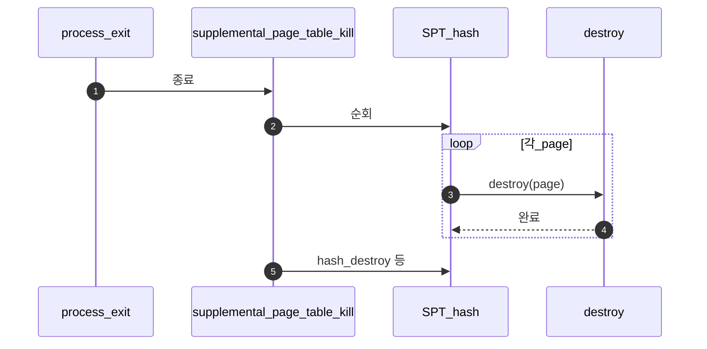
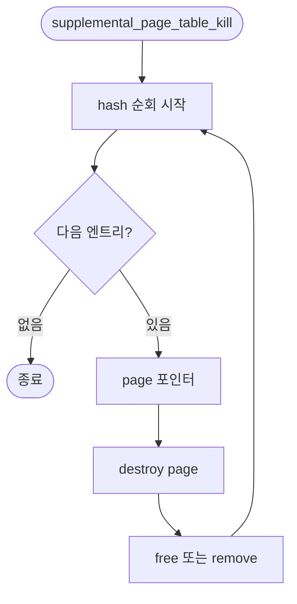

# D – SPT Kill

## 1. 개요 (목표·이유·수정 위치·의존성)

```text
목표
- 프로세스 종료 시 SPT 안의 모든 page를 순회하며 정리한다.

이유
- 프로세스마다 SPT를 가지므로 exit 때 page 설명서와 관련 자원을 모두 해제해야 한다.

수정/추가 위치
- vm/vm.c
  - supplemental_page_table_kill()
  - hash_destroy 또는 hash 순회

의존성
- C의 destroy 함수들이 필요하다.
- Merge 3의 mmap cleanup, Merge 4의 swap cleanup과 나중에 다시 맞춰야 한다.
```

## 2. 시퀀스

exit 시 **`supplemental_page_table_kill`**이 해시를 순회하며 각 page에 대해 **`C - Page Destroy.md`**의 destroy를 호출하고 SPT를 비운다.



## 3. 단계별 설명 (이 문서 범위)

1. **단일 입구**: 프로세스마다 한 번씩 반드시 도는 경로로 두는 것이 디버깅에 유리하다.
2. **이중 free 방지**: destroy 안에서 이미 푼 자원을 다시 건드리지 않게 타입별 규약을 맞춘다.
3. **Merge 3·Merge 4**: mmap·swap 정리 세부는 해당 폴더 문서에서 보강한다.

## 4. 구현 주석 가이드

### 4.1 구현 대상 함수 목록

- `supplemental_page_table_kill` (`vm/vm.c`)
- (연결) hash 순회/파괴 콜백
- (연결) C의 타입별 `destroy` 호출 지점

### 4.2 공통 구조체/필드 계약

- kill은 현재 스레드의 `spt->hash` 엔트리를 전부 순회한다.
- 각 엔트리는 `destroy(page)` 후 제거한다.
- kill은 프로세스 종료 시 단일 진입점으로 동작한다.
- Merge 2 범위에서는 mmap/swap 세부 정책을 과도하게 끌어오지 않는다.

### 4.3 함수별 구현 주석 (고정안)

#### §4.3.0 (이 문서)

[Merge 1 `00-서론.md`](../Merge%201%20-%20Frame%20Claim%20+%20Lazy%20Loading/00-%EC%84%9C%EB%A1%A0.md) §4.3.0과 동일.

---

#### `supplemental_page_table_kill` (`vm/vm.c`)

Merge 2–D에서 이 함수는 **SPT 해시를 순회**하며 각 page에 **`destroy(page)`**를 호출하고 엔트리를 제거해 **종료 시 SPT가 비도록** 한다.

**흐름**

1. `struct hash *h = &spt->hash;`
2. `hash_first`/`hash_next` 또는 `hash_destroy`+콜백 등 **삭제 안전**한 순회만 사용한다.
3. 각 `struct page *p`에 대해 `destroy(p)` (C의 vtable) 후 `free(p)` 또는 `spt_remove_page` 규약과 일치시킨다.
4. 순회 종료 후 hash가 비었는지 보장한다.
5. **하지 않음 (D 경계)**: stack growth 판별, 새 page claim, mmap 등록.

**플로우차트**



### 4.4 함수 간 연결 순서 (호출 체인)

1. `process_exit`가 `supplemental_page_table_kill`을 호출한다.
2. kill이 SPT 엔트리를 순회한다.
3. 각 엔트리에서 C의 destroy를 호출한다.
4. 엔트리 제거 후 종료 경로가 반환된다.

### 4.5 실패 처리/롤백 규칙

- kill 경로는 best-effort 정리 원칙으로, 일부 자원 정리 실패가 있어도 이중 해제는 막는다.
- 순회 도중 삭제 안전성을 보장하는 API만 사용한다.
- D 범위에서는 mmap write-back 세부 실패 정책을 확정하지 않는다(후속 Merge에서 보강).

### 4.6 완료 체크리스트

- 종료 시 SPT 엔트리가 남지 않는다.
- 각 엔트리에서 타입별 destroy가 실제로 호출된다.
- 순회/삭제 과정에서 iterator 오류가 없다.
- kill 경로가 단일 종료 진입점으로 유지된다.
