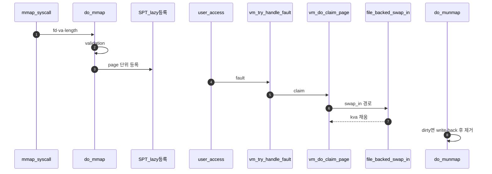

# Merge 3 – mmap / File-backed Page

## 1. 목표

```text
파일을 유저 주소 공간에 매핑하고,
page fault 시 파일 내용을 frame으로 읽어온다.
```

### 1.1 전체 시퀀스 (E2E)

**이 폴더 = Merge 3**다. **mmap으로 lazy 등록 → fault 시 파일에서 frame 채움 → munmap 시 write-back**까지 한 슬라이스다. 함수 쪼개기 순서는 **§2**다.



### 1.2 한 줄로 읽는 순서

1. **syscall** `mmap` → **`do_mmap`**.
2. **검증** (`A - mmap Validation.md`) 실패 시 즉시 에러, 성공 시에만 **등록** (`B - mmap Page Registration.md`).
3. **첫 접근 fault**는 **Merge 1** claim 뒤 **`file_backed_swap_in`**이 aux로 파일을 읽는다 (`C - File-backed Swap In.md`).
4. **`munmap`** (`D - munmap과 Write-back.md`) 이 수정분을 파일에 반영하고 SPT·PTE를 걷는다.

## 2. 이상적인 내부 머지 순서

```text
1. C - File-backed Swap In
2. A - mmap Validation
3. B - mmap Page Registration
4. D - munmap과 Write-back
```

이유:

```text
C가 file-backed page를 실제로 읽어오는 기본 동작을 먼저 준비한다.
A가 mmap 실패 조건을 확정한 뒤 B가 안전한 범위만 SPT에 등록한다.
D는 B가 만든 mmap page 범위를 해제하고 write-back해야 하므로 마지막에 붙인다.
```

## 3. 완료 기준

```text
mmap-read 계열 일부 통과 기대
mmap validation 테스트 일부 통과 기대
munmap 시 수정 내용 write-back 흐름 확인
```
