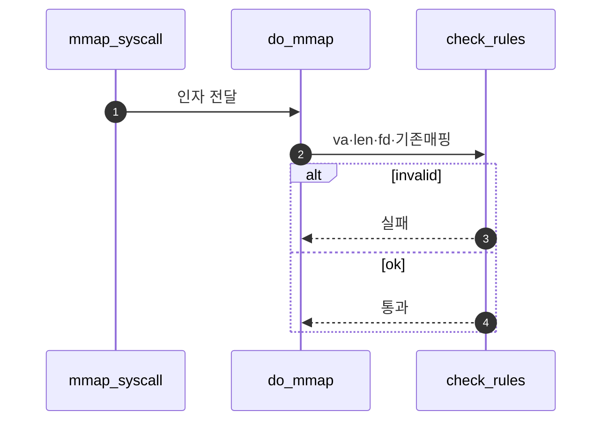

# A – mmap Validation

## 1. 개요 (목표·이유·수정 위치·의존성)

```text
목표
- mmap 요청이 유효한지 검사한다.

이유
- 잘못된 주소, 길이, fd, overlap을 허용하면 SPT/page table 상태가 꼬인다.

수정/추가 위치
- vm/file.c
  - do_mmap()
- userprog/syscall.c
  - mmap syscall 연결 확인

의존성
- B가 page 등록을 하기 전에 A의 검증 조건이 먼저 확정되어야 한다.
```

## 2. 시퀀스

`do_mmap` 초입에서 **fd·정렬·overlap·길이** 등을 검사하고, 실패 시 SPT를 건드리지 않는다.



## 3. 단계별 설명 (이 문서 범위)

1. **정렬**: `PGSIZE` 배수 등 문서/스펙에 맞춘다.
2. **overlap**: 기존 SPT·매핑과 겹치면 거절한다.
3. **통과 후**에만 **`B - mmap Page Registration.md`**가 page를 만든다.

## 4. 구현 주석 가이드

### 4.1 구현 대상 함수 목록

- `do_mmap`의 validation 블록 (`vm/file.c`)
- (연결) `mmap` syscall 인자 검증 지점 (`userprog/syscall.c`)

### 4.2 공통 구조체/필드 계약

- 검증은 등록 전에 완료되어야 한다(실패 시 SPT 변경 금지).
- 필수 검사 항목: 주소 정렬, 길이, fd 유효성, overlap.
- Merge 3-A는 “검사 결과 결정”까지만 담당한다.

### 4.3 함수별 구현 주석 (고정안)

#### `do_mmap` validation 블록

**추상**

```c
/* Merge3-A: mmap 요청의 유효성만 판정한다. 하나라도 실패하면 즉시 NULL/에러를 반환하고 등록 루프에 들어가지 않는다. */
```

**1단계 구체**

- `addr == NULL`, `pg_ofs (addr) != 0`, `length == 0` 등 즉시 거절.
- `fd`가 표준입출력/닫힌 fd인지 검사.
- 대상 VA 구간이 기존 SPT와 겹치면 거절.

**2단계 구체**

1. 인자 수집 후 빠른 실패 조건부터 검사한다.
2. `for`/헬퍼로 `[addr, addr+length)` 구간 overlap 검사.
3. 실패 시 `return NULL` (또는 오류 코드).
4. 통과 시 B의 등록 단계로만 진입.
5. **하지 않음**: page 생성, file read, munmap write-back.

### 4.4 함수 간 연결 순서 (호출 체인)

1. syscall 레이어가 `do_mmap`을 호출한다.
2. A가 validation을 수행한다.
3. 통과한 경우에만 B의 page registration 루프를 실행한다.

### 4.5 실패 처리/롤백 규칙

- 검증 실패 시 할당/등록 없이 즉시 반환.
- 중간 상태를 만들지 않으므로 rollback 대상이 없게 설계한다.
- A 범위에서 부분 등록 복구를 수행하지 않는다(B/D에서 처리).

### 4.6 완료 체크리스트

- 정렬/길이/fd/overlap 검사가 모두 구현되어 있다.
- 검증 실패 케이스에서 SPT 변경이 0건이다.
- 통과 케이스만 B로 전달된다.
