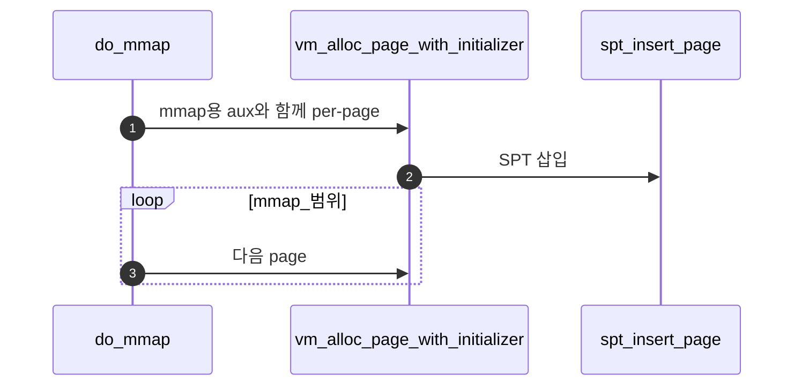
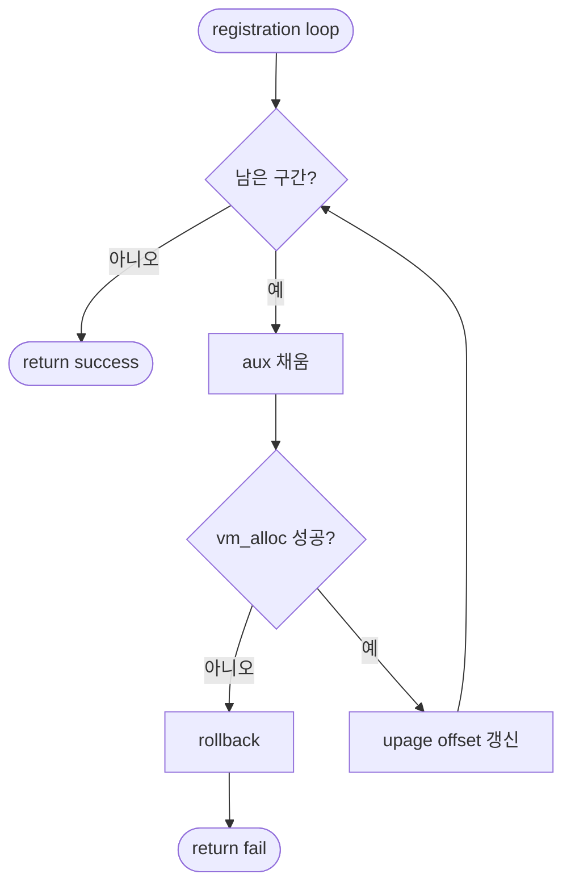

# B – mmap Page Registration

## 1. 개요 (목표·이유·수정 위치·의존성)

```text
목표
- mmap 영역을 page 단위로 나누어 file-backed page로 SPT에 등록한다.

이유
- mmap도 lazy loading 대상이므로 실제 파일 읽기는 page fault 때 해야 한다.

수정/추가 위치
- vm/file.c
  - do_mmap()
  - mmap용 aux 구조체
  - offset/read_bytes/zero_bytes 계산

의존성
- A의 validation을 통과한 범위만 등록해야 한다.
- C의 file_backed_swap_in이 aux 정보를 사용한다.
```

## 2. 시퀀스

통과한 구간을 **page 단위 file-backed**로 SPT에 넣고, **offset / read_bytes / zero_bytes** 등을 aux에 심는다.



## 3. 단계별 설명 (이 문서 범위)

1. **lazy**: 이 시점에서는 파일 전체를 읽지 않는다.
2. **aux**: fault 시 `file_backed_swap_in`이 쓸 필드를 여기서 확정한다.
3. **Merge 1**: 등록 패턴은 Merge 1 폴더의 uninit/file 초기화와 같다.

## 4. 구현 주석 가이드

### 4.1 구현 대상 함수 목록

- `do_mmap`의 등록 루프 (`vm/file.c`)
- aux 생성/초기화 헬퍼 (`vm/file.c`)
- `vm_alloc_page_with_initializer` 호출 지점

### 4.2 공통 구조체/필드 계약

- mmap은 page 단위로 SPT 등록하고 즉시 file read를 하지 않는다.
- aux에는 최소 `file`, `offset`, `read_bytes`, `zero_bytes`를 담는다.
- 타입은 `VM_FILE` 기준으로 고정한다.

### 4.3 함수별 구현 주석 (고정안)

#### §4.3.0 (이 문서)

[Merge 1 `00-서론.md`](../Merge%201%20-%20Frame%20Claim%20+%20Lazy%20Loading/00-%EC%84%9C%EB%A1%A0.md) §4.3.0과 동일.

---

#### `do_mmap` registration 루프

Merge 3–B에서 이 루프는 **validation 통과 구간을 페이지 단위로** 끊어 **`VM_FILE` lazy page**로 SPT에 등록한다.

**흐름**

1. 루프마다 `page_read_bytes`, `page_zero_bytes` 계산(Merge 1 C와 같은 패턴).
2. 페이지마다 aux에 파일 포인터·offset·길이를 채운다.
3. `vm_alloc_page_with_initializer(VM_FILE, upage, writable, <init>, aux)` — `<init>`은 팀이 정한 mmap lazy 콜백(예: `lazy_load_segment`와 별도 이름 가능)으로 단일화.
4. 실패 시 이미 등록한 구간을 팀 규약으로 rollback 후 실패 반환.
5. 성공 시 `upage += PGSIZE`, `offset += page_read_bytes` 등으로 전진.
6. **하지 않음 (B 경계)**: `file_read`, `vm_claim_page`, `pml4_set_page` 직접.

**플로우차트**



### 4.4 함수 간 연결 순서 (호출 체인)

1. A의 검증 통과 후 B의 루프가 시작된다.
2. B가 페이지 단위 lazy 엔트리를 SPT에 넣는다.
3. 첫 접근 fault에서 C의 `file_backed_swap_in`이 aux를 사용한다.

### 4.5 실패 처리/롤백 규칙

- 중간 페이지 등록 실패 시 이미 등록한 구간을 팀 규약으로 정리한다.
- aux 할당 실패 시 즉시 중단하고 누수 없이 반환한다.
- B 범위에서는 write-back 정책을 다루지 않는다.

### 4.6 완료 체크리스트

- mmap 구간이 page 단위로 모두 등록된다.
- aux 필드가 C에서 바로 사용할 수 있게 채워진다.
- 등록 단계에서 즉시 파일 읽기를 하지 않는다.
