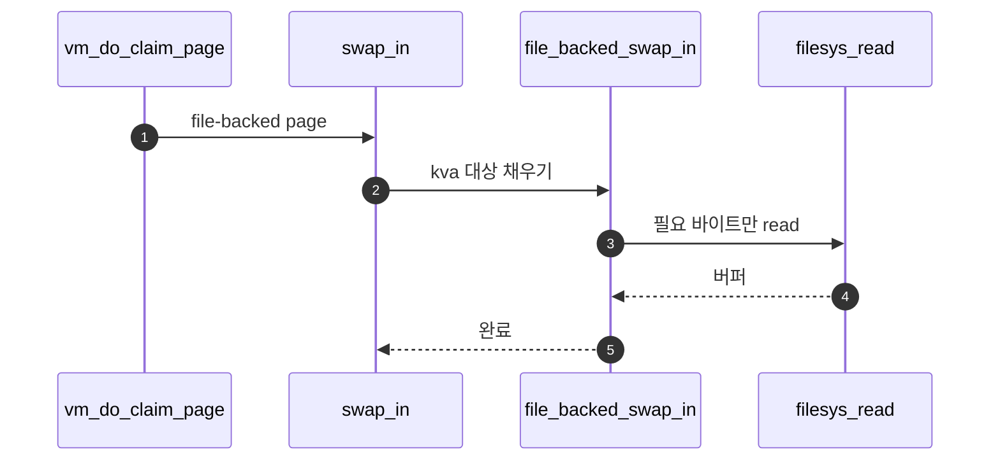

# C – File-backed Swap In

## 1. 개요 (목표·이유·수정 위치·의존성)

```text
목표
- file-backed page fault 시 파일에서 데이터를 읽어 frame에 채운다.

이유
- file-backed page의 원본은 파일이므로, frame 내용은 파일에서 가져와야 한다.

수정/추가 위치
- vm/file.c
  - file_backed_initializer()
  - file_backed_swap_in()
  - 파일 read와 zero fill 처리

의존성
- B가 file, offset, read_bytes, zero_bytes 정보를 저장해야 한다.
- Merge 1의 vm_do_claim_page가 frame->kva를 넘겨줘야 한다.
```

## 2. 시퀀스

claim으로 **`kva`**가 생긴 뒤 **`file_backed_swap_in`**이 aux의 offset 등으로 **파일 read·zero fill**을 수행한다.



## 3. 단계별 설명 (이 문서 범위)

1. **Merge 1 연동**: `swap_in` vtable이 file-backed 구현을 부른다.
2. **partial page**: `read_bytes`·`zero_bytes`로 끝 segment를 처리한다.
3. **Merge 4**: eviction 시 file-backed `swap_out`은 Merge 4 폴더에서 이어진다.

## 4. 구현 주석 가이드

### 4.1 구현 대상 함수 목록

- `file_backed_initializer` (`vm/file.c`)
- `file_backed_swap_in` (`vm/file.c`)
- (연결) `swap_in` 매크로 경로

### 4.2 공통 구조체/필드 계약

- `page->frame->kva`는 A/B 경로에서 이미 확보된 버퍼다.
- `file_backed_swap_in`은 aux/`page->file`의 offset/read/zero 정보를 사용한다.
- C는 읽기와 zero fill만 담당한다.

### 4.3 함수별 구현 주석 (고정안)

#### §4.3.0 (이 문서)

[Merge 1 `00-서론.md`](../Merge%201%20-%20Frame%20Claim%20+%20Lazy%20Loading/00-%EC%84%9C%EB%A1%A0.md) §4.3.0과 동일. `file_backed_swap_in`은 선형 단계가 많지 않아 **플로우차트 생략** 가능.

---

#### `file_backed_swap_in` (`vm/file.c`)

Merge 3–C에서 이 함수는 **file-backed page의 backing file에서 필요한 바이트를 `kva`로 읽고**, 나머지를 **0으로 채운다.** (claim 이후 호출 전제.)

**흐름**

1. `struct file_page *fp = &page->file;`
2. `include/filesys/file.h`: `off_t file_read_at(struct file *file, void *buffer, off_t size, off_t start);` — 예: `read_n = file_read_at(fp->file, kva, fp->read_bytes, fp->ofs);`
3. `read_n != fp->read_bytes`이면 `return false`.
4. `memset((uint8_t *)kva + read_n, 0, fp->zero_bytes);` (성공 시 `read_n == fp->read_bytes`).
5. `return true;`
6. **하지 않음 (C 경계)**: 새 페이지 SPT 등록, 새 frame 할당, munmap.

### 4.4 함수 간 연결 순서 (호출 체인)

1. B가 등록한 file-backed page에 fault가 발생한다.
2. Merge 1 claim 경로가 `swap_in(page, kva)`를 호출한다.
3. vtable이 `file_backed_swap_in`으로 분기해 내용을 채운다.

### 4.5 실패 처리/롤백 규칙

- 파일 읽기 길이 불일치 시 `false`를 반환한다.
- C 범위에서 PTE/프레임 rollback은 호출자 경로에 맡긴다.
- C는 write-back 실패 정책을 다루지 않는다(D/후속 Merge 담당).

### 4.6 완료 체크리스트

- file-backed fault에서 파일 내용이 kva에 로드된다.
- partial page의 zero fill이 보장된다.
- C 코드에 등록/claim 로직이 섞여 있지 않다.
