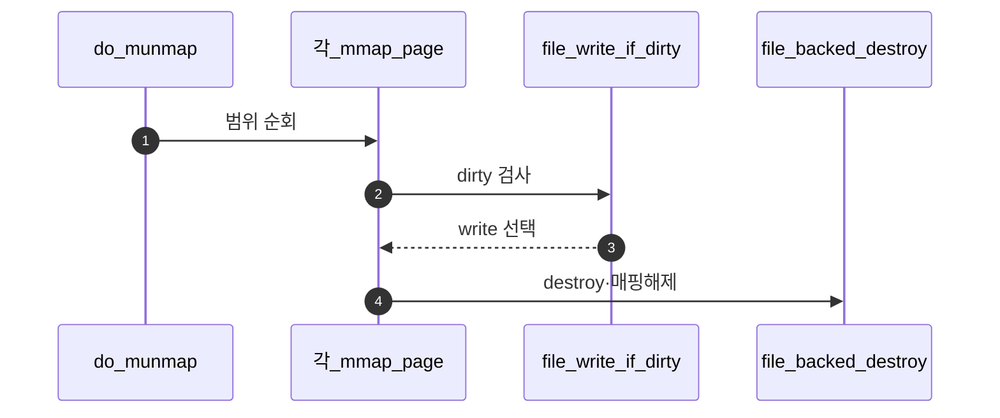
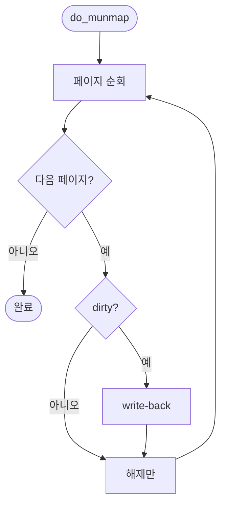

# D – munmap과 Write-back

## 1. 개요 (목표·이유·수정 위치·의존성)

```text
목표
- mmap 해제 시 수정된 page를 파일에 다시 쓰고 mapping을 제거한다.

이유
- mmap된 파일은 메모리에 쓴 내용이 파일에 반영되어야 한다.

수정/추가 위치
- vm/file.c
  - do_munmap()
  - file_backed_destroy()
  - dirty bit 확인과 write-back
- userprog/syscall.c
  - munmap syscall 연결 확인

의존성
- B가 mmap page 범위를 추적할 수 있어야 한다.
- C가 file-backed page 정보를 올바르게 초기화해야 한다.
```

## 2. 시퀀스

`do_munmap`이 범위 안의 page를 순회하며 **dirty면 파일에 write-back**하고 **destroy·PTE 제거**로 매핑을 걷는다.



## 3. 단계별 설명 (이 문서 범위)

1. **부분 munmap**: 길이에 맞게 일부 page만 건드린다.
2. **destroy**: **`../Merge 2 - Stack Growth + Page Cleanup/C - Page Destroy.md`** destroy 체인과 맞물리게 한다.
3. **fd·file**: 닫힌 뒤 접근하지 않도록 refcount를 맞춘다.

## 4. 구현 주석 가이드

### 4.1 구현 대상 함수 목록

- `do_munmap` (`vm/file.c`)
- `file_backed_destroy` (`vm/file.c`)
- (연결) `munmap` syscall 진입 지점

### 4.2 공통 구조체/필드 계약

- munmap은 대상 구간 페이지를 순회한다.
- dirty page는 backing file에 write-back한다.
- 처리 후 SPT/PTE에서 매핑을 제거한다.
- D는 해제/반영 단계이며 신규 등록을 하지 않는다.

### 4.3 함수별 구현 주석 (고정안)

#### §4.3.0 (이 문서)

[Merge 1 `00-서론.md`](../Merge%201%20-%20Frame%20Claim%20+%20Lazy%20Loading/00-%EC%84%9C%EB%A1%A0.md) §4.3.0과 동일.

---

#### `do_munmap` (`vm/file.c`)

Merge 3–D에서 이 함수는 **mmap 구간을 페이지 단위로 순회**하며 dirty면 **파일에 write-back**하고 **매핑을 제거**한다.

**흐름**

1. `for` 루프로 mmap 범위를 페이지 단위 순회.
2. `pml4_is_dirty` 등으로 dirty 검사.
3. dirty면 `file_write_at` 등으로 반영(팀 규약 범위·길이).
4. `destroy(page)` / `spt_remove_page` / `pml4_clear_page` 규약에 맞춰 해제.
5. **하지 않음 (D 경계)**: 새 mmap 등록, stack growth, eviction 정책 변경.

**플로우차트**



### 4.4 함수 간 연결 순서 (호출 체인)

1. syscall이 `do_munmap`을 호출한다.
2. D가 구간 순회하며 write-back 여부를 결정한다.
3. 페이지 해제 후 SPT/PTE 정리로 경로를 종료한다.

### 4.5 실패 처리/롤백 규칙

- write-back 실패 정책(즉시 중단/계속)은 팀 규약으로 고정한다.
- 해제 중복을 막기 위해 destroy 호출 순서를 단일화한다.
- D 범위에서는 swap slot reclaim 세부를 확장하지 않는다.

### 4.6 완료 체크리스트

- munmap 호출 시 대상 구간이 해제된다.
- dirty 페이지만 파일 반영이 수행된다.
- 해제 후 동일 VA 재접근 시 정상 fault 경로로 들어간다.
