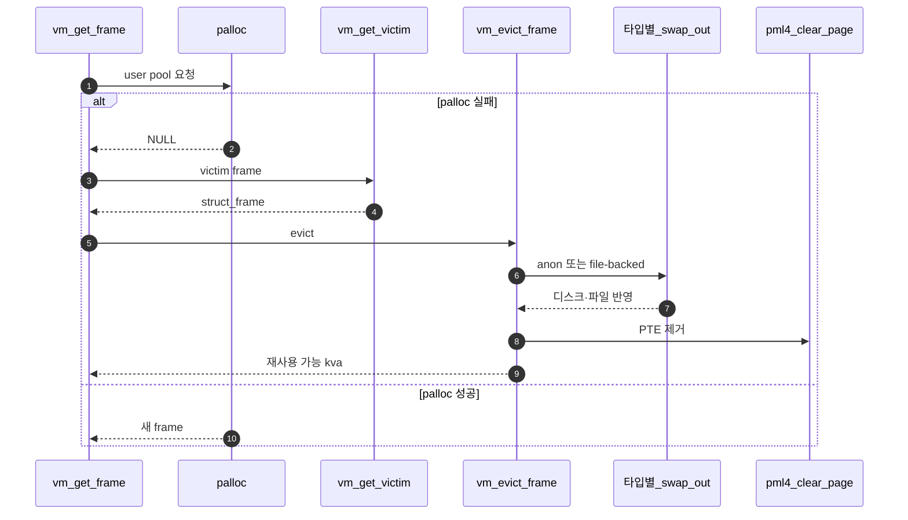

# Merge 4 – Eviction + Swap In/Out

## 1. 목표

```text
물리 frame이 부족할 때 기존 page를 안전하게 보내고,
비워진 frame을 재사용한다.
```

### 1.1 전체 시퀀스 (E2E)

**이 폴더 = Merge 4**다. **`vm_get_frame`이 palloc에 실패**하면 **victim 선택 → 타입별 `swap_out` → PTE·링크 정리 → 빈 frame 반환**으로 이어지고, 나중에 다시 접근하면 **Merge 1**의 `swap_in`이 슬롯을 채운다. 구현 순서는 **§2**다.



### 1.2 한 줄로 읽는 순서

1. **풀 고갈**이 `vm_get_frame`에서 감지된다.
2. **`vm_get_victim`** (`A - Eviction Victim Selection.md`) 이 frame_table에서 희생자를 고른다.
3. **`vm_evict_frame`** (`B - Eviction Flow.md`) 이 `swap_out`·PTE 정리·`page->frame` 해제를 한 번에 맞춘다.
4. **anon** (`C - Anonymous Swap Table.md`) 은 swap 슬롯에 내용을 싣고, **file-backed** (`D - File-backed Swap Out.md`) 은 dirty면 파일에 쓴다.
5. **이후 fault**는 Merge 1과 같이 `swap_in`으로 메모리를 다시 채운다.

## 2. 이상적인 내부 머지 순서

```text
1. C - Anonymous Swap Table
2. D - File-backed Swap Out
3. A - Eviction Victim Selection
4. B - Eviction Flow
```

이유:

```text
C/D가 타입별 swap_out을 먼저 준비해야 eviction이 victim page를 안전하게 보낼 수 있다.
A가 victim을 고르는 정책을 만든 뒤, B가 실제 eviction 전체 흐름에 연결한다.
B는 vm_get_frame과 page table mapping에 영향을 주므로 마지막에 붙이는 것이 안정적이다.
```

## 3. 완료 기준

```text
swap-anon 일부 통과 기대
swap-file 일부 통과 기대
메모리 제한이 있는 테스트에서 eviction 경로 진입 확인
```

## 4. 분업 문서 §4 규약

**단일 기준**: 상위 폴더 [Merge 1 – Frame Claim + Lazy Loading / `00-서론.md`](../Merge%201%20-%20Frame%20Claim%20+%20Lazy%20Loading/00-%EC%84%9C%EB%A1%A0.md) **§4** 및 **§4.3.0**과 동일하다.

- 목차 **4.1~4.6** 동일.
- **4.3**: 함수마다 **역할 문단** + **`흐름` 번호 목록**. **플로우차트**는 루프·분기·실패 경로가 길 때만 추가 (**B안**, Merge 1 `C - Executable Segment Lazy Loading.md` 참고).
- **4.5·4.6**: **「§4.3 `함수명` 흐름 n」** 참조 형식.

이 Merge의 `A~D` 분업 문서는 위 규약으로 §4를 채운다.
