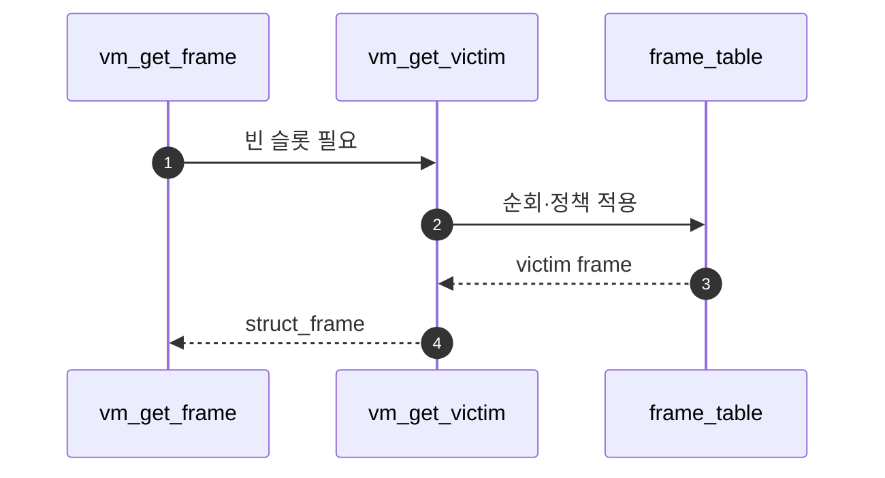

# A – Eviction Victim Selection

## 1. 개요 (목표·이유·수정 위치·의존성)

```text
목표
- frame_table을 순회하며 쫓아낼 frame을 고른다.

이유
- free frame이 없을 때 아무 frame이나 빼면 최근 사용 중인 page를 망가뜨릴 수 있다.

수정/추가 위치
- vm/vm.c
  - vm_get_victim()
  - accessed bit 확인/초기화

의존성
- B의 eviction flow가 victim을 실제로 비워야 한다.
- Merge 1의 frame_table 등록이 되어 있어야 한다.
```

## 2. 시퀀스

`vm_get_victim`이 **frame_table**을 돌며 정책(예: clock, accessed bit)으로 **한 frame**을 고른다. 아직 내용을 비우지는 않는다.



## 3. 단계별 설명 (이 문서 범위)

1. **정책**: 문서에 적은 대로 accessed/dirty를 어떻게 볼지 확정한다.
2. **출력**: 곧바로 **`B - Eviction Flow.md`**에 넘길 `struct frame *`만 고른다.
3. **Merge 1**: victim의 `frame->page` 역참조가 있어야 한다.

## 4. 구현 주석 가이드

### 4.1 구현 대상 함수 목록

- `vm_get_victim` (`vm/vm.c`)
- (연결) frame_table 순회 포인터/clock 핸들러

### 4.2 공통 구조체/필드 계약

- 후보는 frame_table에 존재하는 `struct frame` 중에서 선택한다.
- 선택 단계는 victim 선정만 담당하고 swap_out/PTE clear는 하지 않는다.
- 선정 정책은 팀 기준(clock/accessed bit 등)으로 고정한다.

### 4.3 함수별 구현 주석 (고정안)

#### `vm_get_victim` (`vm/vm.c`)

**추상**

```c
/* Merge4-A: frame_table을 순회해 eviction 대상 frame 1개를 고른다. 실제 내보내기는 B에서 수행한다. */
```

**1단계 구체**

- frame마다 대응 page의 accessed/dirty 참고.
- policy에 따라 통과/skip를 결정.
- 반환값은 `struct frame *` 하나.

**2단계 구체**

1. 순회 시작 위치(예: clock hand)를 가져온다.
2. 각 frame의 page 접근 비트를 확인한다.
3. 희생 조건 만족 시 해당 frame 반환.
4. 미만족이면 비트 초기화/다음 후보로 이동.
5. **하지 않음**: `swap_out`, `pml4_clear_page`, `page->frame = NULL`.

### 4.4 함수 간 연결 순서 (호출 체인)

1. `vm_get_frame`이 palloc 실패를 감지한다.
2. A의 `vm_get_victim`이 victim frame을 반환한다.
3. B의 `vm_evict_frame`이 해당 frame을 실제로 비운다.

### 4.5 실패 처리/롤백 규칙

- victim을 찾지 못하면 상위 호출자에서 실패 처리한다.
- A 단계에서는 상태 변경을 최소화해 롤백 부담을 줄인다.
- 정책 비트 초기화는 팀 규약대로 일관 적용한다.

### 4.6 완료 체크리스트

- frame_table에서 실제 victim frame이 선택된다.
- 선택 단계와 eviction 수행 단계가 분리되어 있다.
- A 코드에 swap_out/PTE 제거가 섞여 있지 않다.
