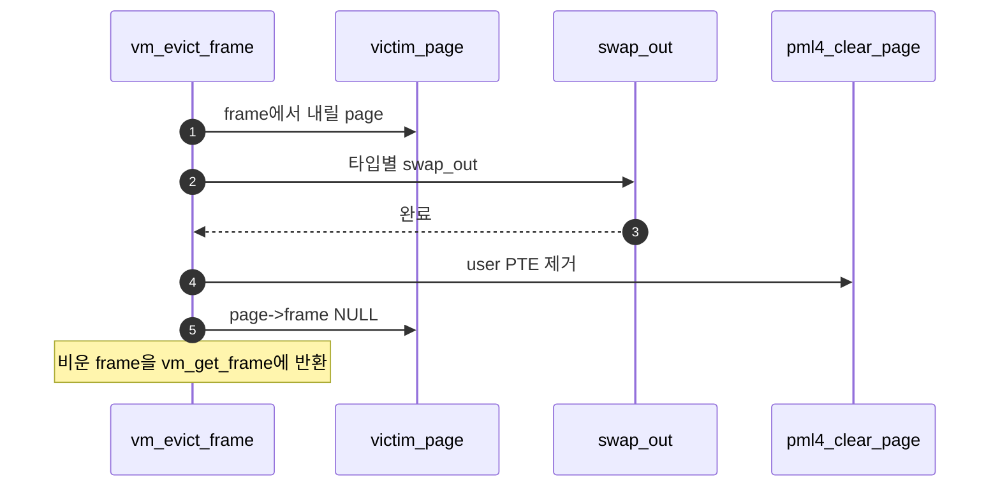

# B – Eviction Flow

## 1. 개요 (목표·이유·수정 위치·의존성)

```text
목표
- victim page를 swap_out하고 page table 매핑과 page-frame 연결을 정리한다.

이유
- eviction은 page 삭제가 아니라 frame에서 내려보내는 작업이다.

수정/추가 위치
- vm/vm.c
  - vm_evict_frame()
  - vm_get_frame()에서 palloc 실패 시 eviction 연결
  - pml4_clear_page()

의존성
- A가 victim frame을 골라줘야 한다.
- C/D의 타입별 swap_out이 필요하다.
```

## 2. 시퀀스

`vm_evict_frame`이 victim의 **page에 대해 `swap_out`**을 호출한 뒤 **PTE를 지우고** `page->frame`을 끊어 **frame을 비운 채** 반환한다.



## 3. 단계별 설명 (이 문서 범위)

1. **`vm_get_frame` 연결**: palloc 실패 분기에서만 부른다.
2. **동시성**: eviction 중 다른 CPU가 같은 page를 건드리지 않게 설계한다(과제 범위에 맞게).
3. **`C - Anonymous Swap Table.md`**, **`D - File-backed Swap Out.md`**: `swap_out` 구현체가 여기로 붙는다.

## 4. 구현 주석 가이드

### 4.1 구현 대상 함수 목록

- `vm_evict_frame` (`vm/vm.c`)
- `vm_get_frame`의 palloc 실패 분기 연결 (`vm/vm.c`)
- `pml4_clear_page` 호출 지점

### 4.2 공통 구조체/필드 계약

- eviction 입력은 A가 고른 victim frame이다.
- `swap_out(page)` 성공 후에만 PTE/링크 정리를 진행한다.
- 종료 상태는 `frame->page == NULL`, `page->frame == NULL`이다.

### 4.3 함수별 구현 주석 (고정안)

#### `vm_evict_frame` (`vm/vm.c`)

**추상**

```c
/* Merge4-B: victim frame의 page를 swap_out한 뒤 PTE와 page-frame 링크를 정리하고, 비워진 frame을 반환한다. */
```

**1단계 구체**

- victim의 `struct page *`를 얻는다.
- 타입별 `swap_out(page)` 호출.
- 성공 시 `pml4_clear_page`, 링크 해제.

**2단계 구체**

1. `struct frame *victim = vm_get_victim ();`
2. `struct page *page = victim->page;`
3. `if (!swap_out (page)) return NULL;`
4. `pml4_clear_page (thread_current ()->pml4, page->va);`
5. `page->frame = NULL; victim->page = NULL;`
6. `return victim;`
7. **하지 않음**: 새 page 등록, stack growth 판별.

### 4.4 함수 간 연결 순서 (호출 체인)

1. `vm_get_frame`에서 palloc 실패.
2. A가 victim 선택.
3. B가 victim eviction 수행.
4. 반환된 frame을 새 claim 경로에서 재사용.

### 4.5 실패 처리/롤백 규칙

- `swap_out` 실패 시 PTE/링크를 건드리지 않고 실패 반환.
- PTE 제거 실패 처리 정책을 팀 규약으로 고정한다.
- B 범위에서는 swap 슬롯 관리 세부를 직접 구현하지 않는다(C/D에서 담당).

### 4.6 완료 체크리스트

- palloc 실패 시 eviction 경로가 호출된다.
- 성공 케이스에서 frame/page 링크가 모두 해제된다.
- eviction 후 frame을 재사용할 수 있다.
