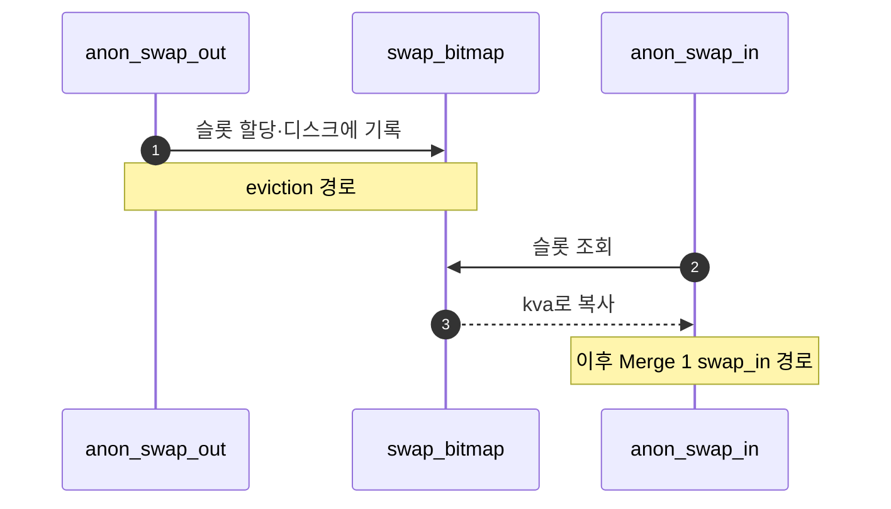

# C – Anonymous Swap Table

## 1. 개요 (목표·이유·수정 위치·의존성)

```text
목표
- anon page를 swap disk에 저장하고 다시 복원한다.

이유
- anon page는 파일 원본이 없으므로 eviction 시 내용을 보존할 임시 저장소가 필요하다.

수정/추가 위치
- include/vm/anon.h
  - swap slot 정보 필드
- vm/anon.c
  - vm_anon_init()
  - anon_swap_out()
  - anon_swap_in()
  - swap bitmap

의존성
- B가 anon page의 swap_out을 호출해야 한다.
- A/B의 eviction 흐름이 있어야 실제로 테스트된다.
```

## 2. 시퀀스

**bitmap·슬롯**으로 swap 공간을 관리하고, **`anon_swap_out`**이 kva를 슬롯에 쓰고 **`anon_swap_in`**이 fault 복구 때 다시 읽는다.



## 3. 단계별 설명 (이 문서 범위)

1. **`vm_anon_init`**: 부팅 시 bitmap 등 자료구조를 준비한다.
2. **page 필드**: 어떤 슬롯을 쓰는지 anon `struct page`에 남긴다.
3. **fork·exit**: Merge 5 폴더에서 슬롯 refcount를 맞춘다.

## 4. 구현 주석 가이드

### 4.1 구현 대상 함수 목록

- `vm_anon_init` (`vm/anon.c`)
- `anon_swap_out` (`vm/anon.c`)
- `anon_swap_in` (`vm/anon.c`)
- (연결) swap bitmap/slot 자료구조

### 4.2 공통 구조체/필드 계약

- anon page는 backing file이 없으므로 swap 슬롯을 반드시 사용한다.
- 슬롯 할당/해제 상태는 bitmap으로 관리한다.
- page의 anon 필드에 슬롯 인덱스를 저장한다.

### 4.3 함수별 구현 주석 (고정안)

#### §4.3.0 (이 문서)

[Merge 1 `00-서론.md`](../Merge%201%20-%20Frame%20Claim%20+%20Lazy%20Loading/00-%EC%84%9C%EB%A1%A0.md) §4.3.0과 동일.

---

#### `vm_anon_init` (`vm/anon.c`)

swap 디스크 핸들·bitmap 등 **anon swap 자료구조**를 초기화한다.

**흐름**

1. `swap_disk` 열기/크기 확인 등 팀 규약.
2. 슬롯 bitmap·락 초기화.

---

#### `anon_swap_out` (`vm/anon.c`)

**빈 swap 슬롯을 할당**하고 `kva` 내용을 디스크에 기록한 뒤 **슬롯 번호를 page에 저장**한다.

**흐름**

1. 슬롯 할당 실패 시 `return false`.
2. 페이지 내용을 섹터 단위로 기록 후 `page->anon` 등에 슬롯 번호 저장.
3. **하지 않음**: victim 선택(A), PTE clear(B).

---

#### `anon_swap_in` (`vm/anon.c`)

저장된 슬롯에서 **디스크를 읽어 `kva`로 복원**하고 bitmap으로 **슬롯 반납**한다.

**흐름**

1. 슬롯 번호로 디스크 읽기.
2. 성공 시 bitmap 반납·필드 정리.
3. **하지 않음**: victim 선택, PTE 삽입(claim 쪽).

### 4.4 함수 간 연결 순서 (호출 체인)

1. B의 eviction이 anon page를 `swap_out` 호출.
2. C가 슬롯에 저장.
3. 이후 fault 시 Merge 1 claim 경로가 `anon_swap_in` 호출해 복원.

### 4.5 실패 처리/롤백 규칙

- 슬롯 할당 실패 시 즉시 `false` 반환.
- 디스크 IO 실패 시 슬롯 상태를 일관되게 되돌린다.
- C 범위에서는 fork refcount 세부 정책을 확정하지 않는다(Merge 5 담당).

### 4.6 완료 체크리스트

- anon eviction 시 swap 슬롯 사용이 확인된다.
- fault 복구 시 같은 슬롯에서 데이터가 복원된다.
- 슬롯 누수/중복 사용이 없다.
