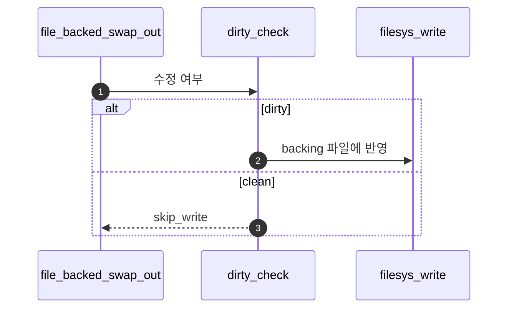
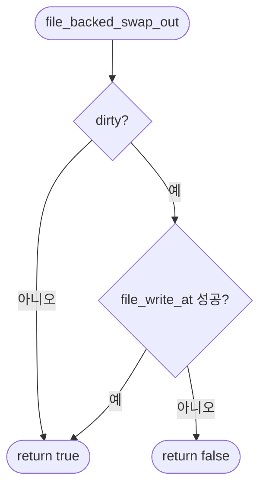

# D – File-backed Swap Out

## 1. 개요 (목표·이유·수정 위치·의존성)

```text
목표
- file-backed page가 쫓겨날 때 dirty 여부에 따라 파일에 기록한다.

이유
- file-backed page는 원본 파일이 backing store라서, 수정된 내용만 파일에 반영하면 된다.

수정/추가 위치
- vm/file.c
  - file_backed_swap_out()
  - dirty bit 확인
  - file write-back

의존성
- B의 eviction flow가 file-backed page의 swap_out을 호출해야 한다.
- Merge 3의 file-backed page 정보가 필요하다.
```

## 2. 시퀀스

`file_backed_swap_out`이 **dirty면 파일 offset에 write**하고, clean이면 **디스크 중복 기록 없이** PTE만 내릴 수 있다.



## 3. 단계별 설명 (이 문서 범위)

1. **backing store**: 원본이 파일이므로 anon과 다른 정책이다.
2. **Merge 3**: mmap·executable file-backed aux와 필드명을 맞춘다.
3. **다시 올리기**: fault 시 **`../Merge 3 - mmap - File-backed Page/C - File-backed Swap In.md`**와 같은 `swap_in`/read 경로로 복구한다.

## 4. 구현 주석 가이드

### 4.1 구현 대상 함수 목록

- `file_backed_swap_out` (`vm/file.c`)
- (연결) dirty bit 확인 지점
- (연결) write-back API 호출 지점

### 4.2 공통 구조체/필드 계약

- file-backed page는 원본 파일이 backing store다.
- dirty인 경우만 파일에 반영하고 clean이면 write를 생략한다.
- D는 out 경로만 다루며 in 경로는 Merge 3-C 재사용.

### 4.3 함수별 구현 주석 (고정안)

#### §4.3.0 (이 문서)

[Merge 1 `00-서론.md`](../Merge%201%20-%20Frame%20Claim%20+%20Lazy%20Loading/00-%EC%84%9C%EB%A1%A0.md) §4.3.0과 동일.

---

#### `file_backed_swap_out` (`vm/file.c`)

Merge 4–D에서 이 함수는 **file-backed victim을 내릴 때** dirty면 **backing file로 write-back**하고, clean이면 기록 없이 성공으로 넘긴다.

**흐름**

1. `struct file_page *fp = &page->file;`
2. dirty 여부 조회(`pml4_is_dirty` 등).
3. dirty면 `file_write_at` 등으로 `fp`의 offset·길이 규약에 맞게 기록 — 실패 시 `false`.
4. clean이면 write 생략·성공.
5. **하지 않음 (D 경계)**: victim 선택, PTE clear, swap bitmap.

**플로우차트**



### 4.4 함수 간 연결 순서 (호출 체인)

1. B의 eviction이 file-backed page를 내릴 때 D 호출.
2. D가 dirty 여부로 write-back 여부를 결정.
3. 완료 후 B가 PTE와 링크를 해제한다.

### 4.5 실패 처리/롤백 규칙

- write-back 실패 시 `false`를 반환해 B가 실패를 인지한다.
- clean page는 write 시도 없이 성공 처리한다.
- D 범위에서는 munmap 해제 순서를 다루지 않는다(Merge 3-D 담당).

### 4.6 완료 체크리스트

- dirty file-backed 페이지가 파일에 반영된다.
- clean 페이지는 불필요한 write를 하지 않는다.
- D 코드에 victim 선택/eviction 본문이 섞여 있지 않다.
