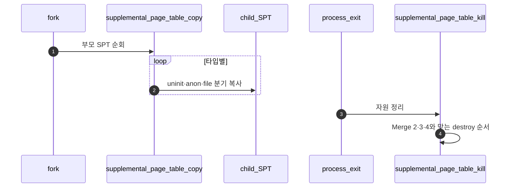

# Merge 5 – Fork/Exit 정리 + 전체 안정화

## 1. 목표

```text
fork와 exit에서도 SPT/page/frame/file/swap 자원이 일관되게 복사되고 정리되도록 마무리한다.
```

### 1.1 전체 시퀀스 (E2E)

**이 폴더 = Merge 5**다. **`fork` → 부모 SPT를 타입별로 자식 SPT에 복사**하고, **`exit`/`process_cleanup` → 앞선 머지의 kill·munmap·swap 규약을 한 번에 만족**시키는 마무리 단계다. 구현 순서는 **§2**다.



### 1.2 한 줄로 읽는 순서

1. **`supplemental_page_table_copy`**가 fork의 핵심이다 (**`A`**, **`B`**, **`C`** 문서).
2. **uninit**은 메타만 복사하고, **로드된 anon**은 내용·frame 정책을 자식 정책에 맞춘다.
3. **file/mmap**은 fd·file·offset 참조를 자식이 안전히 쓰도록 맞춘다.
4. **exit**는 **`D - Exit와 전체 Cleanup 안정화.md`**에서 Merge 2의 SPT kill·mmap·swap 해제 순서를 재검증한다.
5. **회귀**: fork+mmap+swap 조합 테스트로 이중 free를 잡는다.

## 2. 이상적인 내부 머지 순서

```text
1. A - SPT Copy: Uninit Page
2. B - SPT Copy: Loaded Anon Page
3. C - SPT Copy: File-backed/mmap Page
4. D - Exit와 전체 Cleanup 안정화
```

이유:

```text
copy는 uninit -> anon -> file-backed 순서로 확장하는 것이 이해와 디버깅이 쉽다.
D는 A/B/C가 만든 복사 정책과 Merge 2/3/4의 cleanup을 모두 맞춰야 하므로 마지막에 붙인다.
마지막 머지에서는 기능 추가보다 중복 해제와 회귀 테스트 안정화가 핵심이다.
```

## 3. 완료 기준

```text
fork 관련 VM 테스트 일부 통과 기대
mmap-exit, mmap-inherit 계열 점검
swap-fork 계열 점검
전체 vm 테스트 회귀 확인
```

## 4. 분업 문서 §4 규약

**단일 기준**: 상위 폴더 [Merge 1 – Frame Claim + Lazy Loading / `00-서론.md`](../Merge%201%20-%20Frame%20Claim%20+%20Lazy%20Loading/00-%EC%84%9C%EB%A1%A0.md) **§4** 및 **§4.3.0**과 동일하다.

- 목차 **4.1~4.6** 동일.
- **4.3**: 함수마다 **역할 문단** + **`흐름` 번호 목록**. **플로우차트**는 루프·분기·실패 경로가 길 때만 추가 (**B안**, Merge 1 `C - Executable Segment Lazy Loading.md` 참고).
- **4.5·4.6**: **「§4.3 `함수명` 흐름 n」** 참조 형식.

이 Merge의 `A~D` 분업 문서는 위 규약으로 §4를 채운다.
