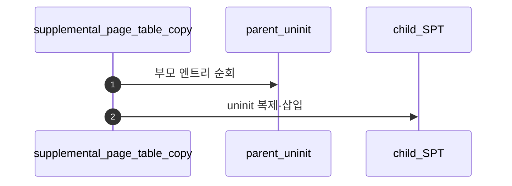
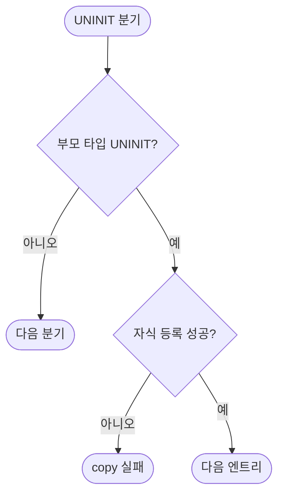

# A – SPT Copy: Uninit Page

## 1. 개요 (목표·이유·수정 위치·의존성)

```text
목표
- 부모의 uninit page 정보를 자식 SPT에 같은 의미로 복사한다.

이유
- fork 후 자식도 아직 접근하지 않은 lazy page를 동일하게 사용할 수 있어야 한다.

수정/추가 위치
- vm/vm.c
  - supplemental_page_table_copy()
  - uninit page copy

의존성
- B/C와 같은 copy 함수 안에서 타입별 분기가 필요하다.
- Merge 1의 vm_alloc_page_with_initializer 흐름을 재사용한다.
```

## 2. 시퀀스

부모의 **uninit page**를 자식 SPT에 **같은 initializer·aux 의미**로 새 `struct page`로 만든다. 아직 frame은 공유하지 않는 경우가 많다.



## 3. 단계별 설명 (이 문서 범위)

1. **aux 복사**: 파일 오프셋 등을 **깊은 복사 vs 참조** 팀 규약에 맞춘다.
2. **writable**: 자식 정책(COW 여부)에 따라 다를 수 있다.
3. **`B`**, **`C`**: 같은 함수 안의 다음 `case`로 확장한다.

## 4. 구현 주석 가이드

### 4.1 구현 대상 함수 목록

- `supplemental_page_table_copy`의 UNINIT 분기 (`vm/vm.c`)
- (연결) `vm_alloc_page_with_initializer` 재사용 경로

### 4.2 공통 구조체/필드 계약

- 부모 UNINIT 엔트리를 자식 SPT에 같은 의미로 복제한다.
- UNINIT 복사 단계에서는 frame 내용 복사를 하지 않는다.
- aux 소유권(깊은 복사/참조)은 팀 규약으로 단일화한다.

### 4.3 함수별 구현 주석 (고정안)

#### §4.3.0 (이 문서)

[Merge 1 `00-서론.md`](../Merge%201%20-%20Frame%20Claim%20+%20Lazy%20Loading/00-%EC%84%9C%EB%A1%A0.md) §4.3.0과 동일.

---

#### `supplemental_page_table_copy` UNINIT 분기

Merge 5–A에서 이 분기는 **부모 UNINIT page의 initializer·aux 의미를 유지한 채** 자식 SPT에 **동등한 UNINIT**을 넣는다.

**흐름**

1. 부모 SPT 순회 중 `page_get_type(parent_page) == VM_UNINIT`일 때만 진입.
2. parent의 `va`, `writable`, 목표 `type`, `init`, `aux`를 추출.
3. 자식에 같은 `va`로 `vm_alloc_page_with_initializer` 등 Merge 1 B와 동등한 경로로 등록.
4. 실패 시 copy 전체 실패 반환.
5. **하지 않음 (A 경계)**: `frame` memcpy, swap 슬롯 refcount.

**플로우차트**



### 4.4 함수 간 연결 순서 (호출 체인)

1. `fork`가 `supplemental_page_table_copy` 호출.
2. A가 UNINIT 엔트리를 먼저 복제.
3. 이어서 B/C 분기로 확장된다.

### 4.5 실패 처리/롤백 규칙

- 자식 등록 실패 시 copy를 중단하고 실패 반환.
- A 범위에서는 이미 복사된 다른 타입 rollback 세부를 확정하지 않는다(D에서 정리 정책 통합).

### 4.6 완료 체크리스트

- 부모 UNINIT 페이지가 자식에서도 lazy 상태로 존재한다.
- UNINIT 단계에서 frame 즉시 할당이 발생하지 않는다.
- aux/initializer 의미가 유지된다.
