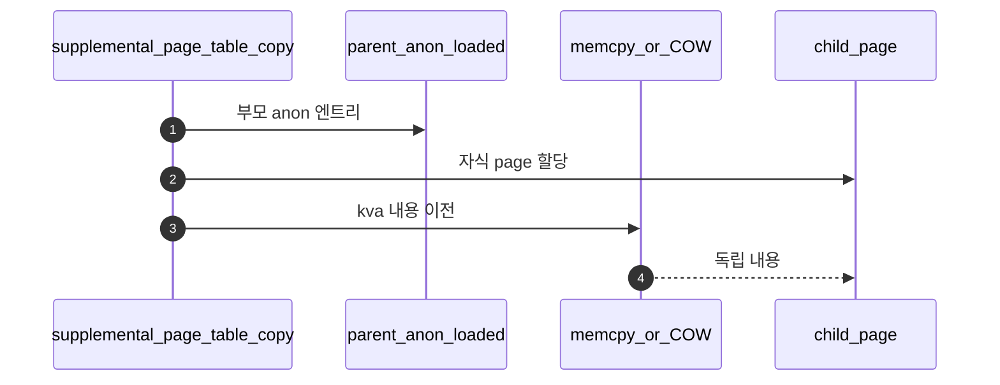
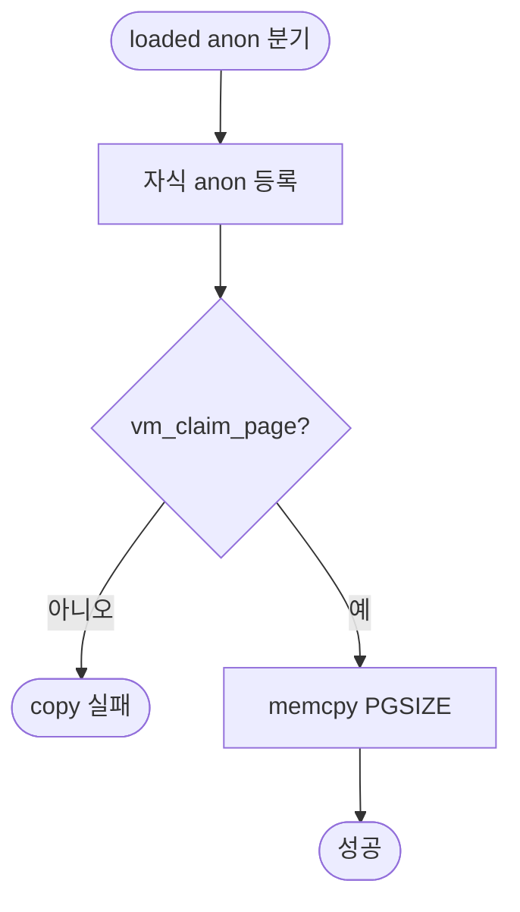

# B – SPT Copy: Loaded Anon Page

## 1. 개요 (목표·이유·수정 위치·의존성)

```text
목표
- 이미 frame에 올라온 anonymous page 내용을 자식에게 복사한다.

이유
- fork 후 부모와 자식은 독립적인 주소 공간을 가져야 한다.

수정/추가 위치
- vm/vm.c
  - supplemental_page_table_copy()
  - anon page copy
  - 자식 page claim 후 frame 내용 memcpy

의존성
- A/C와 copy 함수 구조를 맞춰야 한다.
- Merge 1의 claim 흐름과 Merge 4의 anon 상태 정보가 필요하다.
```

## 2. 시퀀스

이미 올라온 **anon page**는 자식 전용 page를 만든 뒤 **`memcpy` 등으로 kva 내용을 복사**하고, 필요하면 **자식만의 frame**을 claim한다.



## 3. 단계별 설명 (이 문서 범위)

1. **부모 frame 공유(COW)** 를 할지 **즉시 복사**할지 설계를 고른다.
2. **swap 슬롯**: Merge 4 폴더의 anon 필드가 있으면 refcount를 맞춘다.
3. **PTE**: 자식 주소 공간에 새 PTE를 싼다.

## 4. 구현 주석 가이드

### 4.1 구현 대상 함수 목록

- `supplemental_page_table_copy`의 loaded anon 분기 (`vm/vm.c`)
- (연결) 자식 페이지 claim 경로
- (연결) 내용 복사(`memcpy` 또는 팀 COW 훅)

### 4.2 공통 구조체/필드 계약

- 부모/자식 주소 공간은 분리되어야 한다.
- loaded anon은 자식에서 유효한 page+frame 상태를 만들어야 한다.
- swap 슬롯 연계 필드가 있으면 refcount/소유권 규약을 따른다.

### 4.3 함수별 구현 주석 (고정안)

#### §4.3.0 (이 문서)

[Merge 1 `00-서론.md`](../Merge%201%20-%20Frame%20Claim%20+%20Lazy%20Loading/00-%EC%84%9C%EB%A1%A0.md) §4.3.0과 동일.

---

#### `supplemental_page_table_copy` loaded anon 분기

Merge 5–B에서 이 분기는 **부모의 로드된 anon page**를 자식에서 **새로 claim**한 뒤 **내용을 복사**해 독립 상태로 만든다.

**흐름**

1. 부모 순회 중 loaded anon 분기 진입.
2. 자식에 anon page 등록 후 `vm_claim_page(va)`.
3. `memcpy(child_kva, parent_kva, PGSIZE)`.
4. 실패 시 copy 실패 반환 — 부분 복사는 팀 규약으로 정리.
5. **하지 않음 (B 경계)**: mmap/file-backed aux 복사(C).

**플로우차트**



### 4.4 함수 간 연결 순서 (호출 체인)

1. A가 UNINIT 복제를 끝낸다.
2. B가 loaded anon 엔트리 복제+내용 복사를 수행한다.
3. 이어서 C가 file/mmap 엔트리를 처리한다.

### 4.5 실패 처리/롤백 규칙

- claim 실패 또는 memcpy 대상 부재 시 즉시 실패 반환.
- partially-copied child 엔트리는 팀 규약으로 정리한다.
- B 범위에서는 exit cleanup 순서를 확정하지 않는다(D 담당).

### 4.6 완료 체크리스트

- fork 후 자식 anon 페이지 내용이 부모와 동일하다.
- 이후 부모/자식 쓰기가 서로 독립적으로 동작한다.
- B 범위 코드에 file-backed 복사 세부가 섞여 있지 않다.
