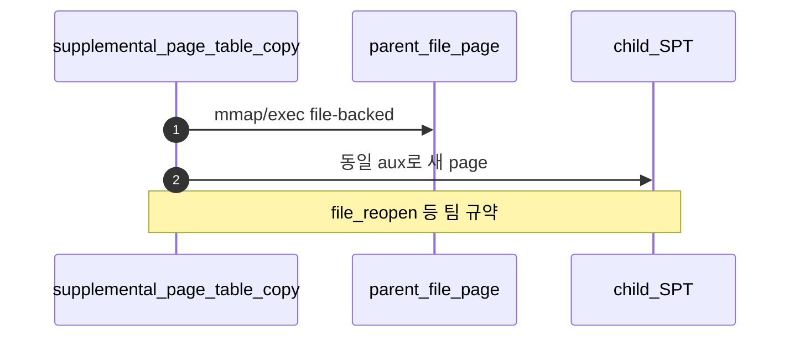

# C – SPT Copy: File-backed/mmap Page

## 1. 개요 (목표·이유·수정 위치·의존성)

```text
목표
- file-backed page와 mmap page의 backing 정보를 자식에게 복사한다.

이유
- 자식 프로세스도 파일 기반 page fault를 올바르게 처리해야 한다.

수정/추가 위치
- vm/vm.c
  - supplemental_page_table_copy()
- vm/file.c
  - mmap/file-backed page copy에 필요한 정보 확인

의존성
- Merge 3의 mmap/file-backed page 구조가 확정되어야 한다.
- A/B와 copy 함수 안에서 충돌 없이 합쳐야 한다.
```

## 2. 시퀀스

**file·mmap page**는 backing `struct file*`·offset·writable 등을 자식 SPT에 복제하고, **fd table duplicate**와 refcount 규약을 맞춘다.



## 3. 단계별 설명 (이 문서 범위)

1. **Merge 3** 구조체와 필드 이름을 그대로 재사용할 수 있게 맞춘다.
2. **중복 close**: 부모·자식 중 누가 `file_close`할지 규칙을 정한다.
3. **lazy 유지**: 복사 직후 파일 전체를 읽지 않는다.

## 4. 구현 주석 가이드

### 4.1 구현 대상 함수 목록

- `supplemental_page_table_copy`의 file-backed/mmap 분기 (`vm/vm.c`)
- (연결) `file_reopen`/refcount 처리 지점
- (연결) 자식 SPT 등록 경로

### 4.2 공통 구조체/필드 계약

- 부모의 file-backed 메타(`file*`, `ofs`, `read/zero`, `writable`)를 자식에 전달한다.
- lazy semantics를 유지해 즉시 파일 전체 읽기를 하지 않는다.
- close 책임(부모/자식)은 단일 규약으로 고정한다.

### 4.3 함수별 구현 주석 (고정안)

#### §4.3.0 (이 문서)

[Merge 1 `00-서론.md`](../Merge%201%20-%20Frame%20Claim%20+%20Lazy%20Loading/00-%EC%84%9C%EB%A1%A0.md) §4.3.0과 동일.

---

#### `supplemental_page_table_copy` file-backed/mmap 분기

Merge 5–C에서 이 분기는 **부모 file-backed/mmap의 backing 메타**를 자식 SPT에 복제해 **fault 시 동일 경로**로 복구되게 한다.

**흐름**

1. 부모 엔트리가 file-backed/mmap인지 판별.
2. `file`, offset, read/zero, `writable` 등 aux 추출 — 필요 시 `file_reopen`으로 자식 전용 참조.
3. 자식에 동일 VA로 file-backed lazy page 등록.
4. 실패 시 copy 실패 반환.
5. **하지 않음 (C 경계)**: 즉시 `file_read`, claim 강제.

### 4.4 함수 간 연결 순서 (호출 체인)

1. A/B 복제 이후 C 분기가 file-backed/mmap 엔트리를 처리한다.
2. 자식은 이후 fault 시 Merge 3 경로(`file_backed_swap_in`)를 재사용한다.

### 4.5 실패 처리/롤백 규칙

- `file_reopen` 실패 시 즉시 copy 실패.
- 중간 실패 시 자식의 열린 file 참조를 누수 없이 정리.
- C 범위에서는 전체 종료 cleanup 순서를 확정하지 않는다(D 담당).

### 4.6 완료 체크리스트

- fork 후 자식 mmap/file-backed 페이지가 정상 fault 복구된다.
- 부모/자식 close 순서에 따른 이중 close가 없다.
- 복사 직후 eager load가 발생하지 않는다.
